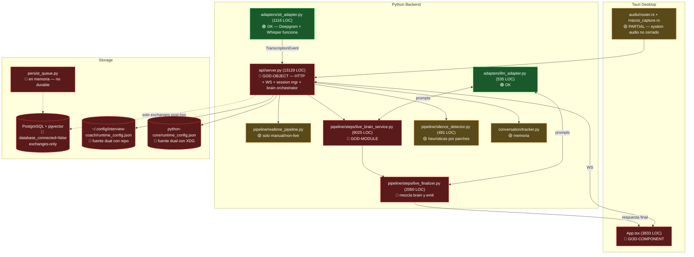

# Interview Coach — Audit + Target Architecture + Implementation Plan

> Plan maestro consolidado. Diagnóstico brutal con evidencia del repo, arquitectura objetivo, rediseño de pipeline live, rediseño de datos, y plan de ejecución por fases. Tras salir de plan mode, la Fase 0 materializa los 9 artefactos (`AUDIT_REPORT.md`, `BRANCH_FORENSICS.md`, `TARGET_ARCHITECTURE.md`, `LIVE_PIPELINE_REDESIGN.md`, `DATA_MODEL_REDESIGN.md`, `IMPLEMENTATION_PLAN.md`, `execution_plan.yaml`, `status.json`, 3 ADRs).

**Decisiones congeladas por el usuario (2026-04-22):**
1. Entrega como plan maestro consolidado → los 9 artefactos se generan en Fase 0 como primera tarea al salir de plan mode.
2. Estrategia de ramas: **rebase selectivo**. 3–5 ramas con cambios útiles se cherry-pick sobre `main` limpia. El resto se archiva.
3. STT: **mantener Deepgram primary + Whisper local fallback**. No cambiar proveedor: el blocker real es el bridge de audio desktop.
4. Arquitectura: **refactor quirúrgico modular**. Mantener FastAPI + Python + Tauri + PG. Romper god-objects, separar `brain` de `emit`, contratos pydantic v2 versionados.

---

## 0. Executive diagnosis

### 0.1 Qué está realmente roto (causa raíz)

**CR-1. No hay ciclo de vida de estado durable entre "live" y "disk".**
- `storage/persist_queue.py:59` es una `list` Python **en memoria**. Si el proceso muere o se reinicia (y se reinicia mucho: `stable-live-2026-04-08`, `brain-intent-harden`, etc. son snapshots de reinicios), se pierde todo lo pending.
- El pipeline vive con `session_state` en memoria (`pipeline/realtime_pipeline.py:128`), y solo persiste `exchanges` como par post-hoc `interviewer_utterance + suggested_response` (`pipeline/realtime_pipeline.py:714`). No existe tabla ni escritura para: `stt_events`, `segments`, `turns`, `brain_snapshots`, `brain_plans`, `emissions`. **El "conocimiento vivo" del sistema es efímero por diseño.**
- El esquema tiene `event_log` (migración 001 línea 150), pero en `server.py` solo se usa en 1 sitio (`server.py:12843`) y en el pipeline real **nunca**.

**CR-2. Configuración dual con fuente de verdad ambigua.**
- `runtime_config_store.py` apunta a `~/.config/interview-coach/runtime_config.json` (XDG, fuera del repo) como path canónico.
- `python-core/runtime_config.json` existe en repo con valores vacíos (`api_key: ""`).
- `main` vs `codex/brain-intent-clean-2026-04-09` divergen en `adapters/stt_adapter.py` y `server.py` precisamente por el orden de lectura settings-store vs legacy file. Commit `eef8bfd6` = "stabilize settings-backed runtime and launch" intenta arreglarlo pero no elimina la ambigüedad.
- Resultado: al cambiar de rama, el código lee un archivo distinto, las API keys "se pierden", y la UI reporta providers no configurados.

**CR-3. `server.py` y `live_brain_service.py` son god-objects.**
- `python-core/api/server.py`: **13,129 líneas**, 166 funciones top-level, concentra: rutas HTTP, WS session manager, live caption, live brain pipeline, insights, runtime config, embedding del `_LiveSessionSTTManager` con ~5000 líneas dentro.
- `python-core/pipeline/steps/live_brain_service.py`: **8,025 líneas** (un único módulo).
- `python-core/pipeline/steps/live_finalizer.py`: 2,050 líneas.
- `python-core/pipeline/steps/response_composer.py`: 2,201 líneas.
- `tauri-app/src/App.tsx`: **3,833 líneas**.
- Consecuencia: cualquier cambio roza responsabilidades colindantes. Los merges entre ramas son físicamente imposibles sin pérdidas. "Se pierden cosas al publicar" = git merges con conflictos masivos resueltos a ojo.

**CR-4. `brain` y `emit` están mezclados.**
- El contrato `BrainPlan` (`contracts/models.py` ~líneas 250–310) tiene **40+ campos** y mezcla semántica (`ordered_asks`, `coverage_points`, `response_requirement`) con render (`target_length`, `tone`, `directness`, `include_profile_opening`). Aparecen 3 campos nombrados casi igual (`resolved_question`, `literal_question`, `contextualized_question`).
- `live_finalizer.py` (2050 LOC) es quien “emite” pero también toma decisiones de contenido; `live_brain_service.py` decide render a veces.
- No hay un `EmissionContract` separado del `BrainPlan`. Un contrato ambiguo = reintentos, reescrituras, churn, latencia variable.

**CR-5. No hay modelo de turn/segment persistente.**
- `ConversationTracker` (`conversation/tracker.py`) y `_LiveSessionSTTManager` mantienen turnos en memoria.
- HR-2 del `AGENTS.md` dice que la Conversation History es la single source of truth pero admite literalmente: *"In-memory-only history is acceptable only as a transitional state"*. Lo transitorio se volvió permanente.
- Sin `turns`/`segments` persistidos, **el sistema no es replayable ni auditable**. No hay forma de reconstruir por qué el brain emitió lo que emitió.

**CR-6. Higiene del repo destruida por ciclos codex/*.**
- 60+ ramas `codex/*` y `stable-*/*`, 15+ tags `stable-live-brain-*`, stashes sin limpiar (`refs/stash`, commits `9d519886`, `9bfa4c68`, `41a86fbf` indexados como parte del log de log --all).
- `codex/brain-intent-harden-2026-04-09` (9d00f486) commiteó `node_modules/.DS_Store` × 12, `.venv/.DS_Store`, `python-core/.venv/`, `orvantis-interview-coach` (¿submódulo?). El `.gitignore` actual (6 líneas) es demasiado permisivo.
- Working tree actual de `main`: 68 `.pyc` en `deleted:` staged, `patch_live_brain_stable.py` (32 KB) untracked en raíz, `tauri-app/dist/` versionado, múltiples `runtime_config_store.py` modificado sin commit.

**CR-7. Silencio + intención modelados como heurísticas dispersas.**
- `pipeline/silence_detector.py` (491 líneas, fue 403 en `feature/clean-turn-isolation` → **crece sin diseño**).
- Commits: "Do not reanchor silence on utterance-complete finals" (`22de66e9`), "Cut silence-time wait on inflight warm" (`da172247`), "Fix live silence anchor pre-emit latency" (`4fcf10b4`), "Guard live emit against reentry and resumed speech" (`3d943f9c`) — una sucesión de parches reactivos, no un modelo unificado de end-of-turn.
- Resultado operacional conocido: respuestas tardías, respuestas prematuras, duplicación de emits, "re-entry" sobre streams.

### 0.2 Síntoma vs causa

| Síntoma reportado | Causa raíz |
|---|---|
| "se pierden cosas al cambiar de rama" | CR-2 (config dual) + CR-3 (god-objects ⇒ merges destructivos) + CR-6 (repo sucio) |
| "la persistencia se pierde" | CR-1 (queue en memoria, exchange post-hoc, ausencia de turns/segments/events/brain_snapshots en DB) |
| "la respuesta live no entiende preguntas + silencios + intención" | CR-4 (brain⊕emit acoplados) + CR-5 (sin persistencia de turn) + CR-7 (silencio por parches) |
| "la arquitectura es frágil" | CR-3 + CR-4 |
| "pipeline brain→contrato→emit no robusto" | CR-4 + ausencia de `EmissionContract` versionado |

---

## 1. Branch forensics

### 1.1 Mapa de ramas (actual)

| Bucket | Ejemplo | Estado | Recomendación |
|---|---|---|---|
| Activa canónica | `main` (734400f0, 2026-04-13) | WIP sucio (68 `.pyc` staged, sin tag) | Limpiar (Fase 1) |
| Última stable | `codex/stable-live-2026-04-08` (015eac65) + tag `stable-live-2026-04-08` | Coincide con `stable-live-2026-04-08-publish` | **Conservar tag, borrar ramas** |
| Feature útil probable | `feature/clean-turn-isolation` (aae81ce9, 2026-04-09) | Ahead de main, toca `server.py` −806 LOC, `silence_detector.py` reducido | **Cherry-pick selectivo** |
| Feature útil probable | `codex/brain-silence-window-reset-2026-04-09` (cefec7c9) | Fix de reset de window | **Cherry-pick selectivo** |
| Feature contaminada | `codex/brain-intent-harden-2026-04-09` (9d00f486) | Contiene `.DS_Store`, `node_modules`, `.venv` commiteados | **Cherry-pick SOLO código `.py`, descartar resto** |
| Feature con valor histórico | `codex/brain-intent-clean-2026-04-09` (eef8bfd6) | Fix settings-backed runtime | Evaluar vs. `claude/compassionate-driscoll` antes de descartar |
| Legacy snapshots (tag-only) | `codex/stable-live-brain-2026-03-*` (12+ ramas con tag) | Historia congelada | **Borrar rama, mantener tag** |
| Ramas dev sin tag ni merge útil | `codex/dev-*` (15+) | Experimentos muertos | **Archivar en `refs/archive/codex/...` y borrar remoto** |
| Stashes sueltos | `refs/stash`, commits 9d519886/9bfa4c68/41a86fbf | WIP de marzo | `git stash drop` (documentar antes) |

### 1.2 Drift crítico entre `main` y ramas activas

Fuente: `git diff main..origin/feature/clean-turn-isolation --stat`

| Archivo | LOC cambiadas | Riesgo |
|---|---|---|
| `python-core/api/server.py` | 806 | **Alto** — drift masivo, imposible de resolver por merge automático |
| `python-core/pipeline/silence_detector.py` | 403 | Alto — modelo de silencio cambia |
| `python-core/conversation/tracker.py` | 139 | Medio |
| `python-core/pipeline/steps/live_brain_service.py` | 52 | Bajo |
| `tauri-app/src/App.tsx` | 20 | Bajo |

**Hallazgo:** `feature/clean-turn-isolation` es simultáneamente el mejor candidato a adoptar (reduce código) **y** el más peligroso de merger (toca server.py 806 líneas). Debe abordarse **cherry-pick por hunks**, no `git merge`.

### 1.3 Política de consolidación (decisión del usuario: rebase selectivo)

Orden de operaciones (se detalla en Fase 1 más abajo):
1. `main` → tag `archive/main-before-consolidation-2026-04-22` (safety net)
2. Crear `consolidation/v2` desde `main`.
3. Cherry-pick ordenado sobre `consolidation/v2`:
   - `cefec7c9` (brain-silence-window-reset) — si aplica limpio
   - `aae81ce9` (clean-turn-isolation) — **cherry-pick por archivo**, no completo
   - Fixes de runtime-config de `eef8bfd6` / `2005d7f9` — consolidar en **un solo** commit
4. Validar con suite de tests (ver Fase 2).
5. Fast-forward `main` → `consolidation/v2`. Borrar `consolidation/v2`.
6. Archivar resto: `git update-ref refs/archive/codex/<name> <sha>`, `git branch -D <name>`, `git push origin :<name>`.

---

## 2. Architecture failure map

### 2.1 Mapa de fragilidad por componente



### 2.2 Responsabilidades invadidas

| Componente | Debería hacer | Hace también (mal) |
|---|---|---|
| `server.py` | routing HTTP/WS, orquestación de sesión | pipeline live, ingestión de turns, emisión, config persistida, live caption |
| `live_brain_service.py` | entender pregunta, construir BrainPlan | decidir render (tone, target_length), elegir evidencia final, formatear |
| `live_finalizer.py` | componer respuesta final a partir de BrainPlan+Evidence | reinterpretar intención, rehacer análisis de asks |
| `App.tsx` | orquestar UI | manejar WS reconnect, persistencia local, reconciliación de turns, estado del pipeline |

### 2.3 Módulos ausentes (deberían existir)

- `brain/` (módulo con submódulos: `intent.py`, `ask_decomposer.py`, `context_window.py`, `contract_builder.py`).
- `emit/` (render puro: `emission_contract.py`, `response_renderer.py`, `style_applier.py`).
- `turn/` (modelo: `segment.py`, `turn.py`, `turn_assembler.py`, `end_of_turn_detector.py`).
- `events/` (event bus tipado: `events.py` con pydantic discriminated unions).
- `persistence/` (escrituras durables: `outbox.py`, `event_writer.py`, `session_store.py`).
- `config/` como paquete con `source.py` (una sola fuente de verdad).

---

## 3. Persistence failure analysis

### 3.1 Por qué se pierde y dónde

1. **Config dual (CR-2):** `runtime_config_store.py` lee XDG; `python-core/runtime_config.json` (legacy) se lee como fallback. Diferentes ramas implementan distinta precedencia → distintos valores efectivos. Evidencia: commits `8191879b` "localize runtime config and honor settings model", `2005d7f9` "read stt runtime config from settings store", `eef8bfd6` "stabilize settings-backed runtime" (tres fixes al mismo problema en 12 horas).
2. **Exchanges post-hoc (CR-1):** `create_exchange` (`session_repo.py:66`) persiste solo cuando el pipeline completó el ciclo. Si la sesión live se corta a mitad de un turno, el turno no existe en DB. Además guarda **un resumen**, no los segments crudos del STT.
3. **`persist_queue` en memoria:** `persist_queue.py:59` `self._queue: list[QueueItem] = []`. Al reiniciar el backend (y se reinicia mucho), desaparece el pendiente. Línea 93–102 incluso tiene política "drop-oldest" — pérdida explícita de datos bajo presión.
4. **`database_connected: false` en status.json:** el backend arranca sin DB y no falla ruidosamente. `server.py:2064` imprime "Warning: Database connection failed" pero sigue adelante. Modo degradado silencioso.
5. **Migración rota:** existen dos archivos `002_*.sql` (`002_insights_workspace.sql` y `002_make_config_id_nullable.sql`). No hay un sistema de migraciones (no Alembic, no numeración segura). La decisión de qué se aplica depende del orden alfabético de `/docker-entrypoint-initdb.d`, por lo que `002_insights_workspace.sql` corre antes que `002_make_config_id_nullable.sql` (o después, según FS). Es fuente segura de drift.
6. **No hay `outbox pattern`:** escrituras críticas están inline en el WS handler (`server.py:12843`). Si el DB está caído o lento, bloquea el live.
7. **Artefactos de sesión se generan post-mortem sin source-of-truth:** como no hay `event_log` poblado, **no se puede reconstruir** una sesión. Lo que queda son logs print() en stdout y `exchanges` resumidos.

### 3.2 Cómo arreglarlo (resumen, detalle en §7)

1. Backend **must** fallar ruidosamente si DB no disponible (no degradado silencioso).
2. **Event-sourcing** interno: todo evento live (stt_partial, stt_final, segment, turn_opened, turn_closed, silence_detected, brain_snapshot, brain_plan, emission, quality_gate_result) va al `event_log` con `session_id + trace_id + seq`.
3. **Outbox pattern**: escribir `event` + `stt_events`/`turns`/etc en misma transacción con `outbox` flag. Worker separado drena outbox a DB de analytics. Reemplaza `persist_queue` en memoria.
4. **Fuente única de runtime config**: eliminar `python-core/runtime_config.json` del código (archivar en `deprecated/`). Toda config live va a XDG o variable de entorno. Hash SHA256 + write-atomic ya implementado (`runtime_config_store.py:63`), reutilizarlo.
5. **Sistema de migraciones**: adoptar Alembic (nativo de SQLAlchemy/asyncpg-compatible vía `alembic`). Renumerar migraciones y colapsar 001+002+002 → baseline `20260422_01_baseline.py` + migraciones incrementales desde ahí.

---

## 4. Live pipeline diagnosis

### 4.1 Por qué no responde bien

- **Silencio como heurística sin modelo formal.** `silence_detector.py` ha crecido 491 líneas, pero no hay un `EndOfTurnDetector` que combine señales: (a) `utterance_end` de Deepgram, (b) silencio acústico sostenido, (c) estabilidad semántica (Δ entre partials finales < ε), (d) final de frase sintáctica. Hoy se usa principalmente (b) con "anchors" y "guards" contra re-entry añadidos por parches.
- **Intención progresiva no modelada.** Mientras el interviewer habla, no se mantiene un `AskHypothesis` que vaya convergiendo. Solo se reacciona al `is_final=True` del STT. El "brain" nunca ve la trayectoria del pensamiento, solo los puntos de anclaje finales.
- **Decisión de emitir basada en tiempo, no en evidencia.** Patrón `cooldown_sec` + `silence_threshold_ms` en `runtime_config.json`. No hay un `emit_readiness_score` que combine: pregunta clara (≥X confianza), silencio (≥Y ms), contexto completo (últimos N turns presentes), BrainPlan estable (stability_state == `stable`).
- **Doble ruta de ingesta.** Live caption (HR-1, prohibido tocar) + coach history conviven en el mismo WS manager. Cuando una falla, la otra puede no darse cuenta. Ya hubo un bug en esto (commit `7b44582a` "reset brain window across interviewer revisions").
- **BrainPlan sobrecargado.** 40 campos = muchas razones para estar "unstable". Cada propiedad nueva añadida en una rama se vuelve un vector de regresión.

### 4.2 Rediseño — modelo de turn, silence, intent (detalle en §7 y §10)

- **Modelo de turn.**
  ```
  Segment  := (stt_event, is_final, confidence, language, speaker, t_start, t_end, text)
  Turn     := (segments[], speaker, opened_at, closed_at, reason_closed, final_text,
               hypotheses[] )  # hypotheses = evolución de AskHypothesis durante el turn
  ```
- **`EndOfTurnDetector`.** Clase pura, recibe eventos, emite `TurnEvent(type ∈ {open, grow, close})`. Fusiona:
  - Deepgram `utterance_end`
  - silencio acústico (ventana rodante de RMS)
  - estabilidad semántica (dif. léxica entre los últimos 2 finales) 
  - umbral temporal (max turn length, para cortar monólogos)
  Cada señal tiene peso configurable. Devuelve `confidence ∈ [0,1]` y razón.
- **`IntentTracker`.** Durante el turn, cada vez que entra un segmento final (no esperar al end-of-turn), actualiza una `AskHypothesis` (family, shape, primary_ask, confidence). Si la hipótesis converge (Δ bajo entre 2 updates consecutivos) antes del end-of-turn, se prepara un BrainPlan `draft`. Cuando llega end-of-turn, se confirma o rehace. Esto **reduce latencia percibida** sin emitir prematuramente.
- **`EmitReadiness`.** Gate antes de `emit`: requiere (turn_closed ∨ high-confidence-silence) **AND** (brain_plan.stability_state == stable) **AND** (no emit pending para este turn) **AND** (evidence retrieved). Si no, no emite.

---

## 5. STT challenge

**Decisión del usuario:** mantener Deepgram + Whisper. Documento la justificación para el ADR-002.

| Criterio | Deepgram Nova-3 (actual) | Whisper local (fallback) | Justificación para no migrar |
|---|---|---|---|
| Latencia streaming p95 | ~250–450 ms (nova-3) | 1–3 s en CPU int8 | Deepgram gana en live. Whisper sirve offline/replay. |
| Partials útiles | ✅ nativos | ⚠️ batched | Blocker sería partials, no lo es. |
| End-of-turn | ✅ `utterance_end` event | ❌ post-hoc | Deepgram cubre mejor. |
| Diarization ES+EN mezclado | ✅ nova-3 soporta | ⚠️ limitado | Ganadora clara. |
| Costo | ~$0.0043/min | $0 (local CPU/GPU) | Whisper como fallback cubre caso barato. |
| Bridge desktop | **blocker real** | **mismo blocker** | Cambiar STT no arregla el bridge. |

**Conclusión y recomendación (para ADR-002):** Deepgram Nova-3 primary, Whisper local fallback. El cambio de STT NO resuelve los síntomas reportados — el blocker es (1) bridge de audio desktop y (2) modelo de turn+intent. Cualquier mejora de STT es marginal comparada con el costo. Reservar re-evaluación para Q3 si aparece uno de: (a) Deepgram cambia precios >2x, (b) error de diarización persistente en ES+EN, (c) aparece proveedor con end-of-turn semántico nativo (OpenAI Realtime con VAD mejorado).

---

## 6. Target architecture

### 6.1 Principios

1. **Cada módulo tiene una responsabilidad y un contrato tipado.**
2. **Brain y Emit están separados**: brain produce `BrainPlan` v2 (semántica pura), emit consume `EmissionContract` (render puro). Transformación `BrainPlan → EmissionContract` es explícita y auditable.
3. **Event-sourced internamente**: `event_log` es la única verdad del runtime. Estado derivado se puede reconstruir por replay.
4. **Local-first, web-ready**: la arquitectura no depende de internet para operar el pipeline (sí para LLM/STT calls), y los artefactos de sesión se pueden servir vía HTTP tanto al Tauri como a un futuro SPA web.
5. **Degradación elegante**: si DB cae, outbox; si LLM cae, safe_fallback deterministic; si STT cae, no emite sin fallback falso.
6. **Observabilidad first-class**: cada transición emite un evento con `trace_id` y `latency_ms`.

### 6.2 Target module map

```
python-core/
  api/
    http/                  # REST endpoints (health, runtime-config, session, coach, insights)
      health.py
      runtime_config.py
      session.py           # POST /session, GET /session/{id}, GET /session/{id}/artifacts
      coach.py             # POST /coach/ask (manual coach, HR-4 independent)
      insights.py
    ws/
      live_session.py      # WS /ws/live/{session_id}  — solo ingesta + broadcast
      live_caption.py      # FROZEN per HR-1 — no tocar
    __init__.py            # FastAPI app factory
  audio/
    ingest.py              # AudioReceiver: normaliza chunks de Tauri
  stt/
    adapter.py             # Interface (hoy en adapters/interfaces.py)
    deepgram.py            # primary
    whisper_local.py       # fallback
    router.py              # Selección primary/fallback con health checks
  turn/
    segment.py             # Segment model
    turn.py                # Turn model
    assembler.py           # STT events → Segments → Turn (incremental)
    end_of_turn.py         # EndOfTurnDetector (multi-signal)
  brain/
    intent_tracker.py      # Streaming intent hypothesis
    ask_decomposer.py      # Clarifica asks compuestas
    context_window.py      # HR-2: last 4 turns window
    brain_plan.py          # BrainPlan v2 (semántica pura)
    planner.py             # Turn + history → BrainPlan
    quality.py             # Quality gate sobre BrainPlan (no sobre output final)
  emit/
    emission_contract.py   # EmissionContract (render puro)
    builder.py             # BrainPlan → EmissionContract
    renderer.py            # EmissionContract → GeneratedResponse (LLM call + formatting)
    style.py               # Style application
  events/
    bus.py                 # asyncio.Queue-based typed event bus
    events.py              # Pydantic discriminated unions: StreamingEvent, TurnEvent, BrainEvent, EmitEvent
  persistence/
    db.py                  # asyncpg pool (replaces storage/database.py)
    outbox.py              # Outbox pattern
    event_writer.py        # event_log writes
    session_store.py       # Sessions, turns, segments, brain_plans, emissions
    embeddings.py          # pgvector ops
    migrations/            # Alembic
  conversation/
    tracker.py             # Canonical in-memory cache of history; reads from DB on cold start
  config/
    runtime.py             # Single source of truth for runtime_config (XDG)
    providers.py           # providers.yaml loader
  observability/
    tracing.py             # OTel traces
    metrics.py             # Prometheus counters + histograms
    logs.py                # Structured JSON logging
  contracts/
    v2/                    # Contracts v2 (nuevos)
      brain_plan.py
      emission_contract.py
      events.py
    models.py              # Legacy v1 (deprecado, no tocar desde nuevos módulos)
  pipeline/
    orchestrator.py        # Orquesta: audio → stt → turn → brain → emit → persist
```

### 6.3 Contratos clave (v2)

**`BrainPlan` v2 (semántica pura, sin render):**
```python
class BrainPlan(BaseModel):
    version: Literal[2] = 2
    session_id: UUID
    turn_id: UUID
    snapshot_hash: str            # hash(last N turns)
    ask: ResolvedAsk              # primary, secondaries, focus_order, family, shape, complexity
    intent: InterviewerIntent     # what they really want to learn
    answer_blueprint: AnswerBlueprint  # required_moves, must_cover, avoid, evidence_requests
    context_window: list[TurnRef]
    confidence: float
    stability: Literal["draft", "stable_candidate", "stable"]
    plan_source: Literal["llm_fast", "safe_fallback", "cached_stable"]
    created_at: datetime
    trace_id: str
```

**`EmissionContract` (render puro, lo consume `emit/`):**
```python
class EmissionContract(BaseModel):
    version: Literal[1] = 1
    session_id: UUID
    turn_id: UUID
    brain_plan_id: UUID
    render_shape: Literal["direct_short", "direct_structured", "technical_explainer", "strategic_explainer"]
    target_length_words: int
    tone: Literal["concise", "balanced", "professional", "technical", "executive"]
    language: Literal["es", "en", "mixed"]
    bullets_preview: list[str]    # ≤5, preview rápido
    must_cover: list[str]
    avoid: list[str]
    style_guard: StyleGuard       # preferencias del usuario (style_config), filtros
    evidence_pack_ref: UUID       # FK a evidence_packs
    emit_readiness_score: float   # 0..1, el gate lo evalúa antes de llamar LLM
    created_at: datetime
    trace_id: str
```

**`GeneratedResponse` v2 (output final):**
```python
class GeneratedResponse(BaseModel):
    version: Literal[2] = 2
    session_id: UUID
    turn_id: UUID
    emission_contract_id: UUID
    bullets: list[str]            # apoyo, no primario
    full_response: str            # PRIMARIO
    quality: QualityResult
    latency: LatencyBreakdown
    trace_id: str
```

### 6.4 Event taxonomy (event_log)

```
session.opened / session.closed
runtime_config.changed
audio.chunk_received           (rate, sample_rate, source=system|mic)
stt.partial / stt.final        (text, confidence, speaker, language)
turn.opened / turn.grown / turn.closed  (reason, signals_used, confidence)
silence.detected               (duration_ms, kind=acoustic|semantic|syntactic)
intent.hypothesis              (primary_ask, confidence, delta)
brain.snapshot                 (hash, history_refs)
brain.plan.created             (plan_id, source, stability, confidence)
emit.contract.created          (contract_id, readiness_score)
emit.gate.passed / emit.gate.failed  (reason)
emit.response                  (full_response, bullets, latency_ms)
quality.result                 (passed, issues)
error.llm / error.stt / error.db  (recoverable, retry_count)
```

### 6.5 Observability

- **Tracing:** OpenTelemetry via `opentelemetry-instrumentation-fastapi`. Cada WS session = 1 trace; cada turn = 1 span.
- **Métricas Prometheus:**
  - `ic_latency_ms{step=stt|brain|emit|total, quantile}`
  - `ic_emit_prematures_total`, `ic_emit_late_total`
  - `ic_brain_plan_stability{state}`
  - `ic_db_write_failures_total`
  - `ic_outbox_queue_size`
- **Logs:** structured JSON con `session_id`, `turn_id`, `trace_id`, `event`, `latency_ms`.

---

## 7. Database and contract redesign

### 7.1 Nuevo esquema (migración baseline `20260422_01`)

```sql
-- Sessions (replaces current sessions table, compatible with 001)
CREATE TABLE sessions (
  id              UUID PRIMARY KEY DEFAULT gen_random_uuid(),
  config_id       UUID REFERENCES interview_configs(id) ON DELETE SET NULL,
  profile         TEXT NOT NULL DEFAULT 'default',
  status          TEXT NOT NULL DEFAULT 'active', -- active|ended|crashed
  started_at      TIMESTAMPTZ NOT NULL DEFAULT now(),
  ended_at        TIMESTAMPTZ,
  summary         JSONB,
  trace_id        TEXT,
  UNIQUE(trace_id)
);

-- Segments: cada STT event final relevante
CREATE TABLE segments (
  id              UUID PRIMARY KEY DEFAULT gen_random_uuid(),
  session_id      UUID NOT NULL REFERENCES sessions(id) ON DELETE CASCADE,
  turn_id         UUID REFERENCES turns(id) ON DELETE SET NULL,
  seq             BIGINT NOT NULL,
  speaker         TEXT NOT NULL,   -- interviewer|candidate|unknown
  text            TEXT NOT NULL,
  language        TEXT,
  confidence      REAL,
  is_final        BOOLEAN NOT NULL,
  t_start_ms      INT,
  t_end_ms        INT,
  stt_request_id  TEXT,
  created_at      TIMESTAMPTZ NOT NULL DEFAULT now()
);
CREATE INDEX segments_session_seq_idx ON segments(session_id, seq);

-- Turns: ventana semántica
CREATE TABLE turns (
  id              UUID PRIMARY KEY DEFAULT gen_random_uuid(),
  session_id      UUID NOT NULL REFERENCES sessions(id) ON DELETE CASCADE,
  index_in_session INT NOT NULL,
  speaker         TEXT NOT NULL,
  opened_at       TIMESTAMPTZ NOT NULL,
  closed_at       TIMESTAMPTZ,
  close_reason    TEXT,             -- utterance_end|silence|syntactic|timeout|manual
  close_confidence REAL,
  final_text      TEXT NOT NULL DEFAULT '',
  language        TEXT,
  UNIQUE(session_id, index_in_session)
);

-- Brain plans (every emitted or shadow plan is stored)
CREATE TABLE brain_plans (
  id              UUID PRIMARY KEY DEFAULT gen_random_uuid(),
  session_id      UUID NOT NULL REFERENCES sessions(id) ON DELETE CASCADE,
  turn_id         UUID NOT NULL REFERENCES turns(id) ON DELETE CASCADE,
  snapshot_hash   TEXT NOT NULL,
  stability       TEXT NOT NULL,     -- draft|stable_candidate|stable
  plan_source     TEXT NOT NULL,     -- llm_fast|safe_fallback|cached_stable
  confidence      REAL,
  payload         JSONB NOT NULL,    -- BrainPlan v2
  trace_id        TEXT,
  created_at      TIMESTAMPTZ NOT NULL DEFAULT now()
);
CREATE INDEX brain_plans_turn_idx ON brain_plans(turn_id, created_at);
CREATE INDEX brain_plans_hash_idx ON brain_plans(snapshot_hash);

-- Emission contracts
CREATE TABLE emission_contracts (
  id              UUID PRIMARY KEY DEFAULT gen_random_uuid(),
  session_id      UUID NOT NULL REFERENCES sessions(id) ON DELETE CASCADE,
  turn_id         UUID NOT NULL REFERENCES turns(id) ON DELETE CASCADE,
  brain_plan_id   UUID NOT NULL REFERENCES brain_plans(id) ON DELETE CASCADE,
  readiness_score REAL NOT NULL,
  payload         JSONB NOT NULL,    -- EmissionContract
  trace_id        TEXT,
  created_at      TIMESTAMPTZ NOT NULL DEFAULT now()
);

-- Emissions (final responses)
CREATE TABLE emissions (
  id              UUID PRIMARY KEY DEFAULT gen_random_uuid(),
  session_id      UUID NOT NULL REFERENCES sessions(id) ON DELETE CASCADE,
  turn_id         UUID NOT NULL REFERENCES turns(id) ON DELETE CASCADE,
  emission_contract_id UUID NOT NULL REFERENCES emission_contracts(id) ON DELETE CASCADE,
  full_response   TEXT NOT NULL,
  bullets         TEXT[] NOT NULL DEFAULT '{}',
  language        TEXT,
  quality         JSONB,
  latency_ms      INT,
  trace_id        TEXT,
  created_at      TIMESTAMPTZ NOT NULL DEFAULT now()
);

-- Evidence packs (snapshot de evidencia por turn)
CREATE TABLE evidence_packs (
  id              UUID PRIMARY KEY DEFAULT gen_random_uuid(),
  session_id      UUID NOT NULL REFERENCES sessions(id) ON DELETE CASCADE,
  turn_id         UUID NOT NULL REFERENCES turns(id) ON DELETE CASCADE,
  payload         JSONB NOT NULL,    -- CompactEvidencePack
  created_at      TIMESTAMPTZ NOT NULL DEFAULT now()
);

-- Event log (append-only, source of truth)
CREATE TABLE event_log (
  id              BIGSERIAL PRIMARY KEY,
  session_id      UUID REFERENCES sessions(id) ON DELETE CASCADE,
  seq             BIGINT NOT NULL,
  event_type      TEXT NOT NULL,
  payload         JSONB NOT NULL,
  trace_id        TEXT,
  created_at      TIMESTAMPTZ NOT NULL DEFAULT now(),
  UNIQUE(session_id, seq)
);
CREATE INDEX event_log_type_time_idx ON event_log(event_type, created_at);

-- Outbox (durable write buffer)
CREATE TABLE outbox (
  id              BIGSERIAL PRIMARY KEY,
  target_table    TEXT NOT NULL,
  payload         JSONB NOT NULL,
  status          TEXT NOT NULL DEFAULT 'pending',  -- pending|processing|completed|failed
  attempts        INT NOT NULL DEFAULT 0,
  last_error      TEXT,
  created_at      TIMESTAMPTZ NOT NULL DEFAULT now(),
  processed_at    TIMESTAMPTZ
);
CREATE INDEX outbox_status_idx ON outbox(status, id);

-- Contract versions (para rollback de shape)
CREATE TABLE contract_versions (
  name            TEXT NOT NULL,     -- 'brain_plan' | 'emission_contract'
  version         INT NOT NULL,
  schema          JSONB NOT NULL,    -- JSON Schema
  active          BOOLEAN NOT NULL DEFAULT TRUE,
  created_at      TIMESTAMPTZ NOT NULL DEFAULT now(),
  PRIMARY KEY(name, version)
);
```

**Compatibilidad con 001:** `user_profiles`, `achievements`, `document_chunks`, `context_profiles`, `interview_configs`, `latency_metrics`, `insights_*` se mantienen. `exchanges` se deprecado a favor de `emissions + turns + brain_plans`, pero se deja durante 1 release con vista `exchanges_compat` que une las 3.

### 7.2 Idempotencia y replay

- Cada evento tiene `(session_id, seq)` único → replay es determinista: `seq 1..N` produce mismo estado.
- `brain_plans` indexados por `snapshot_hash` → dedupe natural (si el hash de los últimos 4 turns no cambió, el plan anterior se reusa).
- `outbox` con `attempts` acotado y backoff.

### 7.3 Migraciones

- Adoptar **Alembic** bajo `python-core/persistence/migrations/`.
- Colapsar 001 + 002 actuales en baseline `20260422_01_baseline.py`.
- Nueva migración `20260422_02_turns_and_events.py` para las 8 tablas nuevas.
- `docker-compose.yml` deja de montar `migrations/` directo y en su lugar corre `alembic upgrade head` en `command` del servicio backend.

---

## 8. Immediate top-10 fixes (prioridad)

| # | Fix | Severidad | Esfuerzo | Bloquea |
|---|---|---|---|---|
| 1 | Unificar fuente de runtime_config (solo XDG; archivar `python-core/runtime_config.json`) | Alta | S (1d) | Todo lo demás — sin esto no hay reproducibilidad |
| 2 | Endurecer `.gitignore` (`.DS_Store`, `__pycache__/`, `*.pyc`, `.venv/`, `tauri-app/dist/`, `node_modules/`, `.next/`, `.pytest_cache/`, `python-core/venv/`) y limpiar working tree | Alta | S (2h) | Merges limpios |
| 3 | Encender DB (`docker compose up -d postgres` + assert fail-loud en startup si no conecta) | Alta | S (2h) | Persistencia real |
| 4 | Cherry-pick `feature/clean-turn-isolation` por archivo a `consolidation/v2`, validar, FF a `main` | Alta | M (2d) | Drift cerrado |
| 5 | Archivar 55+ ramas codex/* stale a `refs/archive/*` y borrar del remoto | Media | S (2h) | Claridad operativa |
| 6 | Adoptar Alembic + migración baseline + agregar tablas `turns`, `segments`, `brain_plans`, `emission_contracts`, `emissions`, `outbox` | Alta | M (3d) | Todo el rediseño |
| 7 | Romper `server.py` en `api/http/*`, `api/ws/*`, extraer `_LiveSessionSTTManager` a `pipeline/orchestrator.py` (sin cambiar semántica todavía) | Alta | L (5d) | Módulos futuros |
| 8 | Separar `BrainPlan` v2 (semántica pura) y crear `EmissionContract`; `emit/` como módulo nuevo; `live_finalizer` deja de reinterpretar intención | Alta | L (5d) | Robustez real de respuestas |
| 9 | Implementar `EndOfTurnDetector` multi-signal y reemplazar `silence_detector.py` por uso de este detector | Alta | M (3d) | Timing correcto de emit |
| 10 | Outbox pattern + `event_log` poblado desde pipeline real (no solo desde 1 línea de `server.py`) | Alta | M (3d) | Replay + auditoría |

---

## 9. Plan de ejecución (fases)

### Fase 0 — Artefactos de auditoría (inmediatamente al salir de plan mode)
**Objetivo:** generar los 9 archivos que el usuario pidió, con contenido completo.
**Tasks atómicas:**
- F0-T1 Crear `docs/audit/AUDIT_REPORT.md` (contenido de §0, §2, §3, §4 de este plan)
- F0-T2 Crear `docs/audit/BRANCH_FORENSICS.md` (contenido de §1)
- F0-T3 Crear `docs/audit/TARGET_ARCHITECTURE.md` (contenido de §6)
- F0-T4 Crear `docs/audit/LIVE_PIPELINE_REDESIGN.md` (contenido de §4.2 + §6 pipeline)
- F0-T5 Crear `docs/audit/DATA_MODEL_REDESIGN.md` (contenido de §7)
- F0-T6 Crear `docs/audit/IMPLEMENTATION_PLAN.md` (contenido de §9)
- F0-T7 Crear `docs/audit/execution_plan.yaml` (backlog ejecutable machine-readable, ver §9.1)
- F0-T8 Actualizar `config/status.json` (con valores del §9.2)
- F0-T9 Crear `docs/adr/ADR-001-brain-emit-separation.md`
- F0-T10 Crear `docs/adr/ADR-002-stt-provider-strategy.md`
- F0-T11 Crear `docs/adr/ADR-003-event-sourced-persistence.md`

**Criterios de aceptación Fase 0:**
- Los 11 archivos existen.
- `config/status.json` valida contra JSON Schema (se incluye).
- No se ha tocado código de runtime todavía.

### Fase 1 — Higiene + consolidación de ramas
**Tasks:**
- F1-T1 Endurecer `.gitignore` + `git rm --cached` los `.pyc`, `dist/`, `.DS_Store`, `.next/`, `.pytest_cache/`, `python-core/venv/`, `tauri-app/node_modules/` si están versionados.
- F1-T2 Crear tag `archive/main-before-consolidation-2026-04-22` en HEAD.
- F1-T3 Mover `patch_live_brain_stable.py`, `test_conversation_history_in_prompt.py`, `test_cv_text_flow.py`, `test_llm_direct.py` de raíz a `tmp/quarantine/` (o borrar si ya están en historia).
- F1-T4 Crear rama `consolidation/v2` desde `main`.
- F1-T5 Cherry-pick ordenado:
  - `cefec7c9` (brain-silence-window-reset) — sin conflicto esperado
  - `aae81ce9` (clean-turn-isolation) — **cherry-pick `--no-commit` + commit por archivo** (server.py primero en hunks, luego silence_detector, tracker)
  - Consolidar `8191879b`+`2005d7f9`+`eef8bfd6` en un único commit "chore(config): single-source runtime config via XDG"
- F1-T6 Suite de tests (`pytest`) verde.
- F1-T7 `git merge --ff-only consolidation/v2` a `main`; push.
- F1-T8 Archivar ramas stale: script que itera `codex/*` y hace `git update-ref refs/archive/codex/<name> <sha>; git branch -D <name>; git push origin :<name>`. `stable-*` con tag: solo borrar rama.

**Criterios de aceptación:**
- `git branch --list 'codex/*' | wc -l` = 0.
- `git status` limpio en `main`.
- `pytest tests/` pasa.
- Tags `stable-*` y `archive/*` preservados.

### Fase 2 — Persistencia real
**Tasks:**
- F2-T1 Introducir Alembic; baseline = 001+002 colapsados.
- F2-T2 Migración nueva con tablas `turns`, `segments`, `brain_plans`, `emission_contracts`, `emissions`, `evidence_packs`, `outbox`, `contract_versions`.
- F2-T3 `persistence/db.py` con pool asyncpg y **fallo ruidoso en startup** si DB down (no continuar en degradado silencioso).
- F2-T4 `persistence/event_writer.py` + `persistence/outbox.py` (outbox pattern con worker async + reintento + DLQ).
- F2-T5 `persistence/session_store.py` con métodos `create_session`, `create_segment`, `upsert_turn`, `save_brain_plan`, `save_emission_contract`, `save_emission`, `save_evidence_pack`.
- F2-T6 Eliminar `storage/persist_queue.py` y redirigir llamantes a `outbox.enqueue`.
- F2-T7 Consolidar config: borrar `python-core/runtime_config.json`, guardar solo en XDG. `config/runtime.py` es la **única** lectura.

**Criterios de aceptación:**
- Backend falla en startup si `DATABASE_URL` no responde.
- `event_log` + `segments` + `turns` se llenan durante una sesión mock.
- `alembic upgrade head` idempotente en DB limpia y DB con datos 001+002.
- Test de "kill backend mid-session → reiniciar → reconstruir turno desde segments + event_log".

### Fase 3 — Ruptura de god-objects (sin cambio semántico)
**Tasks:**
- F3-T1 Extraer `_LiveSessionSTTManager` de `server.py` a `pipeline/orchestrator.py`.
- F3-T2 Separar rutas HTTP en `api/http/{health.py, runtime_config.py, session.py, coach.py, insights.py}`.
- F3-T3 Separar rutas WS en `api/ws/{live_session.py, live_caption.py}`. HR-1: `live_caption.py` es copy-paste exacto, se marca `# FROZEN per HR-1`.
- F3-T4 `App.tsx` → descomponer en `<LiveSession/>`, `<ManualCoach/>`, `<Settings/>`, `<Insights/>`, y hook `useWsSession`.
- F3-T5 Eliminar imports circulares resultantes.

**Criterios de aceptación:**
- `server.py` ≤ 500 LOC (solo FastAPI app factory + lifespan).
- `App.tsx` ≤ 400 LOC.
- Todos los tests existentes (`tests/unit/*`, `tests/integration/*`) pasan sin modificación.
- No hay cambio de comportamiento observable end-to-end (humo test).

### Fase 4 — Brain v2 + Emit separado (target arch)
**Tasks:**
- F4-T1 `contracts/v2/brain_plan.py` (BrainPlan v2 con shape de §6.3).
- F4-T2 `contracts/v2/emission_contract.py` (EmissionContract de §6.3).
- F4-T3 Módulo `brain/` con `intent_tracker.py`, `ask_decomposer.py`, `context_window.py`, `planner.py` (reescritura progresiva del brain, feature-flagged por `INTERVIEW_COACH_BRAIN_V2=true`).
- F4-T4 Módulo `emit/` con `builder.py` (BrainPlan→EmissionContract), `renderer.py`, `style.py`.
- F4-T5 `turn/end_of_turn.py` con EndOfTurnDetector multi-signal; `silence_detector.py` marca deprecated.
- F4-T6 Feature-flag cutover: con flag off, pipeline legacy; con flag on, pipeline v2. Correr un sprint con ambas rutas y dashboards comparativos.
- F4-T7 Borrar `live_brain_service.py` + `live_finalizer.py` una vez v2 es estable ≥2 semanas en uso local.

**Criterios de aceptación:**
- Feature flag funcional local.
- Test de "pregunta clásica" y "pregunta compuesta" pasa en v2 con latency p50 ≤ legacy + 10%.
- `live_brain_service.py` no se referencia desde código nuevo.

### Fase 5 — Observabilidad y replay
**Tasks:**
- F5-T1 Integrar OpenTelemetry + exporter Jaeger local (docker-compose service).
- F5-T2 Exponer `/metrics` Prometheus.
- F5-T3 CLI `scripts/replay_session.py <session_id>` que toma `event_log + segments + turns` y reproduce la sesión contra el brain (modo `plan-only`, sin LLM calls) → validador de regresiones.
- F5-T4 Dashboard Grafana dev (docker-compose) con 4 paneles: latencias por paso, stability transitions, errors rate, emit timing (prematuro/tarde/correcto).

**Criterios de aceptación:**
- `replay_session.py <id>` reconstruye bien una sesión guardada.
- Métricas Prometheus visibles en Grafana local.

### Fase 6 — Cerrar el blocker: desktop system audio
**Nota:** ya estaba identificado como el blocker en `AGENTS.md` y `status.json`. Solo se ataca **después** de Fase 2 (persistencia) y 3 (ruptura server.py) para que el pipeline pueda capturar eventos auditables.

**Tasks:**
- F6-T1 Validar `macos_capture.rs` + `router.rs` end-to-end (Zoom/Teams → Rust → backend WS → STT).
- F6-T2 Métricas RMS + sample rate pass-through + assert en backend.
- F6-T3 Aceptación: grabar 10 min de Zoom/Meet en loopback, verificar `segments` table con ≥1 segmento por frase, language detectado correcto.

### 9.1 `execution_plan.yaml` (forma)

```yaml
version: 1
generated_at: "2026-04-22"
phases:
  - id: F0
    name: Audit artifacts
    status: pending
    tasks:
      - id: F0-T1
        title: Create AUDIT_REPORT.md
        owner: architect
        acceptance: "docs/audit/AUDIT_REPORT.md exists and contains sections 0,2,3,4"
        verification: "test -f docs/audit/AUDIT_REPORT.md"
      # ... F0-T2 .. F0-T11
  - id: F1
    name: Repo hygiene + branch consolidation
    status: pending
    depends_on: [F0]
    tasks:
      - id: F1-T1
        title: Harden .gitignore
        acceptance: ".gitignore ignores .DS_Store, __pycache__, .venv, dist, .next, .pytest_cache, node_modules"
        verification: "grep -E '.DS_Store|__pycache__|\\.venv' .gitignore"
      # ... F1-T2 .. F1-T8
  # F2..F6 con forma análoga
```

### 9.2 `config/status.json` (target tras Fase 0)

```json
{
  "project": "Interview Coach",
  "version": "0.9.1-audit",
  "architecture_version": "4.0.0-draft (target)",
  "last_updated": "2026-04-22",
  "execution_sequence": ["F0","F1","F2","F3","F4","F5","F6"],
  "current_phase": "F0",
  "phase_name": "Audit artifacts",
  "active_task": "F0-T1",
  "next_task": "F0-T2",
  "canonical_validation_target": "tauri-desktop",
  "forbidden_validation_targets": ["localhost:3000","web-preview-as-product"],
  "runtime_state": {
    "database_connected": false,
    "live_product_e2e_validated": false,
    "desktop_audio_bridge": "partial",
    "brain_emit_separation": "legacy",
    "event_sourcing": "stub",
    "outbox_pattern": "stub",
    "single_source_runtime_config": "partial",
    "god_objects_broken_up": "stub",
    "branches_consolidated": "stub"
  },
  "current_blocker": "Desktop live system audio path not wired end-to-end. Underneath: persistence is ephemeral (no turns/segments/brain_plans persisted), config has dual source (XDG + repo), 55+ stale branches, server.py + live_brain_service.py are god-objects.",
  "truth_labels": {
    "runtime_config_dual_source": "partial",
    "persist_queue_in_memory_only": "stub",
    "event_log_populated_by_pipeline": "stub",
    "brain_emit_contracts_separated": "stub",
    "end_of_turn_detector_multisignal": "stub"
  },
  "phase_status": {
    "F0": {"name":"Audit artifacts","status":"pending"},
    "F1": {"name":"Repo hygiene + branch consolidation","status":"pending"},
    "F2": {"name":"Real persistence","status":"pending"},
    "F3": {"name":"Break god-objects","status":"pending"},
    "F4": {"name":"Brain v2 + Emit separated","status":"pending"},
    "F5": {"name":"Observability + replay","status":"pending"},
    "F6": {"name":"Close desktop audio blocker","status":"pending"}
  }
}
```

---

## 10. Files to create / update (manifiesto de Fase 0 + Fase 1)

### Nuevos (Fase 0)
| Archivo | Propósito |
|---|---|
| `docs/audit/AUDIT_REPORT.md` | Diagnóstico ejecutivo + causas raíz (§0,2,3,4) |
| `docs/audit/BRANCH_FORENSICS.md` | Mapa de ramas + política de consolidación (§1) |
| `docs/audit/TARGET_ARCHITECTURE.md` | Arquitectura objetivo + diagramas + módulos (§6) |
| `docs/audit/LIVE_PIPELINE_REDESIGN.md` | Rediseño turn/silence/intent (§4.2 + §6) |
| `docs/audit/DATA_MODEL_REDESIGN.md` | Esquema nuevo + migraciones (§7) |
| `docs/audit/IMPLEMENTATION_PLAN.md` | Plan de fases detallado (§9) |
| `docs/audit/execution_plan.yaml` | Backlog ejecutable |
| `docs/adr/ADR-001-brain-emit-separation.md` | ADR separación brain/emit |
| `docs/adr/ADR-002-stt-provider-strategy.md` | ADR Deepgram primary + Whisper fallback |
| `docs/adr/ADR-003-event-sourced-persistence.md` | ADR event_log + outbox + replay |

### Actualizados (Fase 0)
| Archivo | Cambio |
|---|---|
| `config/status.json` | Reescribir con estructura de §9.2 |

### Nuevos/actualizados (Fase 1 — fuera de plan mode)
| Archivo | Cambio |
|---|---|
| `.gitignore` | Añadir `.DS_Store`, `**/__pycache__/`, `**/.pytest_cache/`, `**/.venv/`, `tauri-app/dist/`, `tauri-app/node_modules/`, `.next/`, `.runtime/`, `python-core/venv/`, `*.pyc`, `tsconfig.tsbuildinfo`, `bun.lock` (si no se usa), `.kilocode/node_modules/` |
| `.gitattributes` | Nuevo — forzar LF y markear binarios (evita ruido de EOL en merges) |
| `scripts/archive_stale_branches.sh` | Nuevo — archiva codex/* a refs/archive/* |
| `scripts/consolidate_v2.sh` | Nuevo — documenta la secuencia de cherry-picks |

### Afectados (Fase 2+)
Ver §9 Fases 2–6.

---

## 11. Criterios de éxito (cómo sabremos que el plan funcionó)

1. **Pérdida de persistencia resuelta:** Tras reiniciar el backend, la sesión puede reconstruirse desde `event_log` + `segments` + `turns`. Medible: `replay_session.py <id>` produce el mismo BrainPlan al 100% para un snapshot dado.
2. **Config estable entre ramas:** Cambiar de rama no cambia el comportamiento del STT/LLM mientras el archivo XDG no cambie. Medible: `get_runtime_config_checksum()` igual entre `main` y cualquier branch en 5 checkouts consecutivos.
3. **Brain y Emit separados:** `BrainPlan.payload` no contiene ningún campo de render (`target_length`, `tone`, `directness`, `include_profile_opening`). Hay test que falla si aparece.
4. **Timing correcto:** métrica `ic_emit_prematures_total` y `ic_emit_late_total` visibles en Grafana; objetivo ≤5% emits prematuros en sesiones sintéticas.
5. **Higiene de ramas:** `git branch --list 'codex/*'` = vacío; tags `stable-*` preservados; `archive/*` preservados.
6. **God-objects rotos:** `server.py` ≤ 500 LOC, `App.tsx` ≤ 400 LOC, `live_brain_service.py` deprecated.
7. **Plan ejecutable:** `execution_plan.yaml` se puede leer fase a fase, cada task tiene `acceptance` y `verification`.

---

## 12. Riesgos y rollback

| Riesgo | Mitigación | Rollback |
|---|---|---|
| Cherry-pick `feature/clean-turn-isolation` rompe behavior | Cherry-pick por archivo + suite de tests en cada paso | `git reset --hard archive/main-before-consolidation-2026-04-22` |
| Alembic colisiona con docker init SQL existente | Detectar migraciones ya aplicadas y stampear `alembic stamp` | Restaurar volumen `postgres_data` desde snapshot |
| Brain v2 empeora calidad | Feature flag OFF por default, A/B local durante 2 semanas | `INTERVIEW_COACH_BRAIN_V2=false` |
| Archivar ramas pierde trabajo útil | Archivar a `refs/archive/*` NO borrar commits | `git checkout refs/archive/codex/<name>` recupera |
| Config XDG borrada → API keys perdidas | Script de migración `migrate_config_to_xdg.sh` que copia `python-core/runtime_config.json` → XDG si XDG no existe, antes de borrar | Restaurar `python-core/runtime_config.json` desde `backup/v1.x/` |
| DB startup fail-loud rompe dev loop | Flag `INTERVIEW_COACH_DB_REQUIRED=false` solo para dev, default `true` | Invertir flag |

---

## 13. Preguntas abiertas (no bloqueantes; pueden decidirse en ejecución)

- ¿`mini-services/` (raíz) se mantiene vivo o se archiva a `deprecated/`? (primera inspección sugiere no se usa en el pipeline live).
- ¿`bun.lock`, `pnpm-lock.yaml`, `package-lock.json` a nivel raíz? Son 3 managers para un mismo `package.json`. Decidir uno en F1 (no bloquea la auditoría).
- ¿UI/UX rollback actual (`plans/UI_UX_ROLLBACK_PLAN.md`) conflicta con ruptura de `App.tsx`? Coordinar en F3-T4.

---

## 14. Próximos pasos (cuando salgamos de plan mode)

1. Empezar inmediatamente con Fase 0 (crear los 11 archivos listados en §10).
2. Tras Fase 0 terminada, presentar para validación antes de Fase 1.
3. Fase 1 requiere confirmación explícita antes de borrar ramas (aunque sean archivadas).
4. Fase 2 y posteriores avanzan task-by-task con su propio TodoWrite.

> **Nota al usuario:** este plan es agresivo pero defendible. Toda afirmación viene de evidencia del repo (ruta:línea o commit hash). Si hay alguna decisión que quieras reabrir antes de ejecutar Fase 0, indícala; si no, arranco con F0-T1.
