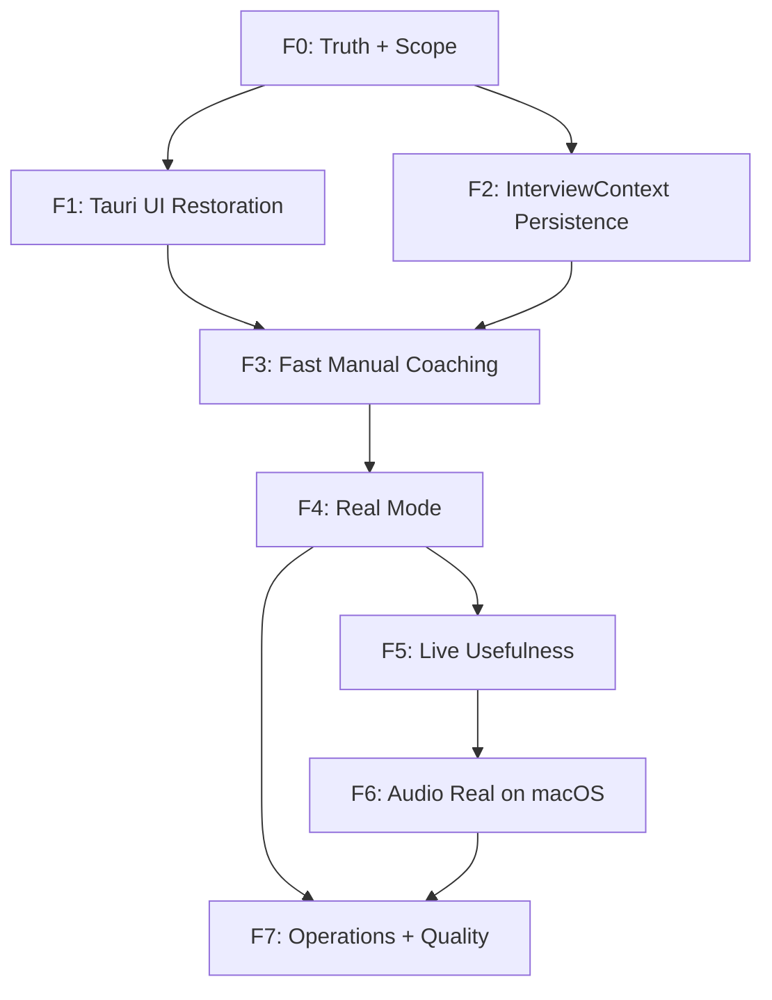

# Interview Coach — Closure Gap Matrix

**Generated**: 2026-03-13  
**Updated**: 2026-03-13 (F0 — canonical scope established)  
**Scope**: Full repository audit vs frozen architecture + Z.ai baseline  
**Truth labels**: functional · partial · stub · demo · broken · missing · deprecated

---

## Section 0: Canonical Product Decisions

The following product decisions are **fixed** as of F0 and govern all subsequent closure work (F1–F7). Any change requires explicit stakeholder approval.

| # | Decision |
|---|----------|
| 1 | **Tauri is the canonical final UI.** The Next.js web app (`src/`) is preview/dev/reference only — not the final product. |
| 2 | **Preparation/manual mode shows FULL RESPONSES as the primary visible artifact.** Not bullets. |
| 3 | **Live mode shows FULL RESPONSES as the primary visible artifact.** Not bullets. |
| 4 | **Bullets may exist internally or as a secondary element**, but they are NOT the primary user-facing output in either mode. |
| 5 | **CV intake + AI CV analysis + saved profile + company/role context are mandatory capabilities.** All must work in the Tauri canonical UI. |
| 6 | **InterviewContext persistence is mandatory** — profile, company, style, language survive app restart. |
| 7 | **Clear user guide and developer runbook are mandatory for closure.** |
| 8 | **Package health and quality gates must be truthful and reproducible.** |

### UX Implication

The prior "bullets-first" language described an *internal pipeline optimization* (emit structured bullets before the full response is ready, reducing perceived latency). **The user-facing primary artifact in both preparation and live mode is now the FULL RESPONSE.** Bullets may appear as a secondary loading indicator or supporting detail, but the primary display element is the complete response.

### Architecture Implication

The frozen architecture stack is unchanged:
- Tauri 2 + Rust audio + Python/FastAPI + React/TS + PostgreSQL/pgvector + explicit pipeline + QualityGate + LanguagePolicy + ConversationTracker

What changes is the **presentation layer contract**: the Emitter and frontend must display full responses as primary, with bullets as optional secondary.

---

## Section 1: Executive Summary

The repository is **architecturally sound but product-incomplete**. The frozen architecture (Tauri 2 + Rust audio + Python/FastAPI + React/TS + PostgreSQL/pgvector + explicit pipeline) is structurally present. However, critical product gaps prevent the system from being a usable live interview coach:

1. **Two divergent UIs** — The Next.js web UI (`src/app/page.tsx`) is the more feature-complete surface (CV intake, style selector, coach components, shadcn UI library). The Tauri desktop UI (`tauri-app/src/App.tsx`) is a self-contained monolith with inline forms, no shared components, no CV intake, and no style selector. The Tauri app is supposed to be canonical per the frozen architecture but has fewer features.

2. **Audio-to-backend bridge is missing** — Real ScreenCaptureKit capture exists in Rust, but captured frames are buffered in-process with **no IPC forwarding** to the Python backend. The STT adapter is never called by real audio data. The entire audio → transcript → pipeline chain only works via manual text input.

3. **No real STT integration in live path** — The Deepgram STT adapter exists but is never invoked by the live pipeline. The `RealtimePipeline` receives pre-transcribed text, never raw audio.

4. **Session persistence is incomplete** — `SessionRepository` and `PersistQueue` exist but are not called by the WebSocket pipeline handler. Sessions live only in memory during a WebSocket connection.

5. **Real mode requires external services** — When `ANTHROPIC_API_KEY` + Docker PostgreSQL are running, the backend genuinely produces real LLM-powered suggestions and real pgvector retrieval. Without them, everything falls back to demo mode. This is correctly labeled.

6. **Test suite is healthy** — 217 tests collected, 78 unit tests passing, contract/integration tests passing. Test infrastructure is solid.

7. **InterviewContext does not persist across restart** — Profile, company, style, and language settings are held in React component state and lost on page reload or app restart.

8. **Full responses are the primary UX artifact** — Per Section 0, the product must display full responses as the primary output. The current pipeline emits bullets-first internally, which is valid as a latency optimization, but the UI contract must be updated to show full responses as primary.

---

## Section 2: Architecture Comparison Table

| Architecture Requirement | Status | Evidence |
|---|---|---|
| **Tauri 2 desktop shell** | **partial** | [`tauri-app/src-tauri/Cargo.toml`](tauri-app/src-tauri/Cargo.toml) uses `tauri = "2.0"`. Shell launches, loads webview, exposes IPC commands. But UI is a monolith with duplication; not the canonical product experience yet. |
| **Rust native audio capture** | **partial** | [`macos_capture.rs`](tauri-app/src-tauri/src/audio/macos_capture.rs:1) has real ScreenCaptureKit stream setup, audio callback, normalization to 16kHz mono via [`router.rs`](tauri-app/src-tauri/src/audio/router.rs:76). Frames buffered in `Vec<AudioFrame>` but **no IPC bridge** to Python backend. [`commands.rs`](tauri-app/src-tauri/src/commands.rs:52) `start_capture` returns `Ok(())` without actually wiring the capture output anywhere. |
| **Python 3.11+ / FastAPI / WebSocket** | **functional** | [`server.py`](python-core/api/server.py:90) creates FastAPI app with health, `/api/suggest`, `/ws/pipeline`. WebSocket handler manages full session lifecycle. Pipeline processes questions through all steps. |
| **React + TypeScript UI** | **functional** | Both UIs use React + TS. Next.js UI uses shadcn components and has full component tree. Tauri UI is plain Tailwind with inline code. |
| **PostgreSQL + pgvector** | **functional** | [`database.py`](python-core/storage/database.py:1) uses asyncpg. [`docker-compose.yml`](docker-compose.yml) provisions PostgreSQL 17 + pgvector. [`evidence_retriever.py`](python-core/pipeline/steps/evidence_retriever.py:48) queries pgvector with semantic similarity. [`001_initial_schema.sql`](python-core/storage/migrations/001_initial_schema.sql) defines full schema with vector columns. |
| **Explicit pipeline** | **functional** | [`realtime_pipeline.py`](python-core/pipeline/realtime_pipeline.py:64) implements the chain: TurnAssembler → LanguagePolicy → QuestionAnalyzer → RetrievalPlanner → EvidenceRetriever → ResponseComposer → QualityGate. Missing: AudioReceiver and STTAdapter are not wired into the live pipeline (text arrives pre-transcribed). Emitter is inline in the WebSocket handler, not a standalone step. |
| **Quality gate flow: Draft → Validate → Repair → Expose** | **functional** | [`quality_gate.py`](python-core/pipeline/steps/quality_gate.py:37) implements validate with 6 checks (metric repetition, contradictions, sub-question coverage, language mismatch, word count, style check). Repair and expose are handled in `process()` and `process_bullets()`. |

### Pipeline Step Mapping

| Frozen Step | Implementation | Status |
|---|---|---|
| AudioReceiver | Not implemented as a pipeline step | **missing** |
| STTAdapter | [`stt_adapter.py`](python-core/adapters/stt_adapter.py:56) has `DeepgramSTTAdapter` | **partial** — exists but not invoked by live pipeline |
| TurnAssembler | [`turn_assembler.py`](python-core/pipeline/steps/turn_assembler.py:46) | **partial** — exists but bypass in practice since text arrives pre-assembled |
| LanguagePolicy | [`language_policy.py`](python-core/pipeline/steps/language_policy.py:49) | **functional** — es/en detection with bilingual rules |
| QuestionAnalyzer | [`question_analyzer.py`](python-core/pipeline/steps/question_analyzer.py:1) | **functional** — pattern-based + optional LLM analysis |
| RetrievalPlanner | [`retrieval_planner.py`](python-core/pipeline/steps/retrieval_planner.py:21) | **functional** — generates query plans from analysis |
| EvidenceRetriever | [`evidence_retriever.py`](python-core/pipeline/steps/evidence_retriever.py:48) | **functional** — real pgvector when DB available, mock fallback |
| ResponseComposer | [`response_composer.py`](python-core/pipeline/steps/response_composer.py:72) | **functional** — real LLM with structured output (bullets + full response), demo fallback |
| QualityGate | [`quality_gate.py`](python-core/pipeline/steps/quality_gate.py:37) | **functional** — 6 validation checks + repair |
| Emitter | Inline in [`server.py`](python-core/api/server.py:584) WebSocket handler | **partial** — no standalone Emitter class; events sent directly via `websocket.send_json()` |

---

## Section 3: Z.ai Baseline Feature Comparison

| Z.ai Feature | Next.js UI | Tauri UI | Backend | Overall |
|---|---|---|---|---|
| **CV intake - upload + parse** | **functional** — [`CVIntake.tsx`](src/components/coach/CVIntake.tsx:48) supports paste and .txt/.md upload, calls `/api/coach/analyze-cv` | **missing** — no CV intake component in [`App.tsx`](tauri-app/src/App.tsx:141) | **functional** — [`/api/analyze-cv`](python-core/api/server.py:380) with real/demo/fallback | **partial** — missing in Tauri |
| **AI CV analysis** | **functional** — calls analyze-cv, displays mode badge, extracts structured profile | **missing** | **functional** — [`cv_analyzer.py`](python-core/pipeline/steps/cv_analyzer.py:59) with LLM extraction | **partial** — missing in Tauri |
| **Saved candidate profile** | **functional** — [`CandidateProfileForm.tsx`](src/components/coach/CandidateProfileForm.tsx) with rich fields (name, email, role, company, skills, achievements, education, languages, certifications, linkedIn, portfolio, summary, rawResume) | **partial** — inline form in [`App.tsx`](tauri-app/src/App.tsx:764) with limited fields (name, email, role, company, years, summary, skills, achievements as comma-separated strings) | **functional** — profile stored in DB via `_persist_cv_profile()` | **partial** — Tauri has thin profile |
| **Company/role context** | **functional** — [`CompanyInfoForm.tsx`](src/components/coach/CompanyInfoForm.tsx) with rich fields (company name, industry, size, description, values, culture, position title, level, department, description, requirements, salary range, location, work mode, job posting URL, notes) | **partial** — inline form in [`App.tsx`](tauri-app/src/App.tsx:819) with limited fields (company name, industry, position title, description, requirements, culture) | **functional** — full context objects forwarded to pipeline via `interview_config` | **partial** — Tauri has thin version |
| **Style selector** | **functional** — [`StyleSelector.tsx`](src/components/coach/StyleSelector.tsx) as dedicated component with descriptions | **partial** — 4 buttons in [`App.tsx`](tauri-app/src/App.tsx:866) (mixed, executive, commercial, technical) without descriptions | **functional** — `ResponseStyle` enum used in pipeline | **partial** — Tauri has minimal version |
| **Manual coaching path** | **functional** — [`QuestionInput.tsx`](src/components/coach/QuestionInput.tsx:41) calls `/api/coach/suggest`, shows processing state | **functional** — inline in [`App.tsx`](tauri-app/src/App.tsx:524) posts to `/api/suggest` with candidate/company context | **functional** — `/api/suggest` runs full pipeline | **functional** |
| **Full response display** | **functional** — [`SuggestionDisplay.tsx`](src/components/coach/SuggestionDisplay.tsx:54) shows full response + key points + tips + copy button | **functional** — inline in [`App.tsx`](tauri-app/src/App.tsx:897) shows bullets + full response + metadata | **functional** — returns bullets + full_response + key_metrics + confidence | **functional** |
| **Session management** | **partial** — `useRealtimeWebSocket` manages WS session state, but no session persistence UI (save/load/history) | **partial** — WS session lifecycle in App.tsx but no persistence UI | **partial** — session repo exists in [`session_repo.py`](python-core/storage/session_repo.py:12) but WS handler does not call it | **partial** — no persistent session history |
| **InterviewContext persistence** | **missing** — state lives in React hooks, lost on refresh | **missing** — state lives in React state, lost on restart | **partial** — DB schema supports it, but no load-on-startup flow | **missing** — mandatory per Section 0 Decision 6 |

---

## Section 4: Two-UI Divergence Analysis

### Canonical UI Decision

> **Per Section 0, Decision 1: Tauri is the canonical final UI.** The Next.js web app (`src/`) serves as a preview/dev/reference surface only. It is NOT the shipped product and will NOT be maintained for feature parity beyond its reference role.

All product-facing features must work in the Tauri desktop app. The Next.js UI is useful for:
- Rapid frontend development iteration
- Backend API testing via browser
- Reference implementation for component behavior

But it is explicitly **not the product**.

### Feature Comparison Table

| Feature | Next.js UI - `src/app/page.tsx` - PREVIEW ONLY | Tauri UI - `tauri-app/src/App.tsx` - CANONICAL |
|---|---|---|
| **Component architecture** | Modular — 6 coach components + 4 realtime components + shadcn library + hooks | Monolithic — ~1227 lines in single App.tsx, no shared components |
| **UI library** | shadcn/ui with Cards, Badges, Alerts, Tabs, Collapsibles, Buttons, Inputs | Plain Tailwind CSS, no component library |
| **CV intake** | ✅ `CVIntake` component with paste + file upload | ❌ Missing — **must be added in F1** |
| **AI CV analysis** | ✅ Calls analyze-cv, displays mode badge | ❌ Missing — **must be added in F1** |
| **Candidate profile** | ✅ Rich form with 13+ fields via `CandidateProfileForm` | ⚠️ Inline form with 8 basic fields — **must be enriched in F1** |
| **Company info** | ✅ Rich form with 15+ fields via `CompanyInfoForm` | ⚠️ Inline form with 6 basic fields — **must be enriched in F1** |
| **Style selector** | ✅ Dedicated component with descriptions | ⚠️ 4 plain buttons — **must be improved in F1** |
| **Manual coaching** | ✅ `QuestionInput` + `SuggestionDisplay` components | ✅ Inline textarea + inline display |
| **Full response as primary** | ✅ Shows full response as main content | ⚠️ Shows full response but bullets displayed equally — **must prioritize full response in F1** |
| **Live session** | ✅ Official `SessionControlPanel`, `AudioSettingsPanel`, `LiveTranscriptPanel`, `RealtimeSuggestionPanel` | ✅ Inline session control, audio settings, transcript, suggestion panels |
| **Audio capture controls** | ❌ Stub — shows "Requires Tauri Desktop" | ✅ Tauri IPC commands for capture start/stop, permission checks, device listing |
| **Backend health check** | ✅ Via Next.js API proxy `/api/coach/backend-health` | ✅ Direct fetch to `http://localhost:8000/health` |
| **WebSocket** | ✅ Via `useRealtimeWebSocket` hook with full lifecycle | ✅ Inline WebSocket management with `wsRef` |
| **Architecture notice** | ✅ Shows "This is NOT the application" warning | ✅ Labels as "Tauri product shell • Task R5.2" |
| **Staged rendering** | ✅ Staged events handled in hook | ✅ Staged events handled in `handleWsEvent` |
| **Session persistence** | ❌ No save/load session UI | ❌ No save/load session UI — **mandatory in F2** |
| **InterviewContext persistence** | ❌ Lost on refresh | ❌ Lost on restart — **mandatory in F2** |
| **Context flow to live** | ✅ Full candidate + company objects passed in `sessionConfig` | ✅ Full candidate + company objects passed in `start_session` |

### Verdict

The **Next.js UI is more feature-complete** for the preparation/manual coaching path (CV intake, rich forms, component modularity). The **Tauri UI has the native audio controls** that the Next.js UI cannot have. Neither is complete.

To make Tauri the canonical UI (as required by Section 0):
1. Port CV intake + AI CV analysis to Tauri (F1)
2. Enrich Tauri profile/company forms to match Next.js richness (F1)
3. Extract style selector into a proper component (F1)
4. Make full responses the primary display, bullets secondary (F1/F3)
5. Add InterviewContext persistence — profile, company, style, language survive restart (F2)
6. The inline monolith approach in App.tsx will not scale; needs component extraction (F1)
7. The Next.js UI should become explicitly labeled as dev-only surface (F1)

---

## Section 5: Component Classification

### a) Reusable — works and fits the frozen architecture

| Component | Location | Notes |
|---|---|---|
| Python backend server | [`python-core/api/server.py`](python-core/api/server.py) | Health, suggest, analyze-cv, WebSocket — all functional |
| Realtime pipeline | [`python-core/pipeline/realtime_pipeline.py`](python-core/pipeline/realtime_pipeline.py) | Orchestrates full pipeline with staged output |
| Question analyzer | [`python-core/pipeline/steps/question_analyzer.py`](python-core/pipeline/steps/question_analyzer.py) | Pattern + LLM analysis, compound question decomposition |
| Language policy | [`python-core/pipeline/steps/language_policy.py`](python-core/pipeline/steps/language_policy.py) | es/en with bilingual rules |
| Quality gate | [`python-core/pipeline/steps/quality_gate.py`](python-core/pipeline/steps/quality_gate.py) | 6 checks, Draft→Validate→Repair→Expose |
| Response composer | [`python-core/pipeline/steps/response_composer.py`](python-core/pipeline/steps/response_composer.py) | Real LLM + structured output callback + demo fallback |
| Evidence retriever | [`python-core/pipeline/steps/evidence_retriever.py`](python-core/pipeline/steps/evidence_retriever.py) | Real pgvector + demo fallback |
| CV analyzer | [`python-core/pipeline/steps/cv_analyzer.py`](python-core/pipeline/steps/cv_analyzer.py) | Real LLM extraction + demo fallback |
| Conversation tracker | [`python-core/conversation/tracker.py`](python-core/conversation/tracker.py) | Claims, metrics, topics tracking |
| Retrieval planner | [`python-core/pipeline/steps/retrieval_planner.py`](python-core/pipeline/steps/retrieval_planner.py) | Query planning from analysis |
| Turn assembler | [`python-core/pipeline/steps/turn_assembler.py`](python-core/pipeline/steps/turn_assembler.py) | Partial-to-final assembly logic |
| Contracts/models | [`python-core/contracts/models.py`](python-core/contracts/models.py) | Clean Pydantic models for entire pipeline |
| Provider registry | [`python-core/adapters/provider_registry.py`](python-core/adapters/provider_registry.py) | YAML-based alias resolution |
| LLM adapter | [`python-core/adapters/llm_adapter.py`](python-core/adapters/llm_adapter.py) | Anthropic + OpenAI + demo adapters |
| Database layer | [`python-core/storage/database.py`](python-core/storage/database.py) | asyncpg pool, clean API |
| Embedding utils | [`python-core/storage/embedding_utils.py`](python-core/storage/embedding_utils.py) | Deterministic hash embeddings for testing |
| Schema migration | [`python-core/storage/migrations/001_initial_schema.sql`](python-core/storage/migrations/001_initial_schema.sql) | Full pgvector schema |
| Styles registry | [`python-core/styles/registry.py`](python-core/styles/registry.py) | Style definitions |
| Docker compose | [`docker-compose.yml`](docker-compose.yml) | PostgreSQL + pgvector |
| Providers config | [`config/providers.yaml`](config/providers.yaml) | STT, LLM, embedding alias config |
| Audio router | [`tauri-app/src-tauri/src/audio/router.rs`](tauri-app/src-tauri/src/audio/router.rs) | Normalization + chunking to 16kHz mono |
| Audio mod | [`tauri-app/src-tauri/src/audio/mod.rs`](tauri-app/src-tauri/src/audio/mod.rs) | Platform abstraction trait |
| Test fixtures | [`tests/fixtures/`](tests/fixtures/) | Question bank + CTO profile |
| Unit tests | [`tests/unit/`](tests/unit/) | 5 test files, 78 passing |
| Integration tests | [`tests/integration/`](tests/integration/) | 8 test files covering WS contract, pipeline, suggest mode, CV, E2E |
| Verification scripts | [`scripts/verify_package.sh`](scripts/verify_package.sh), [`scripts/test_package.sh`](scripts/test_package.sh) | Full verification pipeline |

### b) Valuable but orphaned — good code not wired into canonical path

| Component | Location | Notes |
|---|---|---|
| STT adapter - Deepgram | [`python-core/adapters/stt_adapter.py`](python-core/adapters/stt_adapter.py:56) | `DeepgramSTTAdapter` exists but pipeline never calls it; text arrives pre-transcribed |
| Session repository | [`python-core/storage/session_repo.py`](python-core/storage/session_repo.py) | CRUD for sessions table but WebSocket handler does not persist sessions |
| Persist queue | [`python-core/storage/persist_queue.py`](python-core/storage/persist_queue.py) | Async queue for DB writes but not integrated into pipeline |
| Next.js CVIntake | [`src/components/coach/CVIntake.tsx`](src/components/coach/CVIntake.tsx) | Fully working but only in Next.js UI — reference for Tauri port |
| Next.js CandidateProfileForm | [`src/components/coach/CandidateProfileForm.tsx`](src/components/coach/CandidateProfileForm.tsx) | Rich form — reference for Tauri port |
| Next.js CompanyInfoForm | [`src/components/coach/CompanyInfoForm.tsx`](src/components/coach/CompanyInfoForm.tsx) | Rich form — reference for Tauri port |
| Next.js StyleSelector | [`src/components/coach/StyleSelector.tsx`](src/components/coach/StyleSelector.tsx) | Dedicated component — reference for Tauri port |
| Next.js SuggestionDisplay | [`src/components/coach/SuggestionDisplay.tsx`](src/components/coach/SuggestionDisplay.tsx) | With copy/feedback — reference for Tauri port |
| Realtime components | [`src/components/realtime/`](src/components/realtime/) | 4 official panels (Session, Audio, Transcript, Suggestion) — reference for Tauri |
| useRealtimeWebSocket | [`src/hooks/realtime/useRealtimeWebSocket.ts`](src/hooks/realtime/useRealtimeWebSocket.ts) | Full WS hook — reference for Tauri |
| Session store | [`src/lib/session-store.ts`](src/lib/session-store.ts) | File-based session persistence, orphaned from active flows |
| Next.js API routes | [`src/app/api/coach/`](src/app/api/coach/) | Proxy routes (suggest, analyze-cv, sessions, demo/process, backend-health) — only useful for Next.js dev preview |
| ScreenCaptureKit capture | [`tauri-app/src-tauri/src/audio/macos_capture.rs`](tauri-app/src-tauri/src/audio/macos_capture.rs) | Real capture works but frames go nowhere (buffered in-process) |
| Latency benchmarks | [`tests/benchmarks/test_latency_benchmarks.py`](tests/benchmarks/test_latency_benchmarks.py) | Benchmark infrastructure exists |
| Simulation runner | [`tests/simulations/test_simulation_runner.py`](tests/simulations/test_simulation_runner.py) | Multi-turn simulation framework |
| Stability tests | [`tests/stability/test_long_running.py`](tests/stability/test_long_running.py) | Long-running session tests |

### c) Broken — exists but doesn't work

| Component | Location | Notes |
|---|---|---|
| Audio-to-backend bridge | [`tauri-app/src-tauri/src/commands.rs`](tauri-app/src-tauri/src/commands.rs:52) | `start_capture()` returns `Ok(())` without wiring output. Comment says "In a real app, we'd use the app state to manage the capture" |
| Tauri AppState mic_capture | [`tauri-app/src-tauri/src/commands.rs`](tauri-app/src-tauri/src/commands.rs:11) | `AppState.mic_capture` is defined but never used by `start_capture` command |
| Audio-to-STT-to-pipeline chain | Not wired | Gap between Rust capture → STT adapter → pipeline `process_question` |

### d) Deprecated — should not be used

| Component | Location | Notes |
|---|---|---|
| Event bus contract test | [`tests/integration/test_event_bus_contract.py`](tests/integration/test_event_bus_contract.py) | Tests legacy event names (marked LEGACY in prior assessment) |
| deprecated/ directory | `deprecated/` | Listed in README as containing old `examples/websocket/` but directory is blocked by .kilocodeignore |
| Prisma/SQLite | Removed | No longer in package.json |
| next-auth | Removed | No longer in package.json |
| z-ai-web-dev-sdk | Removed | No longer in package.json |
| mini-services | [`mini-services/`](mini-services/) | Contains a near-empty package.json, appears unused |

---

## Section 6: Backend Pipeline Reality Check

| Pipeline Step | Real Implementation? | Calls External Service? | Default Mode | What's Missing for Real Mode? |
|---|---|---|---|---|
| **AudioReceiver** | ❌ No pipeline step | N/A | N/A | Not implemented as a step; audio enters as pre-transcribed text |
| **STTAdapter** | ✅ `DeepgramSTTAdapter` exists | ✅ Deepgram API | Never invoked | Wire Rust audio frames → STT adapter → pipeline |
| **TurnAssembler** | ✅ Class exists | No | Bypassed | Text arrives as complete turns; assembler logic not exercised in live path |
| **LanguagePolicy** | ✅ Real heuristic | No - local | Active | Nothing — works as-is |
| **QuestionAnalyzer** | ✅ Real pattern + optional LLM | ✅ LLM when `use_llm=True` | Pattern-based | Nothing critical — pattern-based is fast and functional |
| **RetrievalPlanner** | ✅ Real | No - local | Active | Nothing — works as-is |
| **EvidenceRetriever** | ✅ Real pgvector queries | ✅ PostgreSQL + pgvector | Auto - real when DB connected | `EVIDENCE_RETRIEVER_MODE=real` + running PostgreSQL + seeded embeddings |
| **ResponseComposer** | ✅ Real LLM generation | ✅ Anthropic/OpenAI | Auto - real when keys present | `ANTHROPIC_API_KEY` or `OPENAI_API_KEY` |
| **QualityGate** | ✅ Real validation | No - local | Active | Nothing — works as-is |
| **Emitter** | ⚠️ Inline in WS handler | No | Inline `send_json()` | Extract to standalone step with event bus; add persistence |

### Mode Determination Logic

In [`server.py`](python-core/api/server.py:160):
- `check_api_keys_available()` checks for `ANTHROPIC_API_KEY` or `OPENAI_API_KEY`
- If present → `use_real=True` → `PipelineConfig(use_real_llm=True, use_real_embeddings=True)`
- Real mode is genuine: actual LLM calls verified with provider/model metadata in response
- Fallback is graceful and explicitly labeled

### Latency Reality

Per [`config/status.json`](config/status.json:27):
- `/api/suggest` latency: ~8429ms (real mode)
- Bullets latency: ~3710ms (staged emission)
- Full response: ~8383ms
- Staged emission gives ~55% perceived latency improvement

The full response at ~8.4s is acceptable for manual/preparation mode but needs optimization for live interviews. The staged emission model (show bullets early while full response finishes) remains a valid internal optimization.

---

## Section 7: Critical Gaps for Closure (F0–F7)

### F1: Restore Product Value Inside Tauri

| Gap | Severity | Details |
|---|---|---|
| **Tauri UI lacks CV intake** | HIGH | No way to upload/paste CV in desktop app. Must port from Next.js or implement natively. |
| **Tauri UI lacks AI CV analysis** | HIGH | No way to analyze a CV and extract structured profile in Tauri. Backend endpoint exists. |
| **Tauri profile form is thin** | MEDIUM | Missing: education, languages, certifications, linkedIn, portfolio, rawResume fields. Just comma-separated strings for skills/achievements. |
| **Tauri company form is thin** | MEDIUM | Missing: company size, description, values, position level, department, salary range, location, work mode, job posting URL, notes fields. |
| **Tauri has no component library** | MEDIUM | ~1227 lines in single App.tsx with inline everything. Needs component extraction for maintainability. |
| **Style selector is minimal** | LOW | 4 buttons without descriptions vs dedicated component in Next.js. |
| **Full response is not primary display** | HIGH | Currently bullets and full response are displayed equally. Full response must be primary per Section 0. |
| **No session save/load UI** | MEDIUM | Neither UI exposes session persistence (save interview prep, resume later). |

### F2: InterviewContext Persistence

| Gap | Severity | Details |
|---|---|---|
| **Profile lost on restart** | HIGH | Candidate profile data (raw CV, parsed fields, skills, achievements) is held in React state only. |
| **Company context lost on restart** | HIGH | Company name, role, requirements, culture — all lost on restart. |
| **Style/language lost on restart** | MEDIUM | User's chosen coaching style and language preference are not persisted. |
| **Session defaults not reloadable** | MEDIUM | No mechanism to restore previous session configuration on app launch. |

### F3: Fast Manual Coaching Path

| Gap | Severity | Details |
|---|---|---|
| **Manual path latency ~8.4s** | HIGH | Real mode takes ~8.4s for full suggest. Needs latency optimization — fast model for initial pass, streaming, or caching. |
| **No streaming in manual path** | MEDIUM | Manual suggest uses single HTTP POST, waits for complete response. Could benefit from streaming for progressive display. |
| **Full response must be primary** | HIGH | Manual coaching should display the full response as primary, with bullets as secondary supporting detail. |
| **Rich context forwarding** | MEDIUM | All profile/company fields must flow from Tauri forms to suggest endpoint. |

### F4: Real Mode

| Gap | Severity | Details |
|---|---|---|
| **Real pgvector retrieval path** | LOW | Already functional — just ensure seeds and imports work cleanly. |
| **Real LLM generation** | LOW | Already functional when API keys present. |
| **Real CV analysis** | LOW | Already functional. |
| **Demo as explicit fallback** | MEDIUM | Ensure demo mode is clearly labeled and never masquerades as real. Already mostly done. |

### F5: Live Usefulness

| Gap | Severity | Details |
|---|---|---|
| **Session lifecycle** | MEDIUM | WebSocket sessions work but are not persisted to DB. Wire `SessionRepository`. |
| **Conversation tracker** | LOW | Already functional. |
| **Full response in live mode** | HIGH | Live mode must show full responses as primary per Section 0. Current live path emits staged events (bullets then full). |
| **Manual text fallback** | LOW | Already works — text input into live session works via WS. |
| **Session persistence to DB** | MEDIUM | `SessionRepository` and `PersistQueue` exist but are not called by WS handler. |

### F6: Audio Real on macOS

| Gap | Severity | Details |
|---|---|---|
| **Audio-to-backend bridge** | CRITICAL | The biggest product blocker for live audio. Frames captured in Rust but never forwarded. |
| **STT not wired** | HIGH | Deepgram adapter exists but is never called. Audio → STT → pipeline chain doesn't exist. |
| **Microphone capture** | HIGH | `mic_capture.rs` exists with cpal but is not integrated into the pipeline. |
| **IPC bridge from Tauri to backend** | CRITICAL | Frames are `take_frames()` in-process. No Tauri command or event emits them to the WebSocket pipeline. |
| **Tauri capture commands are stubs** | HIGH | `start_capture()` returns `Ok(())` without doing real work. `stop_capture()` is a no-op. |
| **Permission UX** | MEDIUM | Permission checks exist but granting flow depends on macOS system dialogs. No in-app guidance for denied state. |

### F7: Operations + Quality Closure

| Gap | Severity | Details |
|---|---|---|
| **No CI pipeline** | MEDIUM | `.github/workflows/ci.yml` does not exist. Tests run locally only. |
| **No profile import script** | MEDIUM | `scripts/import_profile_embeddings.py` referenced but missing. |
| **Execution plan is stale** | LOW | [`config/execution_plan.yaml`](config/execution_plan.yaml) references old phases, not the F0–F7 closure phases. |
| **status.json claims release_hardening_complete** | LOW | But audio bridge and Tauri UI gaps remain. |
| **User guide incomplete** | MEDIUM | Initial draft created in F0; must be finalized. |
| **Developer runbook incomplete** | MEDIUM | Initial draft created in F0; must be finalized. |
| **verify_package must be truthful** | HIGH | All gates must pass reproducibly. |

---

## Section 8: Closure Phase Sequence (F0–F7)

### F0: Truth + Canonical Scope ← THIS DOCUMENT ✅

Establish the canonical product decisions, update the gap matrix, create initial user guide and developer runbook.

### F1: Restore Product Value Inside Tauri
- Port CV intake to Tauri (paste + text file) + AI CV analysis
- Enrich candidate profile form (add education, certifications, languages, linkedIn, summary richness)
- Enrich company form (add company size, values, position level, department)
- Add proper style selector with descriptions
- Make full response the primary display artifact (bullets secondary)
- Extract Tauri App.tsx monolith into components
- **Gate**: Tauri preparation mode has CV intake, AI analysis, rich profile, rich company, style selector, full-response-primary suggestion display

### F2: InterviewContext Persistence
- Persist raw CV text + parsed profile fields
- Persist company context (name, role, requirements, culture)
- Persist style and language preferences
- Persist session defaults
- Load all context on app startup (reloadable after restart)
- **Gate**: Close Tauri, reopen — all profile/company/style/language context is restored

### F3: Fast Manual Coaching Path
- Optimize `/api/suggest` latency (streaming, faster model alias for initial pass, caching)
- Wire full profile context from Tauri forms to suggest endpoint
- Full response as primary display, bullets as secondary
- Add progressive display in Tauri (show loading state, then full response)
- **Gate**: Manual suggest shows full response as primary; rich context flows end-to-end

### F4: Real Mode
- Verify real pgvector retrieval end-to-end with seeded embeddings
- Verify real LLM response path with provider/model metadata
- Verify real CV analysis with structured extraction
- Demo mode always explicitly labeled as fallback
- **Gate**: With API keys + PostgreSQL, entire pipeline runs in real mode with no demo fallback

### F5: Live Usefulness
- Wire `SessionRepository` into WebSocket handler (persist sessions to DB)
- Wire `PersistQueue` for async writes
- Full response as primary in live mode suggestion events
- Manual text fallback confirmed working
- Harden conversation tracker across multi-turn sessions
- **Gate**: Live WS session persists to DB; full responses displayed as primary; tracker maintains state across turns

### F6: Audio Real on macOS
- Wire IPC: captured AudioFrame from Rust → Tauri event/command → WebSocket → STT → pipeline
- Complete `start_capture`/`stop_capture` commands to actually manage capture lifecycle
- Wire microphone capture path alongside system audio
- Wire STT adapter (Deepgram) into pipeline for audio input path
- Permission UX improvements
- **Gate**: Audio from real meeting → transcript visible → full response suggestion displayed in Tauri

### F7: Operations + Quality Closure
- Finalize `docs/USER_GUIDE.md`
- Finalize `docs/DEVELOPER_RUNBOOK.md`
- Create `.github/workflows/ci.yml` for macOS/Ubuntu/Windows matrix
- Create profile embedding import script
- Update `config/execution_plan.yaml` to reflect F0–F7 phases
- Align `config/status.json` with reality
- Final package verification: `bash scripts/verify_package.sh` passes
- **Gate**: All docs match reality; CI green on macOS; `verify_package.sh` passes; quality gates truthful and reproducible

### Dependency Graph

F1 and F2 can proceed in parallel after F0. F3 depends on both F1 and F2. F4 depends on F3. F5 depends on F4. F6 depends on F5. F7 is the final gate, depending on F4 and F6.

---

*This document is the source of truth for all subsequent closure work. Do not sugarcoat. Verify claims against code before acting on them.*
