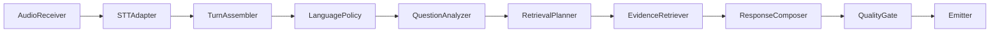
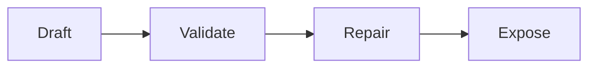

# Interview Coach — Developer Runbook

---

## Architecture

### Frozen Stack

The architecture is frozen at v3.2.1 unless explicit stakeholder approval is given for changes.

| Layer | Technology | Notes |
|---|---|---|
| **Desktop shell** | Tauri 2 | Canonical UI — the shipped product |
| **Native audio** | Rust (ScreenCaptureKit on macOS) | System audio + mic capture |
| **Backend** | Python 3.11+ / FastAPI / WebSocket | Core API and pipeline |
| **UI** | React + TypeScript (Vite in Tauri) | Tailwind CSS for styling |
| **Persistence** | PostgreSQL 17 + pgvector | Single data backbone |
| **Pipeline** | AudioReceiver → STTAdapter → TurnAssembler → LanguagePolicy → QuestionAnalyzer → RetrievalPlanner → EvidenceRetriever → ResponseComposer → QualityGate → Emitter | Explicit 10-step chain |
| **Quality Gate** | Draft → Validate → Repair → Expose | 6 validation checks |
| **Providers** | Anthropic Claude (LLM), Deepgram Nova-3 (STT), OpenAI (embeddings) | Resolved by alias via [`config/providers.yaml`](../config/providers.yaml) |

### Prohibited Technologies

Do **not** reintroduce these into the core path:
- SQLite / Prisma (replaced by PostgreSQL + pgvector)
- ChromaDB (replaced by pgvector)
- next-auth (not part of architecture)

### UX Contract (Section 0 Decisions)

- **Full responses are the primary user-facing artifact** in both preparation and live modes
- **Bullets are secondary** — may exist internally or as loading indicators
- **Tauri is the canonical UI** — Next.js is preview/dev/reference only

---

## Repository Structure

```
interview-coach/
├── AGENTS.md                     # Operating rules and product intent
├── README.md                     # Package status and quick start
├── docker-compose.yml            # PostgreSQL + pgvector container
├── package.json                  # Root Node.js dependencies (Next.js preview)
│
├── config/
│   ├── providers.yaml            # STT/LLM/embedding provider aliases
│   ├── status.json               # Package status (must match reality)
│   └── closure_quality_gates.md  # Closure acceptance criteria
│
├── docs/
│   ├── CLOSURE_GAP_MATRIX.md     # Gap analysis and closure sequence
│   ├── CLOSURE_QUALITY_GATES.md  # Quality gates and acceptance criteria
│   ├── DEVELOPER_RUNBOOK.md      # This document
│   ├── SUPPORT_MATRIX.md         # Platform support tiers
│   └── USER_GUIDE.md             # End-user guide
│
├── python-core/                  # ★ Backend core
│   ├── pyproject.toml            # Python dependencies
│   ├── main.py                   # Entrypoint (uvicorn launcher)
│   ├── api/
│   │   └── server.py             # FastAPI app: health, suggest, analyze-cv, WebSocket
│   ├── adapters/
│   │   ├── interfaces.py         # Abstract adapter interfaces
│   │   ├── llm_adapter.py        # Anthropic + OpenAI + demo LLM adapters
│   │   ├── provider_registry.py  # YAML-driven alias resolution
│   │   └── stt_adapter.py        # Deepgram STT adapter
│   ├── contracts/
│   │   └── models.py             # Pydantic models for entire pipeline
│   ├── conversation/
│   │   └── tracker.py            # Conversation state tracker (claims, metrics, topics)
│   ├── observability/
│   │   ├── latency.py            # Latency measurement utilities
│   │   └── setup.py              # OpenTelemetry setup
│   ├── pipeline/
│   │   ├── realtime_pipeline.py  # Pipeline orchestrator
│   │   └── steps/
│   │       ├── cv_analyzer.py        # CV extraction (real LLM + demo fallback)
│   │       ├── evidence_retriever.py # pgvector semantic retrieval
│   │       ├── language_policy.py    # es/en detection and bilingual rules
│   │       ├── quality_gate.py       # Draft→Validate→Repair→Expose
│   │       ├── question_analyzer.py  # Question type/intent/compound analysis
│   │       ├── response_composer.py  # LLM response generation
│   │       ├── retrieval_planner.py  # Query planning for evidence retrieval
│   │       └── turn_assembler.py     # Partial-to-final turn assembly
│   ├── storage/
│   │   ├── database.py           # asyncpg connection pool
│   │   ├── embedding_utils.py    # Hash-based test embeddings
│   │   ├── persist_queue.py      # Async DB write queue
│   │   ├── session_repo.py       # Session CRUD
│   │   └── migrations/
│   │       └── 001_initial_schema.sql  # Full pgvector schema
│   └── styles/
│       └── registry.py           # Response style definitions
│
├── tauri-app/                    # ★ Canonical desktop UI
│   ├── package.json              # Tauri frontend dependencies
│   ├── vite.config.ts            # Vite build config
│   ├── tsconfig.json             # TypeScript config
│   ├── tailwind.config.js        # Tailwind CSS config
│   ├── index.html                # HTML entry point
│   ├── src/
│   │   ├── App.tsx               # Main application component
│   │   ├── main.tsx              # React entry point
│   │   ├── styles.css            # Global styles
│   │   ├── components/
│   │   │   ├── coach/            # Coaching components (CVIntake, ProfileForm, etc.)
│   │   │   └── ui/               # shadcn/ui components
│   │   └── hooks/                # React hooks
│   └── src-tauri/
│       ├── Cargo.toml            # Rust dependencies (tauri 2.0, screencapturekit)
│       ├── tauri.conf.json       # Tauri app config (window, security, etc.)
│       ├── src/
│       │   ├── commands.rs       # Tauri IPC commands (capture, permissions, health)
│       │   └── audio/
│       │       ├── mod.rs        # Platform abstraction trait
│       │       ├── macos_capture.rs  # ScreenCaptureKit capture implementation
│       │       └── router.rs     # Audio normalization + chunking to 16kHz mono
│       └── icons/                # App icons
│
├── src/                          # Next.js preview UI (NOT canonical)
│   ├── app/
│   │   ├── page.tsx              # Main page orchestrator
│   │   ├── layout.tsx            # App layout
│   │   └── api/coach/            # API proxy routes to backend
│   ├── components/
│   │   ├── coach/                # Coaching components (reference for Tauri)
│   │   ├── realtime/             # Live session components (reference)
│   │   └── ui/                   # shadcn/ui component library
│   ├── hooks/                    # React hooks (WS, session, hotkeys)
│   └── lib/                      # Utilities (backend config, session store)
│
├── tests/                        # ★ Test suite
│   ├── conftest.py               # Shared pytest fixtures
│   ├── unit/                     # 5 files, 78+ passing tests
│   │   ├── test_contracts.py
│   │   ├── test_language_policy.py
│   │   ├── test_provider_registry.py
│   │   ├── test_quality_gate.py
│   │   └── test_question_bank.py
│   ├── integration/              # 8 files, contract + pipeline + E2E tests
│   │   ├── test_frontend_backend_ws_contract.py
│   │   ├── test_health_real.py
│   │   ├── test_pipeline_integration.py
│   │   ├── test_realtime_session_e2e.py
│   │   ├── test_realtime_ui_component_integration.py
│   │   ├── test_suggest_mode.py
│   │   └── test_ws_realtime_flow.py
│   ├── benchmarks/               # Latency benchmarks
│   ├── simulations/              # Multi-turn simulation scenarios
│   ├── stability/                # Long-running session tests
│   └── fixtures/                 # Test data (question bank, CTO profile)
│
├── scripts/                      # ★ Operations scripts
│   ├── bootstrap_macos.sh        # macOS dev environment setup
│   ├── bootstrap_linux.sh        # Linux dev environment setup
│   ├── bootstrap_windows.sh      # Windows dev environment setup
│   ├── bootstrap.sh              # Generic bootstrap
│   ├── doctor_macos.sh           # macOS environment health check
│   ├── doctor_linux.sh           # Linux environment health check
│   ├── doctor_windows.sh         # Windows environment health check
│   ├── doctor.sh                 # Generic doctor
│   ├── test_package.sh           # Test runner (quick/smoke/full modes)
│   ├── test_backend.sh           # Backend-only test runner
│   └── verify_package.sh         # Full package verification
│
└── handoff/kilo-close/           # Closure planning documents
```

### UI Architecture

- **`tauri-app/`** — Canonical desktop UI (Vite + React + TypeScript + Tailwind). This is the shipped product.
- **`src/`** — Next.js preview/dev/reference UI. NOT the final product. Useful as a reference implementation for component behavior and API integration patterns.

---

## Development Setup

### Prerequisites

Run the bootstrap script for your platform:

```bash
# macOS (Tier 1 — recommended)
bash scripts/bootstrap_macos.sh

# Linux
bash scripts/bootstrap_linux.sh

# Windows (via WSL2)
bash scripts/bootstrap_windows.sh
```

The bootstrap script checks/installs:
- Python 3.11+ (via Homebrew on macOS)
- Node.js 18+ / npm
- Bun (optional, used for Next.js preview)
- Rust + Cargo (required for Tauri)
- ScreenCaptureKit prerequisites (macOS 12.3+, Xcode CLI tools, Swift toolchain)
- Python packages from `python-core/pyproject.toml`
- Node packages from root `package.json`
- Docker availability check

### Backend

```bash
cd python-core

# Create and activate virtual environment (recommended)
python3 -m venv .venv
source .venv/bin/activate

# Install dependencies
pip install -e ".[dev]"

# Run server
uvicorn api.server:app --port 8000 --reload
```

The server starts with automatic mode detection:
- If `ANTHROPIC_API_KEY` or `OPENAI_API_KEY` is set → **real mode**
- If PostgreSQL is reachable → **real evidence retrieval**
- Otherwise → **demo/fallback mode** (explicitly labeled)

### Live STT Runtime Validation (L2-STT-05)

Use this to validate the real Deepgram-backed live STT path before moving to L3.

Prerequisites:
- Backend running on `http://127.0.0.1:8000`
- `DEEPGRAM_API_KEY` exported in your shell
- Optional: `ANTHROPIC_API_KEY` for real downstream response generation

Command:

```bash
# From project root
python scripts/validate_live_stt_runtime.py --ws-url ws://127.0.0.1:8000/ws/pipeline
```

What it validates:
- multiple `audio_data` messages in one websocket session
- first partial transcript latency (`first_partial_latency_ms`)
- first final transcript latency (`first_final_latency_ms`)
- stream lifecycle (`stream_open_observed`, `stream_close_observed`)
- provider error capture (`provider_errors`)

Expected success:
- `RESULT=PASS`
- non-null partial and final latency
- final latency greater than or equal to partial latency
- lifecycle flags set to true

Server-side runtime logs to inspect:
- `[WS][STT] stream_open ...`
- `[WS][STT] first_partial ...`
- `[WS][STT] first_final ...`
- `[WS][STT] provider_error ...` (only when provider fails)
- `[WS][STT] stream_close ...`

### L2-STT-06 Evidence Policy

- Runtime evidence must be persisted in [`docs/LIVE_STT_RUNTIME_EVIDENCE.md`](../docs/LIVE_STT_RUNTIME_EVIDENCE.md).
- If `DEEPGRAM_API_KEY` is missing/invalid, record a **blocked** run and do not claim real-provider STT validation success.
- Do not start L3 speaker/turn intelligence until L2-STT-06 has real-provider runtime evidence with measured latencies and lifecycle excerpts.
- If real-provider runtime is attempted but transcript events are STT error payloads (for example Deepgram `1011` / `net0001`), classify as **STT provider/runtime failure** (not passed, not L3-ready).

### L2-STT-07 Stabilization baseline

- Use a **single** Deepgram live path for validation runs:
  - endpoint: `/v1/listen`
  - model: `nova-3`
- Do not mix Flux `/v2/listen` in this stabilization task.
- Required runtime correlation logs per session:
  - app `session_id`
  - Deepgram `request_id`
  - first provider event type
  - first partial transcript event (if any)
  - final transcript event
  - utterance-end event (if any)

### L2-STT-08 Post-final lifecycle acceptance

- Keep the active runtime path constrained to Deepgram Nova-3 `/v1/listen` only.
- Required app-path lifecycle order for real-provider runs:
  1. send audio frames
  2. send Deepgram `KeepAlive` text frames every 3–5s when no audio is being sent
  3. send `Finalize` once audio input is complete
  4. keep receiving provider events (`Results`, `UtteranceEnd`, etc.)
  5. trigger downstream pipeline only on utterance-complete final condition
  6. wait for downstream `analysis` + `suggestion`
  7. send `CloseStream` only after downstream completion or explicit terminal failure

- Utterance-complete trigger must be one of:
  - `Results` with `is_final=true` and `speech_final=true`
  - `UtteranceEnd`
  - finalize-path final result handling when applicable

- Runtime validator command (extended timeout):

```bash
python scripts/validate_live_stt_runtime.py --ws-url ws://127.0.0.1:8000/ws/pipeline --timeout 120
```

- Runtime validation now requires all of:
  - non-error final transcript observed
  - `analysis` observed
  - `suggestion` observed
  - ordering `transcript -> analysis -> suggestion`
  - `finalize_sent_ms` observed
  - if `close_stream_sent_ms` is observed in transcript metadata, enforce `close_stream_sent_ms >= finalize_sent_ms`

- For deterministic real-provider validation, prefer real PCM16 audio input instead of synthetic placeholder payloads:

```bash
say -o /tmp/l2_stt_phrase.aiff "Tell me about your experience leading engineering teams and delivering measurable outcomes"
afconvert -f WAVE -d LEI16@16000 -c 1 /tmp/l2_stt_phrase.aiff /tmp/l2_stt_phrase.wav
python scripts/validate_live_stt_runtime.py \
  --ws-url ws://127.0.0.1:8000/ws/pipeline \
  --audio-file /tmp/l2_stt_phrase.wav \
  --timeout 180
```

- Instrumentation fields to capture from logs/events:
  - `keepalive_count` + keepalive timestamps
  - `finalize_sent_ms`
  - `close_stream_sent_ms`
  - `transcript_timestamp_ms`
  - `analysis_timestamp_ms`
  - `suggestion_timestamp_ms`
  - teardown timestamps (`teardown_ms`, `teardown_cancel_ms`)

- Current truthful state for this repository snapshot:
  - Code hardening for L2-STT-08 is implemented.
  - Real-provider runtime proof is blocked unless `DEEPGRAM_API_KEY` and backend real-mode prerequisites are present in the run environment.

Key endpoints:
- `GET http://localhost:8000/health` — Health check
- `POST http://localhost:8000/api/suggest` — Manual coaching
- `POST http://localhost:8000/api/analyze-cv` — CV analysis
- `WS ws://localhost:8000/ws/pipeline` — Live pipeline

### Frontend (Tauri — Canonical)

```bash
cd tauri-app

# Install Node dependencies
npm install

# Development mode (hot reload)
npm run tauri dev

# Production build
npm run tauri build
```

Requires macOS for full functionality (ScreenCaptureKit, audio capture). The UI loads in a native Tauri window and connects to `http://localhost:8000` for backend services.

### Frontend (Next.js — Preview Only)

```bash
# From project root
bun install   # or npm install
bun dev       # or npm run dev
```

Opens on `http://localhost:3000`. This is for development/testing only — **not the shipped product**.

### Database

```bash
# Start PostgreSQL + pgvector
docker-compose up -d

# Verify running
docker-compose ps

# Check logs
docker logs interview-coach-db

# Connect directly
docker exec -it interview-coach-db psql -U interview_coach -d interview_coach
```

Database credentials (configurable via environment):
- User: `interview_coach`
- Password: `interview_coach_dev`
- Database: `interview_coach`
- Port: `5432`

Schema migrations are automatically applied from `python-core/storage/migrations/` on container initialization.

---

## Testing

### Quick Reference

| Command | What it does | When to use |
|---|---|---|
| `bash scripts/test_package.sh quick` | Unit tests only (78+ tests) | Fast feedback during development |
| `bash scripts/test_package.sh smoke` | Collection + unit + contract + integration | Before committing |
| `bash scripts/test_package.sh full` | All tests | Before merging |
| `bash scripts/verify_package.sh` | Collection + unit + smoke + lint | Full package verification |

### Running Tests Directly

```bash
# Activate virtual environment (if using one)
cd python-core && source .venv/bin/activate && cd ..

# Run all unit tests
python3 -m pytest tests/unit -v

# Run specific test file
python3 -m pytest tests/unit/test_quality_gate.py -v

# Run integration tests
python3 -m pytest tests/integration -v

# Run with coverage
python3 -m pytest tests/unit --cov=python-core --cov-report=html

# Collect all tests (verify nothing is broken)
python3 -m pytest tests --collect-only -q
```

### Test Structure

| Directory | Purpose | Count | Notes |
|---|---|---|---|
| `tests/unit/` | Module-level unit tests | 78+ passing | No external dependencies needed |
| `tests/integration/` | Cross-module + API tests | 8 files | Some require backend running |
| `tests/benchmarks/` | Latency benchmarks | 1 file | Optional; for performance tracking |
| `tests/simulations/` | Multi-turn interview simulations | 1 file | Optional; for scenario testing |
| `tests/stability/` | Long-running session tests | 1 file | Optional; for reliability testing |
| `tests/fixtures/` | Test data | 2 modules | Question bank + CTO profile |

### Key Test Fixtures

- [`tests/fixtures/questions/question_bank.py`](../tests/fixtures/questions/question_bank.py) — Standard interview questions for testing
- [`tests/fixtures/profiles/cto_profile.py`](../tests/fixtures/profiles/cto_profile.py) — CTO profile with achievements and metrics

---

## Configuration

### providers.yaml

Located at [`config/providers.yaml`](../config/providers.yaml). Defines all external service providers by logical alias:

```yaml
providers:
  stt:
    primary:
      alias: "stt_primary"
      provider: "deepgram"
      model: "nova-3"
    fallback:
      alias: "stt_fallback"
      provider: "whisper_local"
      model: "medium"
  llm:
    main:
      alias: "llm_main"
      provider: "anthropic"
      model: "claude-sonnet-4-20250514"
    fast:
      alias: "llm_fast"
      provider: "anthropic"
      model: "claude-haiku-4-5-20251001"
  embedding:
    primary:
      alias: "embedding_primary"
      provider: "openai"
      model: "text-embedding-3-small"
      dimensions: 1536
```

**Alias convention**: All code references providers by alias (`llm_main`, `stt_primary`, `embedding_primary`). No model IDs appear in application code or SQL.

**Environment overrides**: Set `PROVIDER_LLM_MAIN_MODEL=claude-opus-4-20250514` to override a specific provider's model at runtime.

### Environment Variables

| Variable | Purpose | Required? | Default |
|---|---|---|---|
| `ANTHROPIC_API_KEY` | Anthropic API for LLM | Yes (or OPENAI) | — |
| `OPENAI_API_KEY` | OpenAI API for embeddings + fallback LLM | Yes (or ANTHROPIC) | — |
| `DEEPGRAM_API_KEY` | Deepgram API for STT | No | — |
| `POSTGRES_USER` | DB username | No | `interview_coach` |
| `POSTGRES_PASSWORD` | DB password | No | `interview_coach_dev` |
| `POSTGRES_DB` | DB name | No | `interview_coach` |
| `POSTGRES_PORT` | DB port | No | `5432` |
| `DATABASE_URL` | Full connection string override | No | Built from above |
| `EVIDENCE_RETRIEVER_MODE` | Force `real`/`demo` | No | Auto-detect |
| `PROVIDER_LLM_MAIN_MODEL` | Override main LLM model | No | From providers.yaml |
| `PROVIDER_STT_PRIMARY_PROVIDER` | Override primary STT provider | No | From providers.yaml |

### status.json

Located at [`config/status.json`](../config/status.json). Tracks component status, verification results, and phase progress. **Must match verifiable reality** — do not update without running verification commands.

---

## Pipeline Architecture

### Pipeline Flow



### Quality Gate Flow



Validation checks:
1. Metric repetition detection
2. Contradiction detection against conversation history
3. Sub-question coverage for compound questions
4. Language mismatch detection
5. Word count appropriateness
6. Style alignment check

### WebSocket Event Contract

Server → Client:

| Event | Payload | Purpose |
|---|---|---|
| `connected` | `{message, timestamp}` | Connection acknowledged |
| `session_started` | `{session_id, config, mode}` | Session ready |
| `analysis` | `{question_type, is_compound, sub_questions, ...}` | Question analysis result |
| `suggestion` | `{mode, bullets, full_response, confidence, ...}` | Generated response |
| `session_ended` | `{summary}` | Session completed with conversation summary |
| `error` | `{message}` | Error occurred |
| `pong` | `{}` | Keepalive response |

Client → Server:

| Event | Payload | Purpose |
|---|---|---|
| `start_session` | `{config: {...}}` | Begin session with interview context |
| `transcript_ready` | `{text, is_final, language}` | Transcribed text segment |
| `end_session` | `{}` | End current session |
| `ping` | `{}` | Keepalive check |

---

## Truth Labels

Use these labels consistently across all documentation and code:

| Label | Meaning |
|---|---|
| `functional` | Works, tested, verified |
| `demo` | Simulated — not using real external services |
| `partial` | Some paths work, some don't |
| `stub` | Placeholder code only |
| `deprecated` | Should not be used; scheduled for removal |

Never use `complete` unless the path is actually exercised and verified.

---

## Closure Phases (F0–F7)

| Phase | Name | Status | Depends On |
|---|---|---|---|
| **F0** | Truth + Canonical Scope | ✅ Complete | — |
| **F1** | Restore Product Value Inside Tauri | ✅ Complete | F0 |
| **F2** | InterviewContext Persistence | ✅ Complete | F1 |
| **F3** | Fast Manual Coaching Path | ✅ Complete | F1, F2 |
| **F4** | Real Mode | ✅ Complete | F3 |
| **F5** | Live Usefulness | ✅ Complete | F4 |
| **F6** | Audio Real on macOS | ⚠️ Partial | F5 |
| **F7** | Operations + Quality Closure | ✅ Complete | F4, F6 |

See [`docs/CLOSURE_QUALITY_GATES.md`](CLOSURE_QUALITY_GATES.md) for detailed gate criteria per phase.

### Output Discipline

For every task, the developer must return:

1. Files changed
2. Exact commands run
3. Tests run
4. Acceptance proof
5. Blockers
6. Next task

No "done" without proof.

---

## Common Development Tasks

### Adding a New Pipeline Step

1. Create step class in `python-core/pipeline/steps/`
2. Implement an async method matching the step interface
3. Wire into [`realtime_pipeline.py`](../python-core/pipeline/realtime_pipeline.py)
4. Add unit tests in `tests/unit/`
5. Add integration test if step touches external services

### Adding a New API Endpoint

1. Add route in [`server.py`](../python-core/api/server.py)
2. Define request/response models in [`contracts/models.py`](../python-core/contracts/models.py)
3. Add integration test in `tests/integration/`
4. Update this runbook's API endpoint table

### Porting a Component from Next.js to Tauri

1. Study the Next.js component in `src/components/coach/` or `src/components/realtime/`
2. Implement equivalent in `tauri-app/src/` (may extract from `App.tsx` monolith)
3. Use Tailwind CSS (already configured in Tauri)
4. Connect to same backend endpoints (direct fetch, not through Next.js API proxy)
5. Test in `npm run tauri dev`

### Verifying Package Health

```bash
# Full verification (recommended before any commit)
bash scripts/verify_package.sh

# Quick unit-only check
bash scripts/test_package.sh quick

# Environment health
bash scripts/doctor_macos.sh
```

---

## Troubleshooting

### Backend won't start

1. Check Python version: `python3 --version` (need 3.11+)
2. Install dependencies: `cd python-core && pip install -e ".[dev]"`
3. Check port conflicts: `lsof -i :8000`
4. Check for syntax errors: `python3 -m py_compile api/server.py`

### Tests won't collect

1. Verify pytest is installed: `pip install pytest pytest-asyncio`
2. Check for import errors: `python3 -c "import python_core"`
3. Check test file syntax: `python3 -m py_compile tests/unit/test_*.py`

### Tauri build fails

1. Verify Rust: `rustc --version`
2. Verify macOS version: `sw_vers -productVersion` (need 12.3+)
3. Verify Xcode CLI: `xcode-select -p`
4. Clean build: `cd tauri-app && rm -rf node_modules src-tauri/target && npm install`

### Database connection fails

1. Start PostgreSQL: `docker-compose up -d`
2. Check container: `docker ps | grep interview-coach`
3. Check logs: `docker logs interview-coach-db`
4. Verify schema: `docker exec interview-coach-db psql -U interview_coach -c "\dt"`

### Real mode not working

1. Check API keys: `echo $ANTHROPIC_API_KEY`
2. Check database: `docker-compose ps`
3. Check health endpoint: `curl http://localhost:8000/health | jq`
4. Force mode check: Set `EVIDENCE_RETRIEVER_MODE=real` to bypass auto-detect

---

## Required Reading Order

For any serious task, read these in order:
1. [`AGENTS.md`](../AGENTS.md) — Operating rules
2. [`README.md`](../README.md) — Package status
3. [`config/status.json`](../config/status.json) — Component truth
4. [`docs/SUPPORT_MATRIX.md`](SUPPORT_MATRIX.md) — Platform support
5. [`docs/CLOSURE_QUALITY_GATES.md`](CLOSURE_QUALITY_GATES.md) — Quality gates
6. [`docs/CLOSURE_GAP_MATRIX.md`](CLOSURE_GAP_MATRIX.md) — Gap analysis and closure plan
7. Relevant source files in `python-core/`, `tauri-app/src/`, and `tests/`

---

*For end-user documentation, see [`USER_GUIDE.md`](USER_GUIDE.md)*
