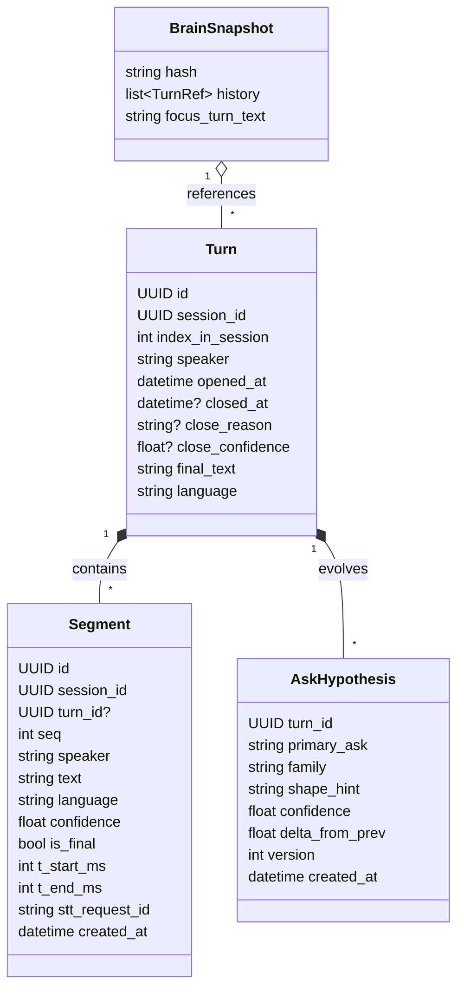
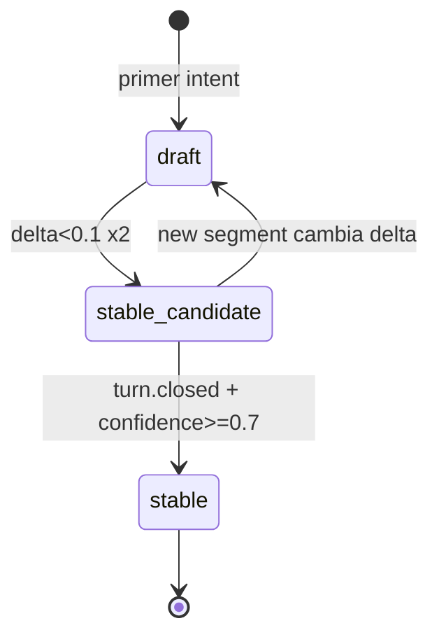

# LIVE PIPELINE REDESIGN — Interview Coach

> Rediseño del pipeline live: modelo de turn, end-of-turn multi-señal, intent tracking progresivo, gate de emit basado en evidencia, y contrato a `emit`.
> Dependencia directa de `TARGET_ARCHITECTURE.md` y `DATA_MODEL_REDESIGN.md`.

---

## 1. Problema a resolver

El pipeline live actual decide "cuándo y qué responder" con heurísticas dispersas:
- `silence_detector.py` (491 LOC) creció por parches (`4fcf10b4`, `22de66e9`, `da172247`, `3d943f9c`).
- No hay un detector unificado de fin-de-turno.
- No hay una hipótesis de intención que converja mientras el interviewer habla.
- La decisión de emitir depende de timers, no de evidencia.

Síntomas: respuestas tardías, prematuras, re-entry sobre streams, duplicación.

---

## 2. Modelo de entidades live



### 2.1 Reglas

- **Segment**: cada `TranscriptionEvent(is_final=True)` relevante crea un segment. Partials se propagan al bus para live caption y tracking de intent, pero **no** crean segment hasta ser final.
- **Turn**: se abre al primer segment de un speaker tras un turn-close previo. Se "crece" con cada segment del mismo speaker. Se cierra por `EndOfTurnDetector`.
- **AskHypothesis**: nace con el primer segment de un turn del interviewer; se re-evalúa con cada segment final. Soporta dos modos: (a) `draft` hasta close; (b) `stable_candidate` si `delta_from_prev < ε` entre 2 versiones consecutivas.
- **BrainSnapshot**: determinista por `hash(last N turns final_text)`. Dedup natural: si el hash coincide con un plan ya emitido, se reusa.

---

## 3. EndOfTurnDetector (multi-señal)

### 3.1 Señales

| Señal | Fuente | Peso default |
|---|---|---|
| `deepgram_utterance_end` | Evento `UtteranceEnd` de Deepgram | 0.40 |
| `acoustic_silence` | RMS rolling window < threshold durante N ms | 0.25 |
| `semantic_stability` | Jaccard(final[t], final[t-1]) ≥ 0.92 durante 2 finales seguidos | 0.15 |
| `syntactic_completion` | Regex de cierre: `[.?!…]$` o `", right?"`, `"okay?"` etc. | 0.10 |
| `turn_timeout` | Duración del turn > `max_turn_ms` (default 60s) | 0.10 |

### 3.2 API

```python
# turn/end_of_turn.py
from dataclasses import dataclass
from typing import Protocol

@dataclass
class EoTSignals:
    utterance_end_received: bool = False
    acoustic_silence_ms: int = 0
    semantic_stability_ratio: float = 0.0
    syntactic_complete: bool = False
    turn_duration_ms: int = 0

@dataclass
class EoTResult:
    closed: bool
    confidence: float
    reason: str   # utterance_end | silence | syntactic | timeout | hybrid
    signals_used: list[str]

class EndOfTurnDetector:
    def __init__(self, *,
                 silence_threshold_ms: int = 500,
                 silence_min_duration_ms: int = 700,
                 max_turn_ms: int = 60_000,
                 semantic_stability_threshold: float = 0.92,
                 close_confidence_threshold: float = 0.65,
                 weights: dict | None = None): ...
    def evaluate(self, signals: EoTSignals) -> EoTResult: ...
```

### 3.3 Lógica

```python
def evaluate(self, s: EoTSignals) -> EoTResult:
    score = 0.0
    used = []
    if s.utterance_end_received:
        score += self.w["utterance_end"]; used.append("utterance_end")
    if s.acoustic_silence_ms >= self.silence_min_duration_ms:
        score += self.w["silence"]; used.append("silence")
    if s.semantic_stability_ratio >= self.semantic_stability_threshold:
        score += self.w["semantic"]; used.append("semantic")
    if s.syntactic_complete:
        score += self.w["syntactic"]; used.append("syntactic")
    if s.turn_duration_ms >= self.max_turn_ms:
        score = max(score, 1.0); used.append("timeout")

    closed = score >= self.close_confidence_threshold
    reason = used[0] if used else "not_closed"
    return EoTResult(closed=closed, confidence=round(score,3),
                     reason=reason, signals_used=used)
```

### 3.4 Configuración

`config/runtime.py` expone un bloque `live_turn`:

```json
{
  "live_turn": {
    "silence_threshold_ms": 500,
    "silence_min_duration_ms": 700,
    "max_turn_ms": 60000,
    "semantic_stability_threshold": 0.92,
    "close_confidence_threshold": 0.65,
    "weights": {
      "utterance_end": 0.40,
      "silence": 0.25,
      "semantic": 0.15,
      "syntactic": 0.10,
      "timeout": 0.10
    }
  }
}
```

---

## 4. IntentTracker (progresivo, no espera al cierre)

### 4.1 Idea

Durante el turn del interviewer, cada segment final actualiza una `AskHypothesis`. Si la hipótesis converge antes del `TurnClosed`, el `planner` puede preparar un `draft` `BrainPlan` — **sin emitir** — para reducir latencia percibida.

### 4.2 API

```python
# brain/intent_tracker.py
@dataclass
class AskHypothesis:
    version: int
    primary_ask: str
    family: str
    shape_hint: str
    confidence: float
    delta_from_prev: float

class IntentTracker:
    def __init__(self, llm_fast, safe_fallback): ...
    def reset(self, turn_id: UUID): ...
    async def ingest(self, turn_text_so_far: str) -> AskHypothesis: ...
```

- `ingest()` se llama con el texto acumulado del turn; devuelve una hipótesis (usa LLM "fast" o, en modo offline, heurísticas).
- `delta_from_prev` = 1 - Jaccard(primary_ask_old_tokens, primary_ask_new_tokens).
- Estabilidad: `delta_from_prev < 0.1` durante 2 actualizaciones seguidas → `stable_candidate`.

### 4.3 Integración con planner

```python
# brain/planner.py
class BrainPlanner:
    async def plan_from_turn(self, turn, context_window) -> BrainPlan: ...
    async def plan_draft_from_hypothesis(self, hypothesis, turn, context_window) -> BrainPlan:
        # stability="draft"
        ...
```

Regla: `plan_draft_from_hypothesis` se invoca si `hypothesis.stability == "stable_candidate"` y no hay ya un plan con el mismo snapshot_hash. **Nunca se emite un draft**; sólo se prepara para acelerar el renderer cuando cierre el turn.

---

## 5. Ventana de contexto (HR-2)

```python
# brain/context_window.py
class ContextWindow:
    WINDOW_SIZE = 4

    def __init__(self, session_store): ...
    async def get(self, session_id: UUID) -> list[TurnRef]:
        all_turns = await session_store.list_closed_turns(session_id)
        if len(all_turns) < self.WINDOW_SIZE:
            return [TurnRef.from_turn(t) for t in all_turns]
        return [TurnRef.from_turn(t) for t in all_turns[-self.WINDOW_SIZE:]]
```

- Lee de `persistence/session_store` (no de memoria solamente).
- En cold start, rehidrata cache desde DB.
- Respeta literal HR-2: si hay ≥4, usa 4; si hay <4, usa todos; nunca vacío si hay algo.

---

## 6. BrainPlan stability y reuso



- `cached_stable`: si `snapshot_hash` coincide con un plan anterior en `brain_plans` cuya `stability=stable`, se reusa.
- Métrica: `ic_brain_plan_stability{state=...}` cuenta transiciones.

---

## 7. EmitReadiness gate

### 7.1 Score

```python
def emit_readiness(plan: BrainPlan, turn: Turn, evidence: EvidencePack, inflight: bool) -> float:
    if inflight:
        return 0.0
    if not turn.closed:
        return 0.0
    if plan.stability != "stable":
        return 0.2
    score = 0.4  # turn closed + stable plan
    score += 0.3 if plan.confidence >= 0.6 else 0.1
    score += 0.2 if evidence.has_required_support(plan) else 0.0
    score += 0.1 if plan.ask.family != "general" else 0.0
    return min(score, 1.0)
```

### 7.2 Threshold

- `emit_threshold = 0.65` por default.
- `emit_contract.readiness_score >= emit_threshold` → `renderer` corre.
- Menor → evento `emit.gate.failed(reason)`, no se llama LLM renderer.

### 7.3 Evita emits duplicados

- `inflight` flag por `turn_id`. Solo un `renderer` activo por turn.
- Si el turn se re-abre (speech después de close prematuro), se cancela el inflight con `asyncio.Task.cancel()` y se registra `error.pipeline` recoverable.

---

## 8. Anti-duplicación y re-entry

El commit `3d943f9c` ("Guard live emit against reentry and resumed speech") fue un parche puntual. El rediseño lo incorpora de forma estructural:

1. **Un turn tiene un único `BrainPlan.stability=stable`** durante su vida. Si se re-abre el turn por más speech, el plan pasa a `draft` y se recalcula.
2. **Un turn tiene como máximo una emisión**. Si ya se emitió, cualquier nuevo trigger produce evento `emit.gate.failed(reason="already_emitted")`.
3. **Un turn se re-abre**: permitido si el EndOfTurnDetector baja `confidence` (ej: otra señal final llega <200ms después del close). Se emite `turn.grown` en lugar de `turn.closed`.

---

## 9. Flujo paso a paso

```
1. STT.partial → bus → live_caption (HR-1) + (no crea segment)
2. STT.final → segment creado → agregado a turn activo
3. EndOfTurnDetector.evaluate(...) corre en cada final; decisión = continue|close
4. Intent_tracker.ingest(turn_text_so_far) en cada final; actualiza AskHypothesis
5. Si hipótesis alcanza stable_candidate → planner.plan_draft_from_hypothesis() precomputa
6. Cuando EndOfTurnDetector devuelve closed=true:
   a. TurnClosed event
   b. Si hay draft reciente con hash matching → plan = draft promote stable
   c. Sino → planner.plan_from_turn(turn, context_window)
   d. builder(plan, evidence) → EmissionContract
   e. emit_readiness(plan, turn, evidence)
   f. Si readiness >= threshold → renderer → GeneratedResponse
   g. Sino → emit.gate.failed(reason)
7. Respuesta → WS broadcast → UI (full_response primario, bullets_preview apoyo)
8. Todo el flujo escribe a event_log vía event_writer (via outbox)
```

---

## 10. Comparativa con sistema actual

| Aspecto | Hoy | Rediseño |
|---|---|---|
| Segments | No persistidos | Persistidos en tabla `segments` |
| Turns | Implícitos en tracker de memoria | Persistidos en tabla `turns` |
| Detector EoT | Parches sobre silence_detector | `EndOfTurnDetector` multi-señal con pesos |
| Intent progresivo | No | `IntentTracker` con versiones y delta |
| Ventana contexto | Memoria | DB-backed, rehidratable |
| BrainPlan reuso | Por hash, mezclado con render | Por hash, semántica pura |
| Emit gate | Timers | Score de readiness |
| Idempotencia emit | Guard añadido post-hoc | Estructural (inflight + turn.state) |
| Replay | Imposible | `scripts/replay_session.py` determinista |

---

## 11. Tests clave (para F2-F4)

1. **Unit `EndOfTurnDetector`**: tabla de casos (utterance_end solo, silencio solo, combinaciones, timeout).
2. **Unit `IntentTracker`**: mismos 3 finals secuenciales → delta decreciente → stable_candidate.
3. **Integration `planner+builder`**: BrainPlan → EmissionContract determinístico (no LLM) en safe_fallback.
4. **Integration `emit_readiness`**: turno abierto no emite; turno cerrado con plan draft no emite; turno cerrado con plan stable y evidence → emite.
5. **Replay**: tomar `event_log` de una sesión grabada, ejecutar offline, verificar que `BrainPlan` final se reconstruye igual.

---

## 12. Dependencias y orden de build

- Requiere **F2** (persistencia real con tablas `turns`, `segments`, `brain_plans`, `event_log`).
- Requiere **F3** (ruptura de `server.py` en `api/ws/live_session.py`).
- **F4** construye brain/emit/turn módulos y feature-flag cutover.
- **F5** añade métricas Prometheus para validar el nuevo timing.
- **F6** (bridge desktop audio) usa este pipeline como consumidor.

---

## 13. Quedan fuera del scope de este rediseño

- **Live caption path** (HR-1). Se preserva literalmente.
- **Diarización avanzada** (más allá de lo que Deepgram nova-3 da por defecto). En un futuro ADR.
- **End-of-thought cross-turn** (interviewer termina pensamiento en 2 turns separados por una breve pausa del candidato). Se aborda en v4.1 si aparece como pain real.
