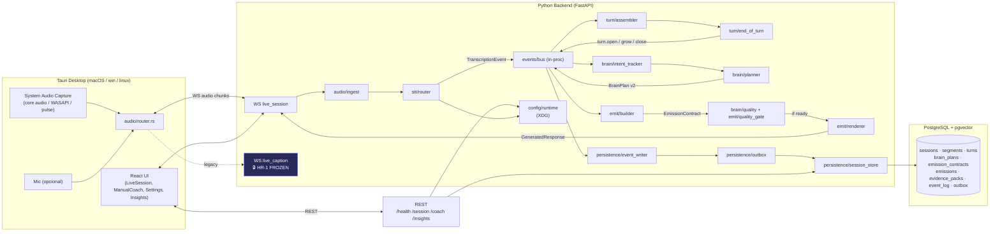
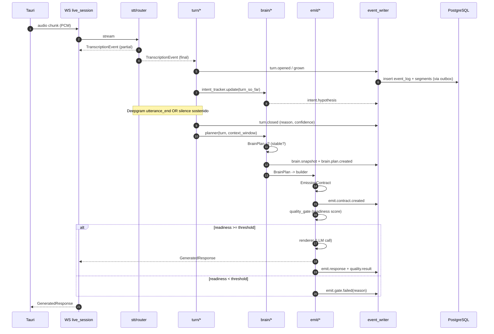
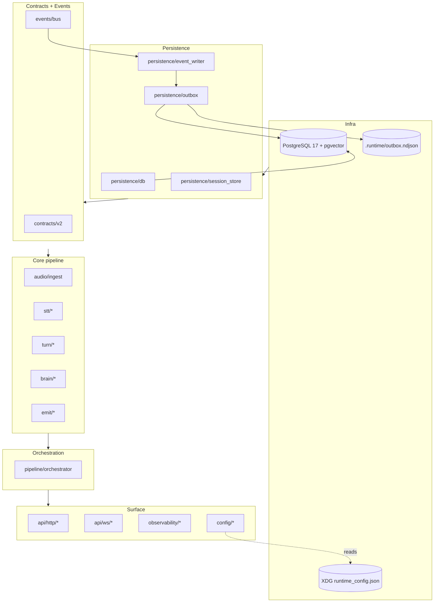

# TARGET ARCHITECTURE — Interview Coach v4.0 (draft)

> Arquitectura objetivo. Mantiene el stack frozen (Tauri + Rust + FastAPI + PostgreSQL + pgvector) pero rompe god-objects, separa `brain` de `emit`, y hace que el pipeline sea event-sourced y replayable.

---

## 1. Principios

1. **Un módulo, una responsabilidad, un contrato tipado.**
2. **Brain y Emit están separados.** Brain produce `BrainPlan v2` (semántica). Emit produce `GeneratedResponse` a partir de `EmissionContract` (render). La transformación `BrainPlan → EmissionContract` es un paso explícito y auditable.
3. **Event-sourced internamente.** Todo lo que ocurre en el pipeline live se escribe a `event_log` con `(session_id, seq, event_type, payload, trace_id)`. El estado derivado (turns, brain_plans, emissions) es reconstruible por replay.
4. **Local-first, web-ready.** La arquitectura no requiere internet para operar (excepto LLM/STT). Los artefactos de sesión se sirven vía HTTP al Tauri y, en futuro, a un SPA web sin cambios de backend.
5. **Degradación elegante.** Si DB cae: outbox. Si LLM cae: `safe_fallback` determinista. Si STT cae: no se emite respuesta inventada.
6. **Observability first-class.** Cada transición tiene `trace_id` y `latency_ms`. Dashboards de latencia, estabilidad y correcciones.
7. **Frozen unless approved.** Stack congelado: FastAPI, Python 3.11+, Tauri 2, Rust, PostgreSQL + pgvector, Deepgram, React+TypeScript.

---

## 2. Vista end-to-end



---

## 3. Módulos — layout de directorios

```
python-core/
  api/
    __init__.py                  # FastAPI app factory
    http/
      __init__.py                # router root
      health.py                  # GET /health
      runtime_config.py          # GET/PUT /api/runtime-config
      session.py                 # POST /session, GET /session/{id}, /artifacts
      coach.py                   # POST /coach/ask (HR-4 independent)
      insights.py                # /insights/*
    ws/
      __init__.py
      live_session.py            # WS /ws/live/{session_id}
      live_caption.py            # 🔒 FROZEN HR-1 — copy exact behavior
  audio/
    __init__.py
    ingest.py                    # Normaliza chunks (PCM16, 16kHz) y mide RMS
  stt/
    __init__.py
    adapter.py                   # Interface (hoy adapters/interfaces.py)
    deepgram.py                  # Primary (fromm adapters/stt_adapter.py)
    whisper_local.py             # Fallback local
    router.py                    # health check + failover
  turn/
    __init__.py
    segment.py                   # Segment model (pydantic)
    turn.py                      # Turn model
    assembler.py                 # STT events -> segments -> turns
    end_of_turn.py               # Multi-signal detector
  brain/
    __init__.py
    intent_tracker.py            # AskHypothesis streaming
    ask_decomposer.py            # Descompone asks compuestas
    context_window.py            # HR-2: last 4 turns (or all if <4)
    brain_plan.py                # Pydantic model BrainPlan v2
    planner.py                   # Turn + history -> BrainPlan
    quality.py                   # Quality gate sobre BrainPlan
  emit/
    __init__.py
    emission_contract.py         # Pydantic model
    builder.py                   # BrainPlan -> EmissionContract
    quality_gate.py              # Emit readiness gate
    renderer.py                  # EmissionContract -> GeneratedResponse (LLM call + style)
    style.py                     # Style application (mixed/executive/technical/commercial)
  events/
    __init__.py
    bus.py                       # Typed asyncio event bus
    events.py                    # Pydantic discriminated unions
  persistence/
    __init__.py
    db.py                        # asyncpg pool (replaces storage/database.py)
    outbox.py                    # Outbox pattern
    event_writer.py              # event_log writes
    session_store.py             # CRUD para sessions, turns, segments, brain_plans, emissions
    embeddings.py                # pgvector ops
    migrations/                  # Alembic
      env.py
      script.py.mako
      versions/
        20260422_01_baseline.py
        20260422_02_turns_events.py
  conversation/
    __init__.py
    tracker.py                   # HR-2 canonical in-memory cache con rehidratación desde DB
  config/
    __init__.py
    runtime.py                   # Single source of truth (XDG)
    providers.py                 # providers.yaml loader
  observability/
    __init__.py
    tracing.py                   # OTel
    metrics.py                   # Prometheus
    logs.py                      # Structured JSON logging
    latency.py                   # (existente)
  contracts/
    __init__.py
    models.py                    # Legacy v1 (marcar deprecated; no tocar desde código nuevo)
    v2/
      __init__.py
      brain_plan.py
      emission_contract.py
      generated_response.py
      events.py
  pipeline/
    __init__.py
    orchestrator.py              # Reemplaza _LiveSessionSTTManager
    # (los módulos legacy migran aquí progresivamente durante F3/F4)
```

---

## 4. Boundaries y responsabilidades

### 4.1 `audio/`
- Entrada: chunks PCM desde Tauri vía WS.
- Salida: `AudioChunk` normalizado (formato fijo, RMS calculado).
- **No conoce**: STT, brain, emit.

### 4.2 `stt/`
- Entrada: stream de `AudioChunk`.
- Salida: `TranscriptionEvent` (partial / final) con `(text, speaker, language, confidence, is_final, t_start, t_end)`.
- Responsable de failover primary→fallback.
- **No conoce**: turns, brain, emit.

### 4.3 `turn/`
- Entrada: `TranscriptionEvent` + señales de `audio/`.
- Salida: `TurnEvent(open|grow|close)` + `Segment[]` adjuntos.
- `EndOfTurnDetector` combina: `utterance_end` STT, silencio acústico, estabilidad semántica, tope temporal.
- **No conoce**: brain, emit.

### 4.4 `brain/`
- Entrada: `TurnEvent(close)` + `ContextWindow(last 4 turns)`.
- Salida: `BrainPlan v2`.
- `intent_tracker` puede emitir `draft` plans antes de close si la hipótesis converge.
- `planner` usa LLM "fast" + `safe_fallback` determinista.
- **No conoce**: render, length, tone.

### 4.5 `emit/`
- Entrada: `BrainPlan v2` + `EvidencePack`.
- Salida: `EmissionContract` → (paso gate) → `GeneratedResponse` (full_response primario, bullets preview).
- Responsable de: shape final, tono, idioma, length, bullets preview, style.
- **No conoce**: cómo se interpretó el ask.

### 4.6 `events/`
- Bus interno asyncio, tipado. Todo módulo publica eventos; `persistence/event_writer` los consume para escribir a `event_log`. La UI los consume (vía WS broadcast filtrado) para live caption + estado.

### 4.7 `persistence/`
- `db.py`: pool, fail-loud en startup.
- `event_writer.py`: escritor append-only a `event_log`.
- `outbox.py`: tabla `outbox` + worker que drena a las tablas destino. Si DB cae, los eventos se acumulan en un fichero WAL local (`.runtime/outbox.ndjson`) y se re-sincronizan al volver la DB.
- `session_store.py`: CRUDs tipados.

### 4.8 `config/runtime.py`
- Única fuente de verdad. Lee de `$INTERVIEW_COACH_RUNTIME_CONFIG_PATH` > `$XDG_CONFIG_HOME/interview-coach/profiles/<profile>/runtime_config.json`.
- `python-core/runtime_config.json` se **borra** y se mueve a `deprecated/` como referencia histórica.

---

## 5. Contratos v2 (shapes canónicos)

### 5.1 `BrainPlan v2` (semántica pura)

```python
# contracts/v2/brain_plan.py
from pydantic import BaseModel, Field
from uuid import UUID
from typing import Literal
from datetime import datetime

class ResolvedAsk(BaseModel):
    primary_ask: str
    secondary_asks: list[str] = Field(default_factory=list)
    focus_order: list[str] = Field(default_factory=list)
    family: Literal["experience_scope","culture_fit","technical_concept",
                    "technical_experience","architecture_design","product_specific",
                    "business_strategy","metrics_outcomes","follow_up_clarification",
                    "mixed_compound","general"]
    shape_hint: Literal["direct_short","direct_structured","technical_explainer",
                        "strategic_explainer"]
    complexity: Literal["simple","compound","deep_technical","strategy"]

class InterviewerIntent(BaseModel):
    summary: str
    dimensions: list[str] = Field(default_factory=list)
    evidence_expected: list[str] = Field(default_factory=list)
    decision_target: str = ""

class AnswerBlueprint(BaseModel):
    required_moves: list[str] = Field(default_factory=list)
    must_cover: list[str] = Field(default_factory=list)
    avoid: list[str] = Field(default_factory=list)
    evidence_requests: list[str] = Field(default_factory=list)

class TurnRef(BaseModel):
    turn_id: UUID
    speaker: Literal["interviewer","candidate","unknown"]
    summary: str

class BrainPlan(BaseModel):
    version: Literal[2] = 2
    id: UUID
    session_id: UUID
    turn_id: UUID
    snapshot_hash: str
    ask: ResolvedAsk
    intent: InterviewerIntent
    answer_blueprint: AnswerBlueprint
    context_window: list[TurnRef] = Field(default_factory=list)
    confidence: float = Field(ge=0.0, le=1.0)
    stability: Literal["draft","stable_candidate","stable"]
    plan_source: Literal["llm_fast","safe_fallback","cached_stable"]
    trace_id: str
    created_at: datetime
```

**Importante**: 0 campos de render. `tone`, `length`, `directness`, `bullets_preview`, `target_length` no existen aquí.

### 5.2 `EmissionContract` (render)

```python
# contracts/v2/emission_contract.py
class StyleGuard(BaseModel):
    style: Literal["executive","commercial","technical","mixed"]
    avoid_phrases: list[str] = Field(default_factory=list)
    preferred_openers: list[str] = Field(default_factory=list)

class EmissionContract(BaseModel):
    version: Literal[1] = 1
    id: UUID
    session_id: UUID
    turn_id: UUID
    brain_plan_id: UUID
    render_shape: Literal["direct_short","direct_structured",
                          "technical_explainer","strategic_explainer"]
    target_length_words: int = Field(ge=50, le=500)
    tone: Literal["concise","balanced","professional","technical","executive"]
    language: Literal["es","en","mixed"]
    bullets_preview: list[str] = Field(default_factory=list, max_length=5)
    must_cover: list[str]
    avoid: list[str]
    style_guard: StyleGuard
    evidence_pack_id: UUID
    emit_readiness_score: float = Field(ge=0.0, le=1.0)
    trace_id: str
    created_at: datetime
```

### 5.3 `GeneratedResponse` v2

```python
# contracts/v2/generated_response.py
class LatencyBreakdown(BaseModel):
    stt_ms: int = 0
    turn_assembly_ms: int = 0
    brain_ms: int = 0
    emit_build_ms: int = 0
    renderer_ms: int = 0
    total_ms: int = 0

class QualityResult(BaseModel):
    passed: bool
    score: float = Field(ge=0.0, le=1.0)
    issues: list[str] = Field(default_factory=list)

class GeneratedResponse(BaseModel):
    version: Literal[2] = 2
    id: UUID
    session_id: UUID
    turn_id: UUID
    emission_contract_id: UUID
    bullets: list[str] = Field(default_factory=list)
    full_response: str                     # PRIMARY artifact per PRODUCT rules
    quality: QualityResult
    latency: LatencyBreakdown
    language: Literal["es","en","mixed"]
    trace_id: str
    created_at: datetime
```

### 5.4 Event taxonomy (`contracts/v2/events.py`)

```python
from typing import Literal, Union
from pydantic import BaseModel, Field
from uuid import UUID
from datetime import datetime

class EventBase(BaseModel):
    session_id: UUID | None = None
    seq: int
    trace_id: str
    created_at: datetime

class SessionOpened(EventBase):
    event_type: Literal["session.opened"] = "session.opened"
    profile: str
    config_id: UUID | None = None

class SessionClosed(EventBase):
    event_type: Literal["session.closed"] = "session.closed"
    reason: str

class AudioChunkReceived(EventBase):
    event_type: Literal["audio.chunk_received"] = "audio.chunk_received"
    source: Literal["system","mic"]
    sample_rate: int
    rms: float

class STTPartial(EventBase):
    event_type: Literal["stt.partial"] = "stt.partial"
    text: str
    language: str

class STTFinal(EventBase):
    event_type: Literal["stt.final"] = "stt.final"
    text: str
    language: str
    speaker: Literal["interviewer","candidate","unknown"]
    confidence: float

class TurnOpened(EventBase):
    event_type: Literal["turn.opened"] = "turn.opened"
    turn_id: UUID
    speaker: str

class TurnGrown(EventBase):
    event_type: Literal["turn.grown"] = "turn.grown"
    turn_id: UUID
    text_delta: str

class TurnClosed(EventBase):
    event_type: Literal["turn.closed"] = "turn.closed"
    turn_id: UUID
    reason: Literal["utterance_end","silence","syntactic","timeout","manual"]
    confidence: float

class SilenceDetected(EventBase):
    event_type: Literal["silence.detected"] = "silence.detected"
    duration_ms: int
    kind: Literal["acoustic","semantic","syntactic"]

class IntentHypothesis(EventBase):
    event_type: Literal["intent.hypothesis"] = "intent.hypothesis"
    turn_id: UUID
    primary_ask: str
    confidence: float
    delta_from_prev: float

class BrainSnapshot(EventBase):
    event_type: Literal["brain.snapshot"] = "brain.snapshot"
    turn_id: UUID
    hash: str
    history_turn_ids: list[UUID]

class BrainPlanCreated(EventBase):
    event_type: Literal["brain.plan.created"] = "brain.plan.created"
    plan_id: UUID
    source: str
    stability: str
    confidence: float

class EmitContractCreated(EventBase):
    event_type: Literal["emit.contract.created"] = "emit.contract.created"
    contract_id: UUID
    readiness_score: float

class EmitGate(EventBase):
    event_type: Literal["emit.gate.passed","emit.gate.failed"]
    contract_id: UUID
    reason: str

class EmitResponse(EventBase):
    event_type: Literal["emit.response"] = "emit.response"
    response_id: UUID
    full_response: str
    latency_ms: int

class QualityResultEvent(EventBase):
    event_type: Literal["quality.result"] = "quality.result"
    target: Literal["brain_plan","emission"]
    passed: bool
    issues: list[str]

class ErrorEvent(EventBase):
    event_type: Literal["error.llm","error.stt","error.db","error.pipeline"]
    recoverable: bool
    retry_count: int
    message: str

PipelineEvent = Union[
    SessionOpened, SessionClosed, AudioChunkReceived,
    STTPartial, STTFinal,
    TurnOpened, TurnGrown, TurnClosed,
    SilenceDetected, IntentHypothesis,
    BrainSnapshot, BrainPlanCreated,
    EmitContractCreated, EmitGate, EmitResponse,
    QualityResultEvent, ErrorEvent,
]
```

---

## 6. Flujo de una pregunta (secuencia)



---

## 7. Observabilidad

### 7.1 Métricas Prometheus (mínimo)

- `ic_latency_ms{stage, quantile}` (histogram) para: `stt`, `turn_assembly`, `brain`, `emit_build`, `renderer`, `total`.
- `ic_emit_prematures_total` — respuesta emitida antes de `TurnClosed` confirmado.
- `ic_emit_late_total` — respuesta emitida >2s después de `TurnClosed`.
- `ic_brain_plan_stability{state="draft|stable_candidate|stable"}` (counter).
- `ic_db_write_failures_total`.
- `ic_outbox_queue_size` (gauge).
- `ic_stt_provider_health{provider}` (gauge 0/1).
- `ic_session_active_count` (gauge).

### 7.2 Traces OTel

- Un trace por WS session.
- Spans: `audio.chunk`, `stt.stream`, `turn.assemble`, `brain.plan`, `emit.build`, `emit.render`, `persistence.write`.

### 7.3 Logs estructurados

- JSON con: `ts`, `level`, `event`, `session_id`, `turn_id`, `trace_id`, `latency_ms`, `error`.
- `observability/logs.py` provee `get_logger(component)` estándar.

---

## 8. Degradación elegante

| Falla | Comportamiento target |
|---|---|
| DB caída al iniciar | Backend falla ruidosamente. No continua en modo silencioso. |
| DB caída durante sesión | Outbox buffer en `.runtime/outbox.ndjson`. Sesión sigue. Al volver DB, drain automático. |
| LLM primary caído | `safe_fallback` determinista emite BrainPlan con `plan_source="safe_fallback"`, `confidence<0.5`. La UI muestra indicador. |
| STT primary caído | Intento failover a Whisper local. Si también cae, emitir evento `error.stt` y mostrar banner en UI. No emitir respuesta inventada. |
| Renderer LLM falla | Emitir `GeneratedResponse` con `quality.passed=false`, `full_response` = contenido del `BrainPlan.answer_blueprint.must_cover` concatenado (placeholder). |
| Desktop audio bridge inactivo | UI muestra banner claro; backend no inventa eventos STT. |

---

## 9. Cutover plan (resumen, detalle en IMPLEMENTATION_PLAN)

1. Contratos v2 coexisten con v1 (directorio `contracts/v2/`).
2. Feature flag `INTERVIEW_COACH_BRAIN_V2=false` por default.
3. Cuando flag=true, `pipeline/orchestrator.py` enruta a `brain/planner.py` + `emit/*`.
4. Cuando flag=false, ruta legacy.
5. Una vez validado ≥2 semanas en uso local, flag default=true, legacy se marca deprecado.
6. Un sprint después, borrar `live_brain_service.py`, `live_finalizer.py`, `response_composer.py` (este último solo si el modo manual también migró).

---

## 10. Qué NO cambia (respeto a hard rules)

- **HR-1 Live Caption frozen**: `_handle_display_event()`, WS `live_caption`, Deepgram streaming para display, rendering en UI. Estos se mueven tal cual a `api/ws/live_caption.py` sin alterar semántica. Tests de regresión específicos.
- **HR-2 Conversation History**: 4-turn window (o all if <4). Se respeta en `brain/context_window.py`.
- **HR-3 Rollback**: se mantiene `backup/v1.x/`, se añade `backup/v2.0/` con snapshot pre-cutover.
- **HR-4 Manual Coach Button independiente**: `api/http/coach.py` no depende de WS session. Endpoint HTTP puro, lee `conversation/tracker` (con rehidratación desde DB si sesión existe en DB).

---

## 11. Diagrama de capas



Regla de dependencias: **una capa puede importar solo de capas inferiores o iguales**. Nunca al revés. En pre-commit, `pyflakes` + un check casero valida esto.
