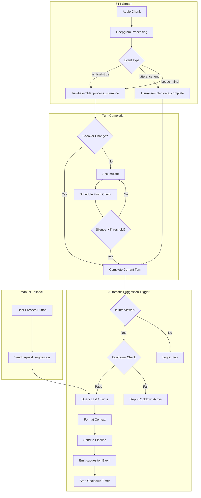

# Automatic Silence Detection for Realtime Suggestions

**Version**: 1.0.0  
**Date**: 2026-03-18  
**Status**: DESIGN READY FOR REVIEW  
**Related**: REALTIME_SUGGESTIONS_NORMALIZATION_PLAN.md, Live Transcript Service (FROZEN)

---

## Executive Summary

This design enables **automatic triggering** of realtime suggestions when the interviewer stops talking, using the conversation history as the source of context. The manual trigger (button/Ctrl+Enter) becomes a **fallback mechanism** rather than the primary interaction mode.

**Key Principle**: Live Transcript service remains **FROZEN** - all changes are isolated to the Realtime Suggestions service.

---

## 1. Current State Analysis

### 1.1 What Exists Today

| Component | Location | Purpose |
|-----------|----------|---------|
| `request_suggestion` handler | [`server.py:3380-3475`](python-core/api/server.py:3380) | Manual WebSocket trigger |
| `get_last_interviewer_turn()` | [`tracker.py:118-176`](python-core/conversation/tracker.py:118) | Fetches last interviewer turn from history |
| `get_recent_context()` | [`tracker.py:178-204`](python-core/conversation/tracker.py:178) | Fetches last N turns for context |
| `TurnAssembler.flush_if_idle()` | [`turn_assembler.py:345-363`](python-core/pipeline/steps/turn_assembler.py:345) | Silence-based turn completion |
| `_schedule_turn_flush()` | [`server.py:728-756`](python-core/api/server.py:728) | Schedules turn flush after silence threshold |
| `_process_completed_turn()` | [`server.py:874-896`](python-core/api/server.py:874) | Processes completed turns with constraints |

### 1.2 Current Problems

1. **Manual-only triggering**: User must press button or Ctrl+Enter
2. **Single-turn context**: Only last interviewer turn is used
3. **No automatic silence detection**: Silence detection exists but only logs, doesn't auto-trigger suggestions
4. **Constraint checking blocks short questions**: Hardcoded 2-second/5-word minimums

---

## 2. Proposed Architecture

### 2.1 Design Philosophy

```
┌─────────────────────────────────────────────────────────────────┐
│                     SILENCE DETECTION FLOW                       │
├─────────────────────────────────────────────────────────────────┤
│                                                                  │
│   STT Events ──► TurnAssembler ──► Silence Detected              │
│                                       │                          │
│                                       ▼                          │
│   ┌─────────────────────────────────────────┐                   │
│   │   AUTOMATIC SUGGESTION TRIGGER          │                   │
│   │                                         │                   │
│   │   1. Query last 4 turns from history    │                   │
│   │   2. Format as rich context             │                   │
│   │   3. Bypass strict constraints          │                   │
│   │   4. Send to coach pipeline             │                   │
│   │   5. Apply cooldown/throttling          │                   │
│   └─────────────────────────────────────────┘                   │
│                                       │                          │
│                                       ▼                          │
│   ┌─────────────────────────────────────────┐                   │
│   │   MANUAL FALLBACK (Button/Ctrl+Enter)   │                   │
│   │                                         │                   │
│   │   - Same history query                  │
│   │   - Same context formatting             │
│   │   - Bypasses cooldown                   │                   │
│   └─────────────────────────────────────────┘                   │
│                                                                  │
└─────────────────────────────────────────────────────────────────┘
```

### 2.2 Silence Detection Strategy: Option B (Backend STT Events) - RECOMMENDED

**Decision**: Use **backend-based silence detection** via STT events.

**Rationale**:

| Criterion | Option A (Frontend Audio) | Option B (Backend STT) | Winner |
|-----------|---------------------------|------------------------|--------|
| Speaker awareness | Requires duplicating speaker logic | Already has speaker attribution | B |
| STT integration | Needs separate silence detection | Uses existing Deepgram events | B |
| Latency | Extra hop: frontend → backend | Direct processing | B |
| Complexity | New audio analysis code | Reuse existing `TurnAssembler` | B |
| Reliability | Audio level != speech end | STT `utterance_end` is authoritative | B |

**Implementation**: Extend existing `_schedule_turn_flush()` and `utterance_complete` handling to auto-trigger suggestions.

---

## 3. Data Flow Architecture

### 3.1 Automatic Trigger Flow



### 3.2 Context Format for Coach Pipeline

**Last 4 Turns Structure**:
```typescript
{
  "context_turns": 4,
  "turns": [
    {
      "speaker": "interviewer",
      "text": "Tell me about your experience with Python",
      "timestamp": "2026-03-18T18:10:00Z",
      "start_time": 1710785400.0,
      "end_time": 1710785405.0,
      "duration_ms": 5000
    },
    {
      "speaker": "candidate", 
      "text": "I've been using Python for 5 years...",
      "timestamp": "2026-03-18T18:10:10Z",
      "start_time": 1710785410.0,
      "end_time": 1710785418.0,
      "duration_ms": 8000
    },
    // ... up to 4 turns
  ],
  "primary_question": "What was the biggest technical challenge?",
  "primary_speaker": "interviewer",
  "conversation_summary": "Discussion of Python experience and past projects"
}
```

---

## 4. Component Design

### 4.1 Backend Components

#### 4.1.1 SilenceDetector (New Class)

```python
# python-core/pipeline/silence_detector.py

class SilenceDetector:
    """
    Detects interviewer silence and triggers suggestion generation.
    Integrates with TurnAssembler and ConversationTracker.
    """
    
    def __init__(
        self,
        conversation_tracker: ConversationTracker,
        silence_threshold_ms: int = 2000,
        cooldown_sec: float = 5.0,
        min_turn_duration_ms: int = 500,  # Relaxed from 2000ms
        min_word_count: int = 2,  # Relaxed from 5 words
        context_turn_limit: int = 4,
    ):
        self.tracker = conversation_tracker
        self.silence_threshold_ms = silence_threshold_ms
        self.cooldown_sec = cooldown_sec
        self.min_turn_duration_ms = min_turn_duration_ms
        self.min_word_count = min_word_count
        self.context_turn_limit = context_turn_limit
        
        self._last_suggestion_at: Optional[float] = None
        self._current_speaker: Optional[str] = None
        self._last_activity_at: Optional[float] = None
        self._suggestion_in_progress: bool = False
    
    def on_speaker_activity(
        self,
        speaker: str,
        text: str,
        timestamp: float
    ) -> None:
        """Called on every STT event to track speaker activity."""
        self._current_speaker = speaker
        self._last_activity_at = timestamp
    
    def on_silence_detected(
        self,
        speaker: str,
        silence_duration_ms: int
    ) -> Optional[Dict[str, Any]]:
        """
        Called when silence exceeds threshold.
        Returns suggestion trigger payload or None.
        """
        if speaker != "interviewer":
            return None
            
        if not self._should_trigger_suggestion():
            return None
            
        return self._build_suggestion_payload()
    
    def _should_trigger_suggestion(self) -> bool:
        """Check cooldown and in-progress status."""
        if self._suggestion_in_progress:
            return False
            
        if self._last_suggestion_at is None:
            return True
            
        elapsed = time.time() - self._last_suggestion_at
        return elapsed >= self.cooldown_sec
    
    def _build_suggestion_payload(self) -> Dict[str, Any]:
        """Build payload with last N turns from history."""
        # Get last N turns from tracker
        recent_turns = self.tracker.get_recent_context(
            limit=self.context_turn_limit
        )
        
        # Find primary question (most recent interviewer turn)
        primary_question = None
        for turn in reversed(recent_turns):
            if turn.get("speaker") == "interviewer":
                primary_question = turn.get("text", "")
                break
        
        return {
            "trigger": "silence_detected",
            "context_turns": len(recent_turns),
            "turns": recent_turns,
            "primary_question": primary_question,
            "timestamp": time.time(),
        }
    
    def mark_suggestion_started(self) -> None:
        """Mark that a suggestion generation has started."""
        self._suggestion_in_progress = True
    
    def mark_suggestion_completed(self) -> None:
        """Mark that suggestion generation completed and reset cooldown."""
        self._suggestion_in_progress = False
        self._last_suggestion_at = time.time()
```

#### 4.1.2 WebSocketHandler Integration

**Modification to `SessionSTTStreamManager`**:

```python
# In SessionSTTStreamManager.__init__():
self._silence_detector = SilenceDetector(
    conversation_tracker=self._pipeline.conversation_tracker,
    silence_threshold_ms=self._turn_assembler.state.silence_threshold_ms,
    cooldown_sec=self._suggestion_cooldown_sec,
    min_turn_duration_ms=500,  # Relaxed for auto-trigger
    min_word_count=2,
    context_turn_limit=4,
)

# In _process_completed_turn() - ADD auto-trigger:
async def _process_completed_turn(self, turn: SpeakerTurn) -> None:
    # ... existing duplicate/speaker checks ...
    
    # NEW: Automatic suggestion trigger on interviewer silence
    if turn.speaker == "interviewer":
        trigger_payload = self._silence_detector.on_silence_detected(
            speaker=turn.speaker,
            silence_duration_ms=turn.duration_ms
        )
        if trigger_payload:
            await self._trigger_automatic_suggestion(trigger_payload)
    
    # ... rest of existing processing ...

# NEW METHOD:
async def _trigger_automatic_suggestion(
    self,
    payload: Dict[str, Any]
) -> None:
    """Trigger suggestion generation from automatic silence detection."""
    self._silence_detector.mark_suggestion_started()
    
    try:
        # Use same pipeline as manual trigger
        question_text = payload["primary_question"]
        context_turns = payload["context_turns"]
        
        # Send progress indicator
        await self._websocket.send_json({
            "type": "analysis",
            "stage": "auto_silence_detected",
            "context_turns": context_turns,
        })
        
        # Process through pipeline
        result = await self._pipeline.process_question(
            question_text,
            is_final=True,
            on_progress=lambda e: self._websocket.send_json(e),
        )
        
        # Emit suggestion (same format as manual)
        await self._websocket.send_json({
            "type": "suggestion",
            "stage": "full",
            "mode": "real",
            "source": "auto_silence",  # Different source
            "trigger": "silence",
            "question": question_text,
            "context_turns": context_turns,
            "full_response": result.exchange.suggested_response.full_response,
            "bullets_preview": result.exchange.suggested_response.bullets,
            "bullets": result.exchange.suggested_response.bullets,
            "confidence": result.exchange.suggested_response.confidence,
            "latency_ms": result.total_latency_ms,
            # ... other fields
        })
        
    finally:
        self._silence_detector.mark_suggestion_completed()
```

#### 4.1.3 Modified Constraint Checking for Auto-Trigger

```python
def _check_auto_trigger_constraints(
    self,
    turn: SpeakerTurn
) -> tuple[bool, str]:
    """
    Relaxed constraints for automatic silence-triggered suggestions.
    Allows shorter turns than manual trigger path.
    """
    # Relaxed duration check (500ms vs 2000ms)
    if turn.duration_ms < self._silence_detector.min_turn_duration_ms:
        return False, f"duration_too_short ({turn.duration_ms}ms)"
    
    # Relaxed word count (2 vs 5)
    word_count = len(str(turn.text or "").split())
    if word_count < self._silence_detector.min_word_count:
        return False, f"word_count_too_low ({word_count})"
    
    # Cooldown check (prevents spam)
    if not self._silence_detector._should_trigger_suggestion():
        return False, "cooldown_active"
    
    return True, ""
```

### 4.2 Frontend Components

#### 4.2.1 WebSocket Message Handling (App.tsx)

```typescript
// Add to existing WebSocket message handler:

if (eventType === "suggestion") {
  // ... existing handling ...
  
  // NEW: Handle auto-trigger vs manual
  const isAutoTrigger = event.trigger === "silence";
  const isManual = event.source === "history_based";
  
  // Log for debugging
  if (isAutoTrigger) {
    console.log(`[Auto] Suggestion from silence, context turns: ${event.context_turns}`);
  }
  
  // ... rest of existing handling ...
}

// NEW: Handle auto-silence detection notification
if (eventType === "silence_detected") {
  // Optional: Show subtle UI indicator that silence was detected
  console.log(`[Auto] Silence detected, ${event.context_turns} turns in context`);
}
```

#### 4.2.2 Manual Trigger (Fallback)

```typescript
// requestSuggestion() - ALREADY EXISTS, no changes needed
// Just ensure it uses same history query path

const requestSuggestion = useCallback(() => {
  if (!wsRef.current || wsRef.current.readyState !== WebSocket.OPEN) {
    setLiveError("WebSocket not connected");
    return;
  }
  if (!liveSession.sessionId || !liveSession.isActive) {
    setLiveError("Start a live session first");
    return;
  }
  
  // Send request_suggestion message (manual override)
  wsRef.current.send(JSON.stringify({
    type: "request_suggestion",
    payload: {
      manual: true,
      bypass_cooldown: true,  // NEW: Override auto cooldown
      timestamp: Date.now()
    }
  }));
  
  setLiveProcessing(true);
}, [liveSession.sessionId, liveSession.isActive]);
```

---

## 5. Configuration

### 5.1 Runtime Config Extension

```python
# Add to LatencyConfig in server.py

class LatencyConfig(BaseModel):
    # ... existing fields ...
    
    # Auto-suggestion configuration
    auto_suggestion_enabled: bool = True
    auto_silence_threshold_ms: int = 2000  # Silence before auto-trigger
    auto_suggestion_cooldown_sec: int = 5  # Min time between auto-suggestions
    auto_min_turn_duration_ms: int = 500   # Min duration for auto-trigger
    auto_min_word_count: int = 2           # Min words for auto-trigger
    auto_context_turn_limit: int = 4       # Number of turns for context
    
    # Manual fallback configuration
    manual_bypasses_cooldown: bool = True  # Manual can override cooldown
```

### 5.2 Settings Panel UI

```typescript
// Add to SettingsPanel.tsx

interface AutoSuggestionSettings {
  enabled: boolean;
  silenceThresholdMs: number;  // Slider: 500-5000ms
  cooldownSec: number;          // Slider: 0-30s
  minTurnDurationMs: number;    // Slider: 100-2000ms
  minWordCount: number;         // Slider: 1-10
  contextTurnLimit: number;     // Slider: 1-10
}
```

---

## 6. Integration Points

### 6.1 With Existing Tracker

```python
# ConversationTracker methods used:

# 1. Record turns as they complete (existing)
tracker.record_turn_event(
    speaker=turn.speaker,
    text=turn.text,
    utterance_count=turn.utterance_count,
    start_time=turn.start_time,
    end_time=turn.end_time,
    reason=turn.completion_reason,
)

# 2. Query last N turns for context (existing)
recent_turns = tracker.get_recent_context(limit=4)

# 3. Query last interviewer turn (existing)
last_interviewer = tracker.get_last_interviewer_turn(max_age_seconds=30.0)
```

### 6.2 With TurnAssembler

```python
# TurnAssembler events trigger SilenceDetector:

# On utterance complete:
completed_turn = turn_assembler.force_complete(reason="utterance_end")
if completed_turn:
    silence_detector.on_silence_detected(
        speaker=completed_turn.speaker,
        silence_duration_ms=completed_turn.duration_ms
    )

# On scheduled flush:
completed_turn = turn_assembler.flush_if_idle(reason="pause")
if completed_turn:
    silence_detector.on_silence_detected(...)
```

### 6.3 With Pipeline

```python
# Pipeline receives enhanced context:

result = await pipeline.process_question(
    question=primary_question,
    is_final=True,
    # NEW: Pass context turns for richer analysis
    conversation_context=recent_turns,
    on_progress=on_progress,
)
```

---

## 7. Error Handling & Edge Cases

### 7.1 Error Scenarios

| Scenario | Behavior |
|----------|----------|
| No history | Log debug, skip silently |
| History but no interviewer turns | Log debug, skip silently |
| Cooldown active | Log debug, increment stats counter |
| Suggestion in progress | Queue or skip (configurable) |
| Pipeline error | Emit `suggestion_error` event, reset state |
| STT disconnect | Pause auto-detection, resume on reconnect |

### 7.2 Edge Cases

```python
# 1. Rapid back-and-forth conversation
# Solution: Cooldown prevents spam

# 2. Interviewer pauses mid-question
# Solution: STT utterance_end detection waits for natural pauses

# 3. Multiple people speaking
# Solution: Only interviewer turns trigger suggestions

# 4. Very short questions ("Why?")
# Solution: Relaxed min_word_count=2 for auto-trigger

# 5. Candidate silence after answer
# Solution: Track speaker, only trigger on interviewer silence
```

---

## 8. Testing Strategy

### 8.1 Unit Tests

```python
def test_silence_detector_cooldown():
    detector = SilenceDetector(cooldown_sec=5.0)
    assert detector._should_trigger_suggestion() == True
    
    detector.mark_suggestion_started()
    detector.mark_suggestion_completed()
    
    assert detector._should_trigger_suggestion() == False  # Cooldown active

def test_silence_detector_payload_building():
    tracker = ConversationTracker()
    # ... add test turns ...
    
    detector = SilenceDetector(tracker, context_turn_limit=4)
    payload = detector._build_suggestion_payload()
    
    assert payload["context_turns"] <= 4
    assert payload["primary_question"] is not None
```

### 8.2 Integration Tests

```python
async def test_auto_trigger_e2e():
    """Test full flow: silence detection → suggestion generation."""
    # 1. Start session
    # 2. Simulate STT events
    # 3. Verify silence detection
    # 4. Verify suggestion event emitted
    # 5. Verify context contains last 4 turns
```

---

## 9. Migration Path

### Phase 1: Add SilenceDetector (No breaking changes)
1. Create `silence_detector.py`
2. Add to `SessionSTTStreamManager`
3. Add configuration options
4. Default `auto_suggestion_enabled=false` for testing

### Phase 2: Enable by Default
1. Set `auto_suggestion_enabled=true`
2. Monitor logs for false positives
3. Tune default thresholds

### Phase 3: Manual as Fallback
1. Document manual trigger as fallback
2. Add UI indicator for auto-suggestion status
3. Add cooldown bypass for manual trigger

---

## 10. Files to Modify

| File | Change Type | Description |
|------|-------------|-------------|
| `python-core/pipeline/silence_detector.py` | Create | New silence detection class |
| `python-core/api/server.py` | Modify | Integrate SilenceDetector, handle auto-trigger |
| `python-core/contracts/models.py` | Modify | Add context to pipeline input model |
| `tauri-app/src/App.tsx` | Modify | Handle new event types, UI indicators |
| `tauri-app/src/components/settings/SettingsPanel.tsx` | Modify | Add auto-suggestion configuration UI |

---

## 11. Open Questions

1. **Should manual trigger always bypass cooldown?**
   - Recommendation: Yes, user explicitly requested it

2. **What if suggestion is in progress when new silence detected?**
   - Option A: Queue it
   - Option B: Skip it
   - Option C: Cancel current and start new
   - Recommendation: Option B (skip) - prevents cascade

3. **Should we include candidate responses in context?**
   - Recommendation: Yes - last 4 turns regardless of speaker for richer context

4. **How to handle overlapping speech?**
   - Use existing speaker attribution from TurnAssembler

---

## 12. Acceptance Criteria

- [ ] Silence detection triggers suggestion within 500ms of turn completion
- [ ] Last 4 turns included in context for coach pipeline
- [ ] Manual trigger (Ctrl+Enter) works as fallback
- [ ] Cooldown prevents spam suggestions
- [ ] Configuration UI allows tuning all thresholds
- [ ] No changes to Live Transcript service
- [ ] All existing tests pass
- [ ] New unit tests for SilenceDetector
- [ ] Integration test for end-to-end flow

---

**Next Step**: Approval of this design, then proceed to implementation Phase 1.
