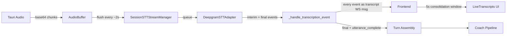
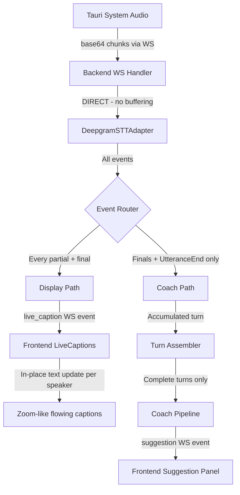
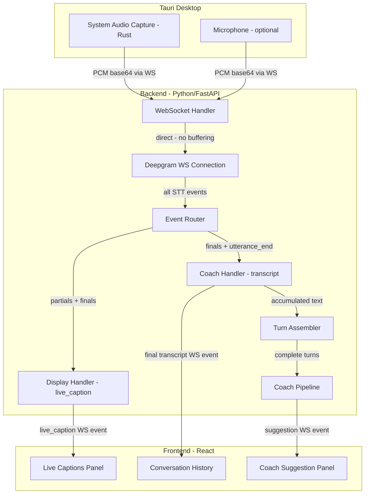

# Dual STT Services Architecture Plan

## Problem Statement

The current live transcript display is **fragmented and delayed**:

```
Interviewer(typing...)  9:42:26 AM
All right. Thank you....

Interviewer(typing...)  9:42:35 AM
and fast. AI. adoption me. night....

Interviewer(typing...)  9:42:42 AM
I know the ones. The ones. All of their teams...

Interviewer(typing...)  9:42:55 AM
teams. to be to be very much. much involved....
```

Two root causes:

1. **Display latency**: [`AudioBuffer`](python-core/api/audio_buffer.py:15) batches ~2 seconds of audio before flushing to Deepgram, adding a minimum 2-second delay before any text appears
2. **Fragmented display**: Every Deepgram partial/final event is sent as a separate `transcript` WS message → frontend creates a new entry or appends, producing many choppy short lines instead of continuous flowing text like Teams/Zoom

## Root Cause Analysis

### Current Single-Service Flow



**Problems identified:**

| Layer | Issue | Impact |
|-------|-------|--------|
| [`AudioBuffer.add_chunk()`](python-core/api/audio_buffer.py:30) | Flushes only when buffer >= 64KB or ~2s | 2+ second delay before first caption |
| [`_handle_transcription_event()`](python-core/api/server.py:1163) | Sends every Deepgram event to frontend as `transcript` | Creates many fragmented entries |
| [`handleWsEvent` in App.tsx](tauri-app/src/App.tsx:984) | Appends text to last entry within 5s window | Still shows fragments when entries start or when window resets |
| [`DeepgramSTTAdapter.stream_audio()`](python-core/adapters/stt_adapter.py:484) | Single stream handles both display and coaching | Cannot optimize buffering strategy independently |

## Solution: Dual Processing Paths from Single STT Stream

### Architecture: One Deepgram connection, two event processing paths



### Key Design Decisions

1. **Single Deepgram WebSocket** - No double cost; same audio stream, split at event routing
2. **No AudioBuffer for display path** - Audio goes directly to Deepgram; display path has zero buffering delay
3. **New `live_caption` WS event type** - Distinct from `transcript`; frontend handles them differently
4. **Frontend caption rendering** - Single updating entry per speaker, like Teams/Zoom captions. Text is replaced in-place, not appended as fragments

### Event Type Contract

| WS Event Type | Source | Purpose | Triggers Coach? |
|---------------|--------|---------|-----------------|
| `live_caption` | Every Deepgram partial/interim | Real-time display | No |
| `transcript` | Deepgram finals + utterance_end | Conversation history + coach | Yes |

### `live_caption` Payload

```json
{
  "type": "live_caption",
  "text": "So I guess, Daniela, in terms of your experience, I would like to hear",
  "speaker": "interviewer",
  "is_partial": true,
  "timestamp_ms": 12345
}
```

- `text` replaces the previous caption for that speaker on the frontend
- When `is_partial` goes `false`, the caption is finalized and archived into conversation history

### `transcript` Payload - unchanged

```json
{
  "type": "transcript",
  "text": "So I guess, Daniela, in terms of your experience, I would like to hear specifically about weekly AI adoption practices.",
  "is_final": true,
  "speaker": "interviewer",
  "utterance_complete": true
}
```

- Only sent on consolidated finals
- Triggers turn assembly → coach pipeline

## Implementation Plan

### Phase 1: Remove Display Buffering Delay

**Goal**: Audio reaches Deepgram immediately; no 2-second `AudioBuffer` gating for STT.

#### 1.1 Bypass AudioBuffer for STT streaming

Currently [`server.py:2976`](python-core/api/server.py:2976) funnels audio through `AudioBuffer.add_chunk()`. Change this so **decoded audio bytes are sent directly to `stt_stream_manager.enqueue_audio()`** without waiting for buffer flush.

The `AudioBuffer` can remain for other purposes but should not gate STT.

**Files changed:**
- [`python-core/api/server.py`](python-core/api/server.py) - audio_data handler sends directly to enqueue_audio

#### 1.2 Stream audio immediately to Deepgram

Currently [`enqueue_audio()`](python-core/api/server.py:1041) puts audio on an asyncio.Queue which feeds `_audio_chunks()` generator → `stream_audio()`. This path is fine and sends audio directly to Deepgram WS. The bottleneck was the `AudioBuffer` gate before `enqueue_audio`.

No change needed to STT adapter or stream manager queue.

### Phase 2: Split Event Routing into Display vs Coach paths

**Goal**: Deepgram events are classified and routed to two distinct handlers.

#### 2.1 Add `_handle_display_event()` method to SessionSTTStreamManager

New method that fires on every Deepgram event (partial or final):

```python
async def _handle_display_event(self, event: TranscriptionEvent) -> None:
    text = (getattr(event, "text", "") or "").strip()
    if not text:
        return
    
    is_final = bool(getattr(event, "is_final", False))
    speaker = self._normalize_speaker(getattr(event, "speaker", None))
    
    await self._websocket.send_json({
        "type": "live_caption",
        "text": text,
        "speaker": speaker,
        "is_partial": not is_final,
        "timestamp_ms": self._elapsed_ms(),
    })
```

#### 2.2 Modify `_handle_transcription_event()` for coach-only path

Current [`_handle_transcription_event()`](python-core/api/server.py:1163) handles both display and coach. Change it to:

- **Remove**: Sending `transcript` WS event for partials (display is now handled by `live_caption`)
- **Keep**: Send `transcript` WS event only for **final + utterance_complete** events
- **Keep**: Turn assembly, speaker correction, pipeline trigger - all unchanged

#### 2.3 Update `_run()` event loop

In [`_run()`](python-core/api/server.py:1117), change the event loop to call both handlers:

```python
async for event in event_stream:
    # Display path: fire immediately for every event
    await self._handle_display_event(event)
    # Coach path: only process finals for turn assembly
    await self._handle_transcription_event(event)
```

**Files changed:**
- [`python-core/api/server.py`](python-core/api/server.py) - SessionSTTStreamManager methods

### Phase 3: Frontend Live Captions Component

**Goal**: Display flowing captions like Teams/Zoom instead of fragmented entries.

#### 3.1 Add `live_caption` event handling in `handleWsEvent`

In [`App.tsx handleWsEvent`](tauri-app/src/App.tsx:944):

```typescript
if (eventType === "live_caption") {
  const text = typeof event.text === "string" ? event.text.trim() : "";
  if (!text) return;
  
  const speaker = typeof event.speaker === "string" ? event.speaker : "unknown";
  const isPartial = event.is_partial !== false;
  
  setLiveCaptions(prev => ({
    ...prev,
    [speaker]: { text, isPartial, timestamp: Date.now() }
  }));
  return;
}
```

#### 3.2 Add `liveCaptions` state

```typescript
interface LiveCaption {
  text: string;
  isPartial: boolean;
  timestamp: number;
}

const [liveCaptions, setLiveCaptions] = useState<Record<string, LiveCaption>>({});
```

#### 3.3 Render live captions area

Replace the fragmented transcript list with a Zoom-like captions display:

```
┌─────────────────────────────────────────────┐
│ Live Captions                               │
│                                             │
│ Interviewer: So I guess, Daniela, in terms  │
│ of your experience, I would like to hear    │
│ specifically about your weekly AI adoption  │
│ practices and how you drive that across...  │
│ ▌  (speaking...)                            │
│                                             │
└─────────────────────────────────────────────┘
```

- Single entry per speaker, updated in-place
- Blinking cursor / "(speaking...)" indicator while `isPartial === true`
- When finalized, text stays briefly then fades or archives to conversation history

#### 3.4 Keep liveTranscripts for finalized conversation history

The existing `liveTranscripts` array continues to accumulate from `transcript` events (now only finals), providing the conversation history below the captions.

**Files changed:**
- [`tauri-app/src/App.tsx`](tauri-app/src/App.tsx) - new state, event handler, render section

### Phase 4: Deepgram Configuration Optimization

**Goal**: Tune Deepgram parameters for best real-time display experience.

#### 4.1 Optimize streaming parameters

Current config in [`DeepgramSTTAdapter.connect()`](python-core/adapters/stt_adapter.py:346):

| Parameter | Current | New | Reason |
|-----------|---------|-----|--------|
| `interim_results` | `true` | `true` | Keep for display captions |
| `utterance_end_ms` | `2500` | `1500` | Faster turn detection for coach |
| `smart_format` | `true` | `true` | Keep for punctuation |
| `endpointing` | not set | `400` | Enable endpointing for faster response segmentation |

#### 4.2 Add `endpointing` parameter

Deepgram's `endpointing` parameter controls how quickly it detects speech-to-silence transitions. Setting `endpointing=400` means Deepgram will detect end of speech after 400ms of silence.

**Files changed:**
- [`python-core/adapters/stt_adapter.py`](python-core/adapters/stt_adapter.py) - connect() query params
- [`python-core/runtime_config.json`](python-core/runtime_config.json) - add endpointing config

### Phase 5: WhisperLocal Alignment - optional

If WhisperLocal is used as an alternative, apply the same dual-path pattern:
- Partial results every ~500ms → `live_caption` events
- Accumulated complete text on silence → `transcript` events for coach

This is lower priority since Deepgram is the primary STT provider.

## Architecture Diagram - Complete Data Flow



## Summary of Changes by File

| File | Changes |
|------|---------|
| [`python-core/api/server.py`](python-core/api/server.py) | Bypass AudioBuffer for STT; add `_handle_display_event()`; modify `_handle_transcription_event()` to coach-only; update `_run()` event loop |
| [`python-core/adapters/stt_adapter.py`](python-core/adapters/stt_adapter.py) | Add `endpointing` param; tune `utterance_end_ms` |
| [`python-core/runtime_config.json`](python-core/runtime_config.json) | Add `endpointing_ms` config option |
| [`tauri-app/src/App.tsx`](tauri-app/src/App.tsx) | Add `liveCaptions` state; handle `live_caption` events; render Zoom-like captions UI; keep `liveTranscripts` for finalized history |
| [`python-core/api/audio_buffer.py`](python-core/api/audio_buffer.py) | No deletion; just no longer in the STT critical path |

## Implementation Order

1. **Phase 1** - Remove AudioBuffer gate → immediate audio to Deepgram
2. **Phase 2** - Split event routing → display path + coach path
3. **Phase 3** - Frontend LiveCaptions component → Zoom-like rendering
4. **Phase 4** - Deepgram parameter tuning → faster endpointing
5. **Phase 5** - WhisperLocal alignment → optional/future

## Frozen Architecture Compliance

- ✅ No new providers introduced - still Deepgram
- ✅ No architecture redesign - same pipeline, just split event routing
- ✅ Tauri desktop remains the canonical target
- ✅ Full response remains the primary coaching artifact
- ✅ PostgreSQL + pgvector persistence unchanged
- ✅ Pipeline steps unchanged: TurnAssembler → QuestionAnalyzer → ResponseComposer → QualityGate → Emitter
