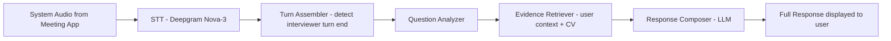

# Interview Coach — Product Vision

## One-liner

Interview Coach is a **system-audio-first real-time interview coach** that listens to the interviewer, detects turn completion, consolidates the interviewer's turn, and produces a strong suggested response from the user's saved interview context.

## Core loop

**Input**: System audio from any meeting app — Zoom, Meet, Teams, etc.
**Output**: A ready-to-use suggested answer based on the user's real experience.

## What it is

1. **System-audio-first** — the coach hears the interviewer through desktop system audio capture. Microphone is secondary/optional.
2. **Turn-aware** — it detects when the interviewer finishes speaking and only then generates a response.
3. **Context-powered** — responses draw from the user's saved CV, company info, candidate profile, and prior conversation history.
4. **Full response as primary artifact** — the user sees a complete, well-structured suggested answer. Bullets exist only as fast preview.

## What it is NOT

- Not a teleprompter or script reader
- Not a transcription tool
- Not a post-interview analyzer
- Not a web app — it is a **Tauri desktop app** that can capture system audio

## Existing assets we reuse

| Layer | Technology | Status |
|---|---|---|
| Desktop shell | Tauri 2 | partial |
| Native audio capture | Rust - macOS CoreAudio | partial |
| Backend | Python 3.11 / FastAPI / WebSocket | functional |
| STT | Deepgram Nova-3 via STTAdapter | functional at backend scope |
| Pipeline | TurnAssembler → QuestionAnalyzer → EvidenceRetriever → ResponseComposer → QualityGate | functional |
| UI | React + TypeScript | functional for manual mode |
| Persistence | PostgreSQL + pgvector | stub |
| User context | CV intake, candidate profile, company info forms | functional |

## Critical path to live product

The only blocker is wiring the desktop system audio end-to-end:

1. **R4 — Desktop system audio capture**: Rust captures system audio from meeting apps via CoreAudio, sends PCM to backend WebSocket
2. **R5 — Real STT on desktop path**: Deepgram processes the desktop-captured audio stream
3. **R6 — Speaker/turn detection**: TurnAssembler correctly identifies interviewer turn completion from the live stream
4. **R7 — Live response usefulness**: ResponseComposer generates contextually strong answers in real-time

Everything before R4 already works. The pipeline, STT adapter, context forms, and manual coaching are functional.

## User experience

1. User opens Interview Coach desktop app
2. User enters their CV, target company, and role beforehand
3. User joins a video call in any meeting app
4. User clicks "Start Live Session" — system audio capture begins
5. Interviewer asks a question — the coach transcribes it in real-time
6. When the interviewer finishes speaking — the coach generates a suggested response
7. User reads the suggestion and answers in their own words

## Design principles

- **Latency matters** — the response must appear within seconds of the interviewer finishing
- **Context is king** — generic answers are useless; every response must use the user's real experience
- **System audio is primary** — the product only works if it can hear the interviewer from the meeting app
- **One artifact** — full_response is what the user sees; everything else is internal
