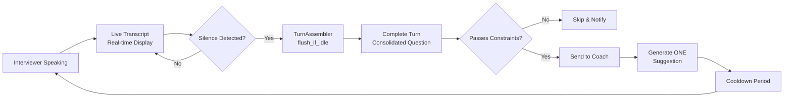
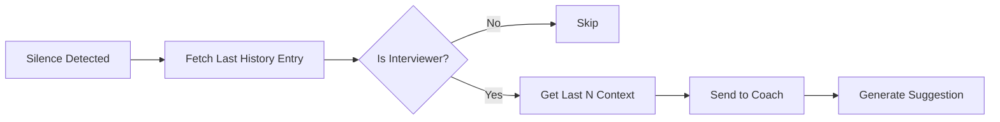

# Realtime Suggestions Service Normalization Plan

**Version**: 2.0.0  
**Date**: 2026-03-18  
**Status**: REVISED - READY FOR REVIEW  
**Related**: Live Transcript Service (FROZEN - DO NOT MODIFY)

---

## Executive Summary

This plan addresses the **Realtime Suggestions service** which is currently non-functional due to overly strict turn boundary constraints. The **Live Transcript service is WORKING and FROZEN** - this plan explicitly avoids any changes to live transcription functionality.

**Critical Correction from v1.0**: The service should NOT trigger suggestions every 2-3 words. Instead:
1. **Accumulate** everything during the interviewer's turn (live transcript shows real-time)
2. **Detect** when interviewer STOPS talking (silence / turn-end detection)
3. **Consolidate** the COMPLETE turn (full question/context)
4. **ONLY THEN** send to coach for analysis
5. **Generate ONE** suggestion based on the complete context

The normalization will:
1. Ensure proper turn-end detection via silence and Deepgram events
2. Relax hardcoded constraints to allow natural short questions
3. Add runtime configurability for suggestion thresholds
4. Implement manual suggestion trigger capability for fallback
5. Maintain clear separation from the frozen Live Transcript service

---

## Problem Statement

### Root Causes Identified (from Debug Analysis)

#### 1. Turn Boundary Constraints Too Strict (Applied at Wrong Time)
**Location**: [`python-core/api/server.py:587-589`](python-core/api/server.py:587)

```python
# Hardcoded values that override runtime config
self._min_utterance_duration_ms = 2000  # 2 seconds minimum
self._min_utterance_words = 5           # 5 words minimum  
self._suggestion_cooldown_sec = 5.0     # 5 second cooldown
```

**Impact**: Natural short questions like "Why Python?" (3 words, <1 sec) are rejected even after proper turn completion.

**Important**: These constraints are applied AFTER turn completion (correct timing), but values are too strict.

#### 2. Missing Runtime Configurability
**Location**: [`python-core/api/server.py:78-83`](python-core/api/server.py:78)

The [`LatencyConfig`](python-core/api/server.py:78) class is missing `min_utterance_words`:
```python
class LatencyConfig(BaseModel):
    utterance_end_ms: int = 2000
    silence_threshold_ms: int = 500
    min_utterance_duration_ms: int = 300
    suggestion_cooldown_sec: int = 3
    # MISSING: min_utterance_words
```

#### 3. Frontend Is Completely Passive
**Location**: [`tauri-app/src/App.tsx:1072-1100`](tauri-app/src/App.tsx:1072)

- Only **receives** suggestions via WebSocket `suggestion` events
- Never **sends** trigger requests
- No manual override capability when automatic silence detection fails

#### 4. Turn Completion Mechanism Exists But Needs Verification
**Current Implementation**:
- [`TurnAssembler.flush_if_idle()`](python-core/pipeline/steps/turn_assembler.py:344) - Silence-based completion
- [`_schedule_turn_flush()`](python-core/api/server.py:728) - Schedules flush after silence threshold
- Deepgram [`utterance_end`](python-core/api/server.py:664) events - External turn boundary signal
- [`speech_final`](python-core/api/server.py:827) events - Speech segment completion

**Risk**: Silence detection may fail in noisy environments or with irregular speech patterns.

#### 5. Speaker Identification Issues
**Location**: [`python-core/api/server.py:881-886`](python-core/api/server.py:881)

```python
if turn.speaker != "interviewer":
    print("[WS][TURN] skip_downstream ... reason=non_interviewer")
    return
```

Turns with speaker "unknown" or "candidate" are silently skipped without user visibility.

---

## Service Boundaries Definition

### Live Transcript Service (FROZEN)
**Status**: WORKING - DO NOT MODIFY

**Responsibilities**:
- Real-time caption display via `live_caption` events
- Transcript history accumulation via `transcript` events
- All STT output processing for display purposes
- Speaker attribution for visual feedback

**Files**: 
- [`tauri-app/src/App.tsx:990-1070`](tauri-app/src/App.tsx:990) - Live caption handling
- [`python-core/adapters/stt_adapter.py`](python-core/adapters/stt_adapter.py) - STT processing

**Events**:
- `live_caption` - Rapid partial updates
- `transcript` - Finalized transcript chunks

### Realtime Suggestions Service (TO NORMALIZE)
**Status**: NOT WORKING - THIS PLAN ADDRESSES

**Responsibilities**:
- Detect interviewer questions/turns
- Trigger suggestion pipeline
- Provide manual override capability
- Surface configuration and status to user

**Files**:
- [`python-core/api/server.py:852-896`](python-core/api/server.py:852) - Constraint checking
- [`tauri-app/src/App.tsx:1072-1100`](tauri-app/src/App.tsx:1072) - Suggestion display (passive)
- [`tauri-app/src/components/settings/SettingsPanel.tsx:414-434`](tauri-app/src/components/settings/SettingsPanel.tsx:414) - Partial latency UI

**Events**:
- `suggestion` - Generated coaching responses

### Architectural Boundary Rules
1. **NO changes to live caption processing** - Frozen behavior
2. **NO changes to transcript accumulation** - Frozen behavior  
3. **ONLY changes to suggestion trigger logic** - Constraint relaxation + manual trigger
4. **Configuration changes ONLY affect suggestions** - Not transcription
5. **Turn-end detection is the ONLY valid trigger** - Never trigger on partial/short utterances

---

## Proposed Solution Architecture

### Corrected Mental Model: Turn-Based Suggestion Flow



### Phase 1: Verify Turn-End Detection (Priority 1)
1. Verify `TurnAssembler.flush_if_idle()` triggers correctly on silence
2. Verify Deepgram `utterance_end` events trigger turn completion
3. Ensure `_schedule_turn_flush()` uses correct silence threshold
4. **Goal**: Confirm turns complete when interviewer stops speaking

### Phase 2: Relax Hardcoded Constraints (Priority 2)
1. Remove hardcoded overrides in WebSocketHandler
2. Add `min_utterance_words` to LatencyConfig
3. Use runtime config values instead of hardcoded constants
4. **Key Change**: Constraints apply at turn-end, not during accumulation

### Phase 3: Runtime Configurability (Priority 3)
1. Add `min_utterance_words` slider to SettingsPanel
2. Expand slider ranges for more flexibility
3. Sync backend and frontend config schemas

### Phase 4: Manual Trigger Capability (Priority 4)
1. Add WebSocket message type `request_suggestion`
2. Add backend handler for manual trigger
3. Add UI button in frontend (with keyboard shortcut)
4. **Purpose**: Fallback when automatic silence detection fails

### Phase 5: Visibility & Diagnostics (Priority 5)
1. Add suggestion status indicator in UI
2. Surface constraint rejection reasons
3. Add debug logging toggle

---

## Alternative Architecture: Use Conversation History as Source

**Idea from User**: Instead of relying solely on `TurnAssembler`, use the **conversation history** as the source for coach analysis.

### Why This is a Better Approach

1. **History Already Has Consolidated Turns**: The conversation tracker already accumulates and stores complete speaker turns
2. **Context Rich**: Can send last N messages for better context (not just the current question)
3. **Proven Path**: History persistence is working, TurnAssembler is more complex
4. **Simpler Trigger**: Detect silence → fetch last history entry → send to coach

### Implementation Approach



**File**: [`python-core/conversation/tracker.py`](python-core/conversation/tracker.py)

The conversation tracker already has:
- `record_turn_event()` - Stores complete turns
- `get_recent_context()` - Retrieves recent conversation
- Proper speaker attribution

**Proposed Change**: Add method to get last interviewer question:

```python
async def get_last_interviewer_turn(self, session_id: str) -> Optional[dict]:
    """Get the most recent interviewer turn from history."""
    # Query history for last interviewer entry
    # Return the complete consolidated text
```

**Recommendation**: Evaluate both approaches during Phase 1. If TurnAssembler proves unreliable, pivot to History-based approach.

---

## Detailed Implementation Steps

### Phase 1: Verify Turn-End Detection Mechanisms

Before relaxing constraints, we must ensure turn completion is working correctly.

#### File: [`python-core/api/server.py`](python-core/api/server.py)

**Verification 1**: Check `_schedule_turn_flush()` behavior (line 728-750)

The flush mechanism should:
- Schedule a flush after `silence_threshold_ms` of inactivity
- Cancel pending flush on new speech
- Complete the turn via `flush_if_idle()`

**Current Code**:
```python
def _schedule_turn_flush(self) -> None:
    self._cancel_turn_flush()
    self._turn_flush_token += 1
    token = self._turn_flush_token
    threshold_sec = max(self._turn_assembler.state.silence_threshold_ms / 1000, 0.0)

    async def _flush_after_pause():
        try:
            if threshold_sec:
                await asyncio.sleep(threshold_sec)
            if token != self._turn_flush_token:
                return
            completed = self._turn_assembler.flush_if_idle(
                current_time=time.time(),
                reason="pause",
            )
            if completed is None:
                return
            self._record_turn_event(completed)
            await self._process_completed_turn(completed)
```

**Verification Steps**:
1. Add logging to confirm `flush_if_idle()` is called
2. Add logging to confirm `completed` turn is returned
3. Verify `_process_completed_turn()` receives the complete turn

**Change 1**: Add diagnostic logging for turn completion
```python
async def _flush_after_pause():
    try:
        if threshold_sec:
            await asyncio.sleep(threshold_sec)
        if token != self._turn_flush_token:
            return
        
        print(f"[TURN][FLUSH] Attempting flush after {threshold_sec}s silence")
        completed = self._turn_assembler.flush_if_idle(
            current_time=time.time(),
            reason="pause",
        )
        if completed is None:
            print(f"[TURN][FLUSH] No turn to flush (idle check failed)")
            return
        
        print(f"[TURN][FLUSH] Turn flushed: '{completed.text[:60]}...' "
              f"duration={completed.duration_ms}ms utterances={completed.utterance_count}")
        self._record_turn_event(completed)
        await self._process_completed_turn(completed)
    except asyncio.CancelledError:
        return
    except Exception as e:
        print(f"[TURN][FLUSH] Error: {e}")
```

**Verification 2**: Check Deepgram `utterance_end` handling (line 664)

The `utterance_end` event should trigger immediate turn completion:

```python
# In _update_interviewer_turn_candidate or similar
if is_final and utterance_complete:
    # ... completes the turn
    return completed_text
```

**Diagnostic Addition**:
```python
if is_final and utterance_complete:
    print(f"[TURN][DEEPGRAM] utterance_end received, completing turn: '{normalized_text[:60]}...'")
    # ... existing completion logic
```

**Alternative - History-Based Trigger** (if TurnAssembler proves problematic):

```python
async def _trigger_suggestion_from_history(self) -> None:
    """
    Alternative trigger using conversation history.
    Called when silence is detected.
    """
    if hasattr(self._pipeline, 'conversation_tracker'):
        tracker = self._pipeline.conversation_tracker
        last_interviewer = tracker.get_last_interviewer_turn(self._session_id)
        
        if last_interviewer:
            print(f"[SUGGESTION][HISTORY] Triggering from history: '{last_interviewer['text'][:60]}...'")
            # Create synthetic turn from history
            synthetic_turn = SpeakerTurn(
                speaker="interviewer",
                text=last_interviewer['text'],
                start_time=last_interviewer['start_time'],
                end_time=last_interviewer['end_time'],
                is_complete=True,
                completion_reason="history_based_trigger"
            )
            await self._process_completed_turn(synthetic_turn)
```

---

### Phase 2: Relax Hardcoded Constraints

#### File: [`python-core/api/server.py`](python-core/api/server.py)

**Change 2**: Update LatencyConfig model (line 78-83)
```python
class LatencyConfig(BaseModel):
    """Latency configuration for real-time processing"""
    utterance_end_ms: int = 2000
    silence_threshold_ms: int = 500
    min_utterance_duration_ms: int = 300
    suggestion_cooldown_sec: int = 3
    min_utterance_words: int = 3  # ADD THIS - default 3 words for short questions
```

**Change 3**: Update WebSocketHandler.__init__ (line 586-589)
```python
# BEFORE (hardcoded):
self._min_utterance_duration_ms = 2000
self._min_utterance_words = 5
self._suggestion_cooldown_sec = 5.0

# AFTER (from runtime config):
config = get_runtime_config()
latency_config = config.latency if config else LatencyConfig()
self._min_utterance_duration_ms = latency_config.min_utterance_duration_ms
self._min_utterance_words = latency_config.min_utterance_words
self._suggestion_cooldown_sec = latency_config.suggestion_cooldown_sec
```

**Change 4**: Add runtime config refresh capability (new method)
```python
async def _refresh_latency_config(self) -> None:
    """Reload latency configuration from runtime config"""
    config = get_runtime_config()
    if config and config.latency:
        self._min_utterance_duration_ms = config.latency.min_utterance_duration_ms
        self._min_utterance_words = config.latency.min_utterance_words
        self._suggestion_cooldown_sec = config.latency.suggestion_cooldown_sec
```

---

### Phase 3: Frontend Configuration Updates

#### File: [`tauri-app/src/lib/persistence.ts`](tauri-app/src/lib/persistence.ts)

**Change 1**: Update LatencyConfig interface (line 34-42)
```typescript
export interface LatencyConfig {
  utterance_end_ms: number;
  silence_threshold_ms: number;
  min_utterance_duration_ms: number;
  suggestion_cooldown_sec: number;
  min_utterance_words: number;  // ADD THIS
}
```

**Change 2**: Update DEFAULT_RUNTIME_CONFIG (verify exists)
```typescript
export const DEFAULT_LATENCY_CONFIG: LatencyConfig = {
  utterance_end_ms: 2000,
  silence_threshold_ms: 500,
  min_utterance_duration_ms: 300,
  suggestion_cooldown_sec: 3,
  min_utterance_words: 3,  // ADD THIS
};
```

#### File: [`tauri-app/src/components/settings/SettingsPanel.tsx`](tauri-app/src/components/settings/SettingsPanel.tsx)

**Change 1**: Add min_utterance_words slider after suggestion_cooldown (after line 434)
```tsx
<div className="grid gap-2">
  <div className="flex items-center justify-between">
    <Label htmlFor="latency-min-words">
      Min Utterance Words
    </Label>
    <span className="text-sm font-medium">
      {config.latency?.min_utterance_words ?? 3} words
    </span>
  </div>
  <Slider
    id="latency-min-words"
    min={1}
    max={10}
    step={1}
    value={[config.latency?.min_utterance_words ?? 3]}
    onValueChange={(value) => updateLatencyConfig({ min_utterance_words: value[0] })}
  />
  <p className="text-xs text-muted-foreground">
    Minimum words to trigger suggestion (1-3 for natural conversation)
  </p>
</div>
```

**Change 2**: Expand min_utterance_duration_ms range (line 402-408)
```typescript
// BEFORE: min={50} max={1000}
// AFTER: min={50} max={2000} (allow wider range)
min={50}
max={2000}
step={50}
```

---

### Phase 4: Manual Trigger Capability

#### File: [`python-core/api/server.py`](python-core/api/server.py)

**Change 1**: Add new WebSocket message handler (in message routing)
```python
async def _handle_request_suggestion(self, payload: dict) -> None:
    """
    Handle manual suggestion request from frontend.
    Bypasses normal turn boundary constraints.
    """
    text = payload.get("text", "").strip()
    if not text:
        await self._send_ws_message({
            "type": "suggestion_error",
            "error": "No text provided for manual suggestion"
        })
        return
    
    # Force process as interviewer turn regardless of speaker
    print(f"[WS][MANUAL] suggestion_requested session_id={self._session_id} text='{text[:60]}...'")
    
    # Create synthetic turn
    synthetic_turn = SpeakerTurn(
        speaker="interviewer",
        text=text,
        start_time=perf_counter(),
        end_time=perf_counter(),
        is_complete=True,
        completion_reason="manual_trigger"
    )
    
    # Bypass constraint checks - process immediately
    await self._process_completed_turn_forced(synthetic_turn)
```

**Change 2**: Add forced processing method
```python
async def _process_completed_turn_forced(self, turn: SpeakerTurn) -> None:
    """
    Process a turn without constraint checking (for manual triggers).
    Similar to _process_completed_turn but skips _check_turn_boundary_constraints.
    """
    if self._is_duplicate_turn(turn):
        print(f"[TURN][MANUAL] duplicate_turn session_id={self._session_id}")
        return
    
    # Skip speaker check - manual trigger implies interviewer
    # Skip constraint check - manual trigger bypasses constraints
    
    # Rest of processing same as _process_completed_turn...
    # [Copy logic from _process_completed_turn starting line 898]
```

**Change 3**: Update message routing to handle new type
```python
# In message handler switch statement
if msg_type == "request_suggestion":
    await self._handle_request_suggestion(payload)
```

#### File: [`tauri-app/src/App.tsx`](tauri-app/src/App.tsx)

**Change 1**: Add manual trigger function (near other WS functions)
```typescript
const requestManualSuggestion = useCallback((text?: string) => {
  // Use provided text or last transcript
  const suggestionText = text || liveTranscripts[liveTranscripts.length - 1]?.text;
  if (!suggestionText || !liveSession.isActive) return false;
  
  sendWs("request_suggestion", { 
    text: suggestionText,
    timestamp: Date.now()
  });
  setLiveProcessing(true);
  return true;
}, [liveTranscripts, liveSession.isActive, sendWs]);
```

**Change 2**: Add UI button in live session controls (in JSX)
```tsx
<Button
  variant="outline"
  size="sm"
  onClick={() => requestManualSuggestion()}
  disabled={!liveSession.isActive || liveProcessing}
  title="Force suggestion for last transcript (Ctrl+Enter)"
>
  <Sparkles className="mr-1 h-4 w-4" />
  Get Suggestion
</Button>
```

**Change 3**: Add keyboard shortcut (in useEffect)
```typescript
useEffect(() => {
  const handleKeyDown = (e: KeyboardEvent) => {
    if (e.ctrlKey && e.key === "Enter" && liveSession.isActive) {
      e.preventDefault();
      requestManualSuggestion();
    }
  };
  window.addEventListener("keydown", handleKeyDown);
  return () => window.removeEventListener("keydown", handleKeyDown);
}, [liveSession.isActive, requestManualSuggestion]);
```

---

### Phase 5: Visibility & Diagnostics

#### File: [`tauri-app/src/App.tsx`](tauri-app/src/App.tsx)

**Change 1**: Add suggestion status state
```typescript
const [suggestionStatus, setSuggestionStatus] = useState<{
  lastCheckedAt: number | null;
  lastRejectionReason: string | null;
  constraintsActive: boolean;
}>({
  lastCheckedAt: null,
  lastRejectionReason: null,
  constraintsActive: true
});
```

**Change 2**: Handle new backend events
```typescript
if (eventType === "suggestion_skipped") {
  setSuggestionStatus(prev => ({
    ...prev,
    lastCheckedAt: Date.now(),
    lastRejectionReason: event.reason || "unknown"
  }));
  return;
}

if (eventType === "constraints_updated") {
  setSuggestionStatus(prev => ({
    ...prev,
    constraintsActive: true
  }));
  return;
}
```

**Change 3**: Add status indicator in UI
```tsx
{suggestionStatus.lastRejectionReason && (
  <Alert variant="default" className="bg-amber-50">
    <Info className="h-4 w-4" />
    <AlertDescription>
      Suggestion skipped: {suggestionStatus.lastRejectionReason}
      <Button 
        variant="link" 
        size="sm" 
        onClick={() => requestManualSuggestion()}
      >
        Force anyway
      </Button>
    </AlertDescription>
  </Alert>
)}
```

#### File: [`python-core/api/server.py`](python-core/api/server.py)

**Change 1**: Send skip notifications to frontend
```python
async def _send_suggestion_skipped(self, reason: str, text_preview: str) -> None:
    """Notify frontend that a suggestion was skipped and why"""
    await self._send_ws_message({
        "type": "suggestion_skipped",
        "reason": reason,
        "text_preview": text_preview[:60],
        "timestamp": perf_counter()
    })
```

**Change 2**: Update constraint check to notify frontend
```python
# In _check_turn_boundary_constraints, when constraints fail:
constraints_passed, constraints_reason = self._check_turn_boundary_constraints(turn)
if not constraints_passed:
    print(f"[WS][TURN] skip_downstream ... reason={constraints_reason}")
    await self._send_suggestion_skipped(constraints_reason, turn.text)
    return
```

---

## Technical Details: Turn-End Detection Mechanisms

### Current Implementation Analysis

#### 1. TurnAssembler Silence Detection
**File**: [`python-core/pipeline/steps/turn_assembler.py:344`](python-core/pipeline/steps/turn_assembler.py:344)

```python
def flush_if_idle(
    self,
    current_time: Optional[float] = None,
    *,
    reason: str = "pause",
) -> Optional[SpeakerTurn]:
    if self.state.current_turn is None:
        return None
    current_time = current_time or time.time()
    last_activity = self.state.last_utterance_time or self.state.last_activity_time
    if last_activity is None:
        return None
    elapsed_ms = (current_time - last_activity) * 1000
    if elapsed_ms >= self.state.silence_threshold_ms:
        return self._complete_current_turn(
            end_time=last_activity,
            reason=reason,
        )
    return None
```

**Key Point**: `flush_if_idle()` checks if `elapsed_ms >= silence_threshold_ms` and completes the turn.

#### 2. Scheduled Flush in WebSocketHandler
**File**: [`python-core/api/server.py:728`](python-core/api/server.py:728)

```python
def _schedule_turn_flush(self) -> None:
    self._cancel_turn_flush()
    self._turn_flush_token += 1
    token = self._turn_flush_token
    threshold_sec = max(self._turn_assembler.state.silence_threshold_ms / 1000, 0.0)

    async def _flush_after_pause():
        try:
            if threshold_sec:
                await asyncio.sleep(threshold_sec)
            # ... flush logic
```

**Key Point**: Flush is scheduled after `silence_threshold_ms` of inactivity.

#### 3. Deepgram Utterance End
**File**: [`python-core/adapters/stt_adapter.py:735`](python-core/adapters/stt_adapter.py:735)

Deepgram sends `utterance_end` event when silence exceeds `utterance_end_ms`:

```python
if event_type in {"utteranceend"}:
    self._received_utterance_complete = True
    close_allowed = True
```

**Key Point**: Deepgram's `utterance_end_ms` should align with our `silence_threshold_ms`.

#### 4. Constraint Checking at Turn-End
**File**: [`python-core/api/server.py:852`](python-core/api/server.py:852)

```python
def _check_turn_boundary_constraints(self, turn: SpeakerTurn) -> tuple[bool, str]:
    # Check minimum duration
    if turn.duration_ms < self._min_utterance_duration_ms:
        return False, f"duration_too_short ..."
    
    # Check minimum word count
    word_count = len(str(turn.text or "").split())
    if word_count < self._min_utterance_words:
        return False, f"word_count_too_low ..."
```

**Key Point**: Constraints are checked AFTER turn completion - this is correct behavior.

### Timing Alignment Requirements

| Parameter | Purpose | Recommended Value |
|-----------|---------|-------------------|
| `utterance_end_ms` | Deepgram silence detection | 1500-2000ms |
| `silence_threshold_ms` | TurnAssembler flush trigger | Should match `utterance_end_ms` |
| `endpointing_ms` | Deepgram speech boundary | 400-500ms (faster than utterance_end) |

**Important**: These values should be aligned:
- Deepgram detects silence at `utterance_end_ms`
- TurnAssembler flushes at `silence_threshold_ms`
- If `silence_threshold_ms < utterance_end_ms`, we may flush before Deepgram signals completion

---

## Configuration Changes

### Updated RuntimeConfig Schema

```python
class LatencyConfig(BaseModel):
    """Latency configuration for real-time processing"""
    utterance_end_ms: int = 2000        # STT: Deepgram utterance end (100-3000ms)
    silence_threshold_ms: int = 500     # Turn detection: silence threshold (100-3000ms)
    min_utterance_duration_ms: int = 300 # Suggestions: min speech duration (50-2000ms)
    suggestion_cooldown_sec: int = 3     # Suggestions: cooldown between (1-10sec)
    min_utterance_words: int = 3         # Suggestions: min words (1-10 words) NEW
```

### Default Values Rationale

| Parameter | Old Hardcoded | New Default | Rationale |
|-----------|--------------|-------------|-----------|
| min_utterance_duration_ms | 2000ms | 300ms | Allow short questions like "Why Python?" |
| min_utterance_words | 5 | 3 | Natural conversation threshold |
| suggestion_cooldown_sec | 5.0 | 3 | Faster response cadence |
| silence_threshold_ms | 2000 | 1500 | Match Deepgram utterance_end_ms |

### Migration Path for Existing Configs

1. Backend will use new defaults if field missing
2. Frontend will show slider at default position if value missing
3. User can adjust via SettingsPanel

---

## Acceptance Criteria

### Functional Requirements

1. **Turn-Based Suggestion Flow (CRITICAL)**
   - [ ] While interviewer speaks → Live Transcript updates, NO suggestions sent
   - [ ] When interviewer pauses (silence detected) → Turn is consolidated
   - [ ] Complete turn sent to coach → ONE suggestion generated
   - [ ] Suggestion cooldown applies AFTER suggestion, not during turn accumulation

2. **Complete Question Detection**
   - [ ] "Why Python?" (3 words, after silence) triggers ONE suggestion
   - [ ] "Tell me about yourself" (4 words, after silence) triggers ONE suggestion
   - [ ] Multi-sentence questions consolidated into single suggestion
   - [ ] "Ok" (1 word) respects min_words constraint at turn-end

3. **Manual Trigger Fallback**
   - [ ] "Get Suggestion" button appears during live session
   - [ ] Ctrl+Enter keyboard shortcut works
   - [ ] Manual trigger uses history/consolidated turn
   - [ ] Manual trigger works when automatic silence detection fails

4. **Configuration Persistence**
   - [ ] SettingsPanel shows all 5 latency parameters
   - [ ] Changes persist to runtime_config.json
   - [ ] Changes take effect without restart

5. **Visibility & Debugging**
   - [ ] User can see suggestion status (waiting/ready/generated)
   - [ ] Debug logging shows turn completion events
   - [ ] Clear indication when suggestion is skipped and why

### Performance Requirements

1. **Turn Detection Latency**: Turn completion detected within 1 second of silence
2. **Suggestion Latency**: Suggestion appears within 5 seconds of turn completion
3. **Cooldown**: Respects configured cooldown BETWEEN suggestions only
4. **No Impact**: Live transcript service performance unchanged

### Service Boundary Requirements

1. **Live Transcript Is Frozen**: No changes to caption display or real-time updates
2. **Suggestions Are Separate**: Suggestion service operates independently
3. **Turn-End Only**: Never trigger suggestions mid-turn or on partial text

### Compatibility Requirements

1. **No Breaking Changes**: Existing WebSocket clients continue working
2. **Optional Fields**: New config fields have sensible defaults
3. **Rollback Ready**: Can revert to previous behavior via config

---

## Rollback Plan

### Immediate Rollback (Config-Based)

If issues arise, revert via SettingsPanel:
1. Open SettingsPanel
2. Set `min_utterance_duration_ms` to 2000
3. Set `min_utterance_words` to 5
4. Set `suggestion_cooldown_sec` to 5

Or edit [`python-core/runtime_config.json`](python-core/runtime_config.json):
```json
{
  "latency": {
    "min_utterance_duration_ms": 2000,
    "min_utterance_words": 5,
    "suggestion_cooldown_sec": 5
  }
}
```

### Code Rollback (If Needed)

**Phase 1 rollback**: 
- Restore hardcoded values in WebSocketHandler.__init__
- Remove `min_utterance_words` from LatencyConfig

**Phase 2 rollback**:
- Remove manual trigger button from UI
- Remove `request_suggestion` handler from backend

**Full rollback**:
- Restore from backup/v1.0 if available
- Or git revert to pre-normalization commit

### Verification After Rollback

1. Backend starts without errors
2. Live transcript service still functional
3. Suggestions trigger with original (strict) constraints

---

## Risk Assessment

| Risk | Likelihood | Impact | Mitigation |
|------|------------|--------|------------|
| **Too many suggestions** (relaxed constraints) | Medium | Medium | Configurable thresholds; user can tune up |
| **Live transcript regression** | Low | High | Strict boundary enforcement; no shared code changes |
| **Manual trigger abuse** | Low | Low | Cooldown still applies; rate limiting in future |
| **Config sync issues** | Medium | Low | Frontend falls back to defaults; backend validates |
| **Performance degradation** | Low | Medium | Constraints reduce processing; monitoring added |

### Risk Mitigation Details

1. **Too Many Suggestions**: 
   - Default values are conservative (3 words, 300ms)
   - User can increase thresholds via UI
   - Cooldown prevents spam

2. **Live Transcript Regression**:
   - No changes to `live_caption` or `transcript` event handling
   - Suggestion logic isolated in separate methods
   - Frozen code paths clearly marked

3. **Manual Trigger Abuse**:
   - Still subject to cooldown period
   - Duplicate detection still active
   - Future: Add rate limiting if needed

4. **Config Sync Issues**:
   - Backend uses Pydantic defaults if field missing
   - Frontend uses DEFAULT_LATENCY_CONFIG if value missing
   - Validation on both sides

---

## Implementation Checklist

### Phase 1: Verify Turn-End Detection (CRITICAL FIRST STEP)
- [ ] Add diagnostic logging for `flush_if_idle()` calls
- [ ] Verify `_schedule_turn_flush()` triggers after silence threshold
- [ ] Verify Deepgram `utterance_end` events are received
- [ ] Confirm turn completion triggers `_process_completed_turn()`
- [ ] Evaluate History-based trigger as alternative approach
- [ ] Document which turn-end mechanism is working reliably

### Phase 2: Relax Constraints
- [ ] Add `min_utterance_words` to LatencyConfig
- [ ] Update WebSocketHandler to use runtime config values
- [ ] Remove hardcoded overrides (2000ms, 5 words, 5sec)
- [ ] Test with short questions (3 words, <1 sec)
- [ ] Verify constraints only apply at turn-end, not mid-turn

### Phase 3: Configurability
- [ ] Update persistence.ts LatencyConfig interface
- [ ] Add min_utterance_words slider to SettingsPanel
- [ ] Expand duration slider range
- [ ] Test config persistence
- [ ] Verify config changes apply without restart

### Phase 4: Manual Trigger
- [ ] Add `request_suggestion` WebSocket handler
- [ ] Add `requestManualSuggestion` function in App.tsx
- [ ] Add UI button (with disabled state during cooldown)
- [ ] Add Ctrl+Enter keyboard shortcut
- [ ] Test manual override when automatic detection fails
- [ ] Ensure manual trigger uses consolidated turn/history

### Phase 5: Visibility
- [ ] Add `suggestion_skipped` event
- [ ] Add status indicator in UI (waiting/ready/generated)
- [ ] Add debug logging toggle
- [ ] Test visibility features
- [ ] Verify user understands when/why suggestions trigger

---

## Success Metrics

### Quantitative
- **Turn Detection**: 95%+ of interviewer silences result in turn completion
- **Suggestion Rate**: 80%+ of completed interviewer turns (3+ words) generate suggestions
- **Single Suggestion Per Turn**: Exactly ONE suggestion per completed turn (no duplicates)
- **Manual Trigger Success**: 95%+ success rate when automatic detection fails
- **Configuration Latency**: Changes apply within 5 seconds
- **No Regression**: Live transcript latency unchanged

### Qualitative
- User experiences ONE suggestion per interviewer question (not multiple)
- User can force suggestion when automatic detection fails
- User understands when suggestion is "waiting for silence" vs "cooling down"
- Configuration is intuitive and discoverable

### Anti-Metrics (What We DON'T Want)
- Suggestions triggered mid-sentence (during interviewer speech)
- Multiple suggestions for the same question
- Suggestions on every 2-3 words
- Suggestions during candidate speech

---

## Appendix A: WebSocket Message Types

### New Outgoing (Backend → Frontend)
| Type | Purpose | Payload |
|------|---------|---------|
| `suggestion_skipped` | Notify constraint rejection | `{reason, text_preview, timestamp}` |
| `constraints_updated` | Confirm config change applied | `{timestamp}` |

### New Incoming (Frontend → Backend)
| Type | Purpose | Payload |
|------|---------|---------|
| `request_suggestion` | Manual trigger | `{text?, timestamp}` |

### Existing (Unchanged)
| Type | Direction | Status |
|------|-----------|--------|
| `live_caption` | Backend → Frontend | FROZEN |
| `transcript` | Backend → Frontend | FROZEN |
| `suggestion` | Backend → Frontend | Preserved |
| `audio_data` | Frontend → Backend | Preserved |

---

## Appendix B: Related Documents

- [`AGENTS.md`](AGENTS.md) - Project truth and architecture rules
- [`plans/CANONICAL_EXECUTION_PACK.md`](plans/CANONICAL_EXECUTION_PACK.md) - Master execution plan
- [`config/status.json`](config/status.json) - Current phase and blockers
- [`docs/SUPPORT_MATRIX.md`](docs/SUPPORT_MATRIX.md) - Component status

---

**Plan Approval Required Before Implementation**

This plan must be reviewed and approved before switching to Code mode for implementation.
