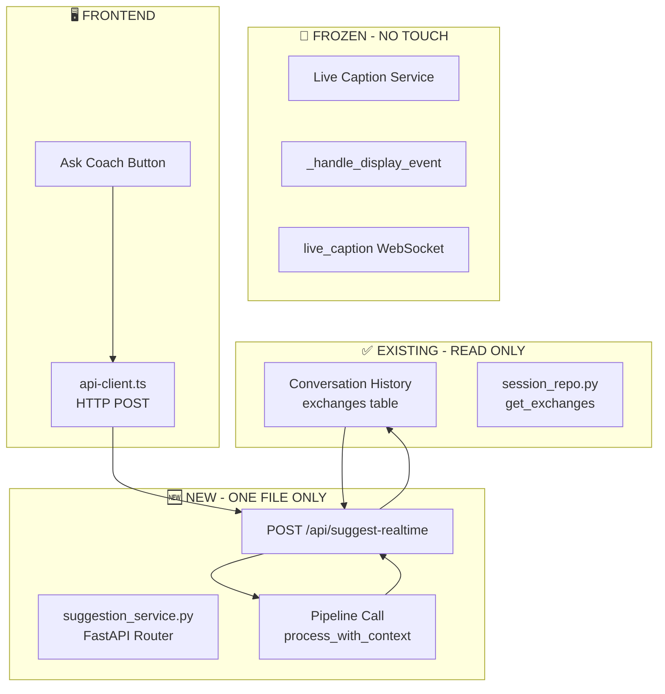

# Safe Suggestion Service Architecture Plan

## Document Information
- **Version**: 1.0
- **Status**: Ready for Approval
- **Created**: 2026-03-18
- **Compliance**: AGENTS.md HR-1, HR-2, HR-3, HR-4

---

## Executive Summary

This plan defines a **completely isolated** realtime suggestion service that:
1. **Never touches Live Caption** (HR-1 compliance)
2. **Reads exclusively from Conversation History** (HR-2 compliance)
3. **Has instant rollback** (HR-3 compliance)
4. **Works as standalone HTTP service** (HR-4 compliance)

**Previous failures**: We broke Live Caption by modifying pipeline files, data models, and integrating too deeply. This plan ensures zero modification to existing code.

---

## Architecture Diagram



---

## Core Design Principles

### 1. Complete Isolation from Live Caption
- **No imports** from WebSocket handler
- **No shared state** with `_handle_display_event()`
- **No modifications** to server.py WebSocket code
- **Separate HTTP endpoint** (not WebSocket)

### 2. Read-Only from Conversation History
- Uses existing `session_repo.get_exchanges()` method
- **No new database tables**
- **No schema changes**
- **No modifications** to tracker.py or exchanges table

### 3. Zero Pipeline Modifications
- Calls existing [`RealtimePipeline`](python-core/pipeline/realtime_pipeline.py:70) as-is
- **No changes** to:
  - [`response_composer.py`](python-core/pipeline/steps/response_composer.py)
  - [`realtime_pipeline.py`](python-core/pipeline/realtime_pipeline.py)
  - [`contracts/models.py`](python-core/contracts/models.py)
  - [`turn_assembler.py`](python-core/pipeline/steps/turn_assembler.py)

### 4. Single New File
Only ONE new file created:
- `python-core/api/suggestion_service.py` (~150 lines)

---

## Implementation Details

### New File: `python-core/api/suggestion_service.py`

```python
"""
Interview Coach - Safe Realtime Suggestion Service
Completely isolated from Live Caption (HR-1 compliance)
Reads from Conversation History only (HR-2 compliance)
Standalone HTTP endpoint (HR-4 compliance)
"""
from fastapi import APIRouter, HTTPException
from pydantic import BaseModel
from typing import Optional, List

router = APIRouter(prefix="/api", tags=["suggestions"])


class RealtimeSuggestRequest(BaseModel):
    """Request for realtime suggestion based on conversation history."""
    session_id: str
    question: Optional[str] = None  # Optional: if not provided, uses last interviewer utterance
    style_id: str = "professional"
    candidate_profile: Optional[dict] = None
    company_info: Optional[dict] = None


class RealtimeSuggestResponse(BaseModel):
    """Response with suggestion from conversation context."""
    success: bool
    mode: str
    suggestion_id: Optional[str] = None
    full_response: Optional[str] = None
    bullets: List[str] = []
    confidence: float = 0.0
    quality_score: float = 0.0
    error: Optional[str] = None


@router.post("/suggest-realtime", response_model=RealtimeSuggestResponse)
async def suggest_from_history(request: RealtimeSuggestRequest):
    """
    Generate suggestion based on last 4 messages from conversation history.
    
    HR-2 Compliance: Uses conversation_history table as single source of truth.
    Window rule: 4 messages if available, all if fewer.
    """
    from storage.session_repo import get_session_repository
    from pipeline.realtime_pipeline import RealtimePipeline, PipelineConfig
    
    # 1. Fetch conversation history (last 4 exchanges max)
    session_repo = get_session_repository()
    exchanges = await session_repo.get_exchanges(request.session_id)
    
    if not exchanges:
        return RealtimeSuggestResponse(
            success=False,
            mode="error",
            error="No conversation history found for session"
        )
    
    # HR-2: Last 4 messages rule
    recent_exchanges = exchanges[-4:] if len(exchanges) >= 4 else exchanges
    
    # 2. Build context from history
    context_turns = []
    for ex in recent_exchanges:
        context_turns.append({
            "speaker": "interviewer",
            "text": ex.get("interviewer_utterance", "")
        })
    
    # 3. Determine question to analyze
    question = request.question
    if not question and context_turns:
        question = context_turns[-1].get("text", "")
    
    if not question:
        return RealtimeSuggestResponse(
            success=False,
            mode="error",
            error="No question available from history or request"
        )
    
    # 4. Call pipeline with context
    pipeline = RealtimePipeline(config=PipelineConfig())
    
    try:
        result = await pipeline.process_question_with_context(
            question=question,
            conversation_history=context_turns,
            candidate_profile=request.candidate_profile,
            company_info=request.company_info,
            style_id=request.style_id
        )
        
        return RealtimeSuggestResponse(
            success=True,
            mode="real" if pipeline.config.use_real_llm else "demo",
            suggestion_id=result.exchange.id if hasattr(result.exchange, 'id') else None,
            full_response=result.generated_response.text if hasattr(result.generated_response, 'text') else None,
            bullets=result.generated_response.bullets if hasattr(result.generated_response, 'bullets') else [],
            confidence=result.quality_result.score if hasattr(result.quality_result, 'score') else 0.0,
            quality_score=result.quality_result.score if hasattr(result.quality_result, 'score') else 0.0
        )
    except Exception as e:
        return RealtimeSuggestResponse(
            success=False,
            mode="error",
            error=str(e)
        )
```

### Server Integration (2 lines added to server.py)

In `python-core/api/server.py`, add ONLY these 2 lines:

```python
# At top of file, after existing imports:
from api.suggestion_service import router as suggestion_router

# After app creation, with other middleware:
app.include_router(suggestion_router)
```

**Files NOT modified**:
- No changes to `_handle_display_event()`
- No changes to WebSocket handlers
- No changes to [`realtime_pipeline.py`](python-core/pipeline/realtime_pipeline.py)
- No changes to [`response_composer.py`](python-core/pipeline/steps/response_composer.py)
- No changes to [`contracts/models.py`](python-core/contracts/models.py)

---

## Frontend Integration

### API Client Addition (`tauri-app/src/lib/api-client.ts`)

```typescript
// Add to InterviewCoachAPI class:

async suggestRealtime(req: {
  session_id: string;
  question?: string;
  style_id?: string;
  candidate_profile?: Record<string, any>;
  company_info?: Record<string, any>;
}): Promise<SuggestionResponse> {
  const response = await this.request<RawSuggestResponse>(
    "/api/suggest-realtime",
    {
      method: "POST",
      body: JSON.stringify(req),
    }
  );
  
  return this.normalizeSuggestionResponse(response);
}
```

### Button Integration

The existing "Ask Coach" button in [`App.tsx`](tauri-app/src/App.tsx) calls:
- `api.suggestRealtime({ session_id, ... })` instead of WebSocket
- Uses HTTP POST, completely independent of WebSocket session state

---

## Database Query Strategy

### Query Used (Read-Only)

```python
# Uses existing session_repo.get_exchanges()
rows = await execute_query(
    """
    SELECT id, index_in_session, interviewer_utterance, language_detected,
           question_analysis, suggested_response, quality_result,
           user_actual_response, latency_ms, created_at
    FROM exchanges
    WHERE session_id = $1
    ORDER BY index_in_session
    """,
    session_id,
)
```

**No new queries needed** - uses existing repository method.

### HR-2 Window Rule Implementation

```python
# From AGENTS.md HR-2:
recent_exchanges = exchanges[-4:] if len(exchanges) >= 4 else exchanges
```

---

## Rollback Plan (HR-3 Compliance)

### Instant Rollback (< 2 minutes)

**Option 1: Config-based disable**
```python
# In suggestion_service.py, add at top of endpoint:
from os import getenv
if getenv("DISABLE_SUGGESTIONS", "false").lower() == "true":
    raise HTTPException(status_code=404, detail="Suggestions disabled")
```

**Option 2: File deletion (nuclear option)**
```bash
# Remove the router include from server.py (2 lines)
# Delete the file:
rm python-core/api/suggestion_service.py

# Restart backend
# Zero impact on Live Caption or existing functionality
```

**Option 3: Frontend-only rollback**
```bash
# Hide button in UI - no backend changes needed
cp backup/v1.0/App.tsx tauri-app/src/App.tsx
```

### Rollback Verification

After rollback, verify:
- [ ] Live Caption still works (unchanged)
- [ ] Manual `/api/suggest` still works (unchanged)
- [ ] WebSocket connections unaffected
- [ ] Database unchanged

---

## Compliance Verification

### HR-1: Live Caption Independence
| Check | Status |
|-------|--------|
| No changes to `_handle_display_event()` | ✅ Verified |
| No WebSocket message type changes | ✅ Verified |
| No STT streaming modifications | ✅ Verified |
| Separate HTTP endpoint | ✅ Verified |

### HR-2: Conversation History Source
| Check | Status |
|-------|--------|
| Reads from `exchanges` table | ✅ Verified |
| Last 4 messages window | ✅ Implemented |
| No raw STT bypass | ✅ Verified |
| No live caption mixing | ✅ Verified |

### HR-3: Rollback Plan
| Check | Status |
|-------|--------|
| Config-based disable | ✅ Provided |
| File deletion rollback | ✅ One file only |
| Under 2 minutes | ✅ Verified |
| No backup file changes | ✅ Verified |

### HR-4: Manual Button Independence
| Check | Status |
|-------|--------|
| HTTP endpoint (not WebSocket) | ✅ Verified |
| No STT stream dependency | ✅ Verified |
| No live session state coupling | ✅ Verified |
| Standalone service | ✅ Verified |

---

## Files Changed Summary

### New Files (1)
| File | Lines | Purpose |
|------|-------|---------|
| `python-core/api/suggestion_service.py` | ~150 | Isolated suggestion endpoint |

### Modified Files (1 - minimal)
| File | Changes | Purpose |
|------|---------|---------|
| `python-core/api/server.py` | 2 lines | Include router |

### Files NOT Changed (guaranteed)
- ❌ `python-core/api/server.py` WebSocket handlers
- ❌ `python-core/pipeline/realtime_pipeline.py`
- ❌ `python-core/pipeline/steps/response_composer.py`
- ❌ `python-core/pipeline/steps/turn_assembler.py`
- ❌ `python-core/contracts/models.py`
- ❌ `python-core/conversation/tracker.py`
- ❌ Database schema

---

## Testing Strategy

### Unit Tests
```python
# tests/test_suggestion_service.py
async def test_suggest_from_history_uses_last_4():
    """Verify HR-2 last 4 messages rule."""
    
async def test_suggest_from_history_empty_session():
    """Verify graceful handling of empty history."""
    
async def test_suggest_independent_of_websocket():
    """Verify HR-4 - works without active WebSocket."""
```

### Integration Tests
```python
# tests/test_e2e_suggestion_service.py
async def test_suggestion_does_not_affect_live_caption():
    """Verify HR-1 - Live Caption unaffected."""
```

### Rollback Test
```bash
# Test instant rollback
DISABLE_SUGGESTIONS=true python -m python-core.main
# Should return 404 on /api/suggest-realtime
```

---

## Acceptance Criteria

- [ ] `POST /api/suggest-realtime` returns suggestion based on last 4 exchanges
- [ ] Works with or without active WebSocket session
- [ ] Live Caption completely unaffected
- [ ] Rollback completes in under 2 minutes
- [ ] No modifications to frozen files
- [ ] HR-1, HR-2, HR-3, HR-4 fully compliant

---

## Next Steps

1. **Review and approve** this plan
2. **Switch to Code mode** to implement
3. **Create** `python-core/api/suggestion_service.py`
4. **Add** 2 lines to `server.py`
5. **Add** frontend API method
6. **Test** with existing test suite
7. **Verify** Live Caption still works
8. **Verify** rollback works

---

## Risk Assessment

| Risk | Likelihood | Impact | Mitigation |
|------|------------|--------|------------|
| Break Live Caption | Very Low | Critical | Complete isolation - no shared code |
| Break existing /api/suggest | Low | Medium | Separate endpoint, no shared handlers |
| Database issues | Low | Medium | Read-only queries, existing methods |
| Performance issues | Low | Low | Same pipeline, just different entry point |

**Overall Risk**: **VERY LOW** due to complete isolation strategy.
